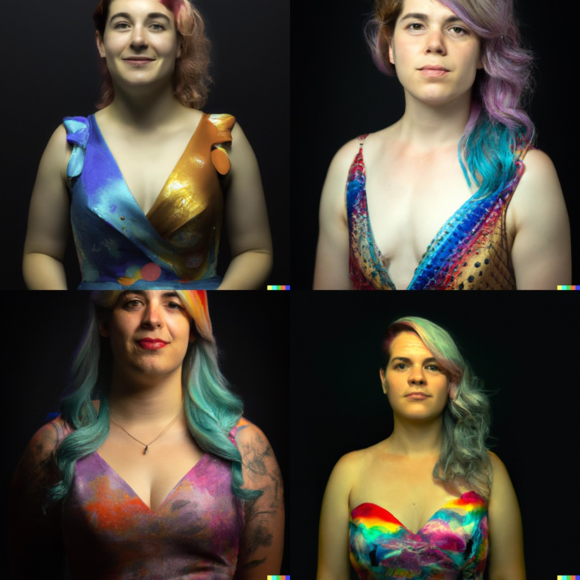

Generative AI is the new hotness - using AI models trained on a huge amount of data that can generate new data. This includes generating text or images. I decided to create a video giving an explanation of generative AI using - you guessed it, generative AI!

Check out the video here:



## Creating this video

To create this video I needed a few things:

- An image of a person to use for the presenter
- A script
- A way to convert the script to spoken audio
- A way to make the image move in time with the audio
- A YouTube description

My plan was to do all of this using AI.

### Create the image

To create the image, I decided to use [DALL-E-2](https://openai.com/product/dall-e-2), the latest image generation model from OpenAI. This model takes a prompt and generates an image. You can either use it through their website at [labs.openai.com](https://labs.openai.com/), or you can generate images using their [API](https://platform.openai.com/docs/api-reference/images).

When creating a prompt you need to be as descriptive as possible so that the AI can generate the image. The website generates 4 images for each prompt, all different.

This is the prompt I used:

> A hyper realistic bust upwards portrait of a classically beautiful mid-20s woman of indeterminate race with rainbow hair, who looks like a cross between a CEO and an opera singer and is posed facing the camera. She is wearing a colorful dress and is standing in front of a plain black backdrop.

These are the 4 images created:

I picked the one with the full head as I wanted to animate the full face.

This took a few iterations to get a prompt that created images I liked, such as age, outfit and style of dress. Most of the images were of the right quality, but some had a few quirks. For example, the eyes in this image were not well generated:

DALL-E creates square images, at a default of 1024x1024, so I knew I would need to add extra sizing on the sides or top and bottom to get the right aspect ratio. THis is why I added **standing in front of a plain black backdrop** to the prompt, so I could fill out the extra space with a single color. 

Once generated, I downloaded the image, and then resized it to a higher resolution using the [ML super resolution feature of Pixelmator Pro](https://www.pixelmator.com/blog/2019/12/17/all-about-the-new-ml-super-resolution-feature-in-pixelmator-pro/). 

### Create the script

Next up was something for the generated AI character to say. For this I decided to use [ChatGPT](https://chat.openai.com) with the [GPT4 model](https://openai.com/research/gpt-4). I decided to sign up for this at US$20 a month rather than wait, so will see if it is a worthwhile investment.

ChatGPT generates text for you based of textual prompts, and has a 'memory' to remember your conversation and use this as the input to the next prompts, allowing you to have a conversation-like discussion.

This is the prompt I used:

> You are Ganya, the CEO of an AI company and your company is called Alvie. Write a 5 minute talk that covers an introduction to generative AI and how it can benefit businesses. This talk needs to be entertaining with a couple of jokes, but also informative. The audience for this talk is a group of students who don't have strong technical knowledge.

The name Ganya is a unisex name used with Hebrew origins, and means clever. Alvie is a English female name, and is short for Alvina. It is a name which means wise friend. I picked these names at random from a baby name site listing names that mean intelligent.

This is the output it generated:

> Ladies and gentlemen, future tech wizards, and brilliant entrepreneurs, thank you for inviting me to speak today. I am Ganya, the CEO of Alvie, and I'll be your digital tour guide on this wild journey through the fascinating world of generative AI. So, buckle up, because we're about to embark on an adventure that's more thrilling than binge-watching a season of your favorite sci-fi show!
> 
> Now, you might be wondering, "What the heck is generative AI?" Well, you know how your phone's predictive text often tries to guess what you're typing before you even finish typing it? Yeah, that's a tiny taste of generative AI! It's like a mind-reading superpower, but for machines. And it's not only limited to text, it can be used for images, music, and even entire virtual worlds.
> 
> You see, generative AI is the cool cousin of traditional AI. Instead of being the nerdy, know-it-all who's good at math, generative AI is the creative type who spends their time painting, writing poetry, or designing websites. It's the kind of AI that dares to dream, and it's revolutionizing the way we think about technology.
> 
> But let's take a step back and look at the big picture. Generative AI is like a chef, and data is its secret ingredient. It takes massive amounts of data, mixes it all up, and uses this delicious concoction to create brand-new content, whether that's text, images, or music. Essentially, it's a digital Picasso with a dash of Shakespeare and a sprinkle of Mozart.
> 
> Now, I know what you're thinking: "That's all great, Ganya, but how can generative AI help my business? I'm not running an art gallery or a concert hall!" Well, fear not! Generative AI is a versatile beast and can benefit businesses in many ways.
> 
> For example, take customer service. We all know how frustrating it can be to deal with a grumpy customer service rep who clearly didn't have their morning coffee. Enter generative AI: it can be used to create friendly, informative, and highly responsive chatbots that can handle thousands of customer inquiries at once, without ever needing a caffeine fix. That's what I call efficiency!
> 
> Speaking of efficiency, generative AI can also help companies optimize their workflow. Imagine having a smart algorithm that can analyze complex data sets and automatically generate insightful reports for your team. It's like having an intern who never gets tired, never complains, and doesn't need a salary. The only downside? You can't send it out to fetch you coffee, but hey, nobody's perfect!
> 
> Now, I can't let you leave without a joke or two, can I? So, here's one for you: Why did the generative AI go to therapy? Because it had deep learning issues! (Pause for laughter) Okay, okay, I promise I won't quit my day job.
> 
> But in all seriousness, folks, generative AI is an incredible tool that can transform the way we do business. It can help companies save time, money, and resources, while also enabling us to create new, innovative products and services. As we embark on this exciting journey together, let's remember that the future of AI is not just about cold, hard numbers; it's about tapping into the boundless creativity that lies within each and every one of us.
> 
> Thank you for your time, and I hope this little chat has sparked your imagination and inspired you to explore the fantastic world of generative AI!

### Convert the script to spoken audio

There are a number of tools that can take text and create spoken audio. The best ones use AI to make the voice sound lifelike with changes in timing and intonation that mimic how a real person would speak. As a Microsoft person I could have used the [Cognitive services speech service](https://speech.microsoft.com/) but this would have meant writing code, and I couldn't be bothered...

Instead I used [Eleven Labs](https://elevenlabs.io) which has a free tier for up to 10,000 characters per month. You can select from a range of different voices, paste in your text and it creates the audio as an MP3 file. There is a limit of 2,500 characters per conversion, so I had to do it in 2 chunks as my text was 3,335 characters long, then use Camtasia to stitch the audio files together.

Here is the generated audio:



### Create a video speaking the audio

The next step was to create the video by mashing up the audio and the image, and animating the image to speak the words. There are a number of tools that could contribute to this, such as [Make it talk from Adobe research](https://github.com/adobe-research/MakeItTalk), but I wanted a solution that I didn't need to run myself.

I ended up using [D-ID](https://www.d-id.com) which is not cheap! They have a 14 day free tier for up to 5 minutes of video, but beyond that it gets very expensive. It works really well though! You can either use one of their avatars, or upload an image yourself. Once they have the image, you provide either the script and it will generate the audio for you (using the Microsoft Cognitive services under the hood), or upload the audio.

It then allows you to download the final video, and because I had a square image it sized it to 1280x1280. I then open up Camtasia one more time to create 2 videos with this - one at 1920x1080 for YouTube, and one at 1080x1920 for Instagram, filling the extra space around the video with the background color which was slightly off-black.

### Create a YouTube video

Now I had my video, it was time to upload to YouTube. I uploaded the video and knocked up a simple thumbnail with text for the video name manually. Tools like DALL-E are not good for adding text to images, so something to research is a tool for this.

I then needed a description, so it was time to go back to ChatGPT! The prompt I used was:

> Generate a YouTube description for a video with the following text:
>
> \<the script\>

I then added the complete script to the prompt (I cut it off here for brevity). ChatGPT then generated the following:

> Title: Exploring the World of Generative AI with Alvie CEO Ganya
> 
> Description:
> 
> 🚀 Join Ganya, the CEO of Alvie, as she takes you on an exciting and informative journey through the world of generative AI! In this video, Ganya breaks down what generative AI is, how it works, and its potential to revolutionize the way we do business. From creative applications like art, music, and writing to practical uses in customer service and workflow optimization, generative AI offers a world of possibilities.
> 
> 🤖 Key Points:
> 0:00 - Introduction and Welcome
> 1:05 - What is Generative AI?
> 2:38 - How Generative AI Works: Data and Creativity
> 4:15 - Benefits of Generative AI for Businesses
> 6:45 - The Future of AI and Creativity
> 8:30 - Jokes and Closing Remarks
> 
> 🔮 Don't miss this opportunity to learn about the fantastic world of generative AI and its potential to unlock boundless creativity in technology and business. Hit the subscribe button to stay updated on the latest advancements and insights from Alvie!
> 
> #GenerativeAI #Alvie #AIinBusiness

Pretty good stuff! I removed the `#Alvie` tag as this makes no sense as Alvie doesn't exist, and had to re-do the time stamps for the chapter markers as ChatGPT has no way of knowing the timings. But otherwise it was perfect!

I added a disclaimer at the start of the description to say this was AI generated, and listed the tools.

And I was done! Video created and uploaded all powered by generative AI!

### What's next?

My next job is to try to automate all this into a tool so I can give it a prompt and have it create and upload the full video without any manual intervention.
