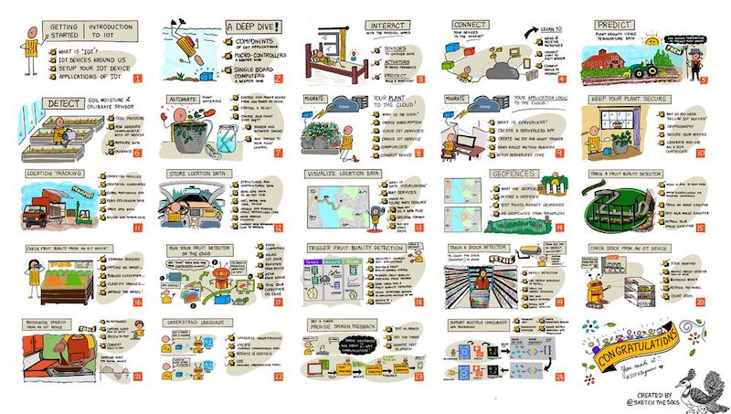
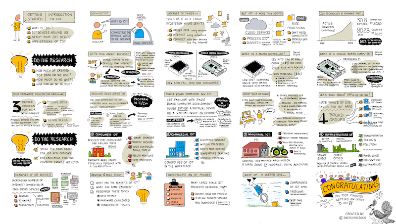

It is our very great pleasure to announce the release of a new, free, MIT-licensed open-source curriculum all about the Internet of Things: [IoT for Beginners](https://aka.ms/iot-beginners). Brought to you by a team of Azure Cloud Advocates, Program Managers, and [Microsoft Learn Student Ambassadors](https://studentambassadors.microsoft.com/), we hope to empower students of all ages to learn the basics of IoT. Presuming no knowledge of IoT, we offer a free 12-week, 24-lesson curriculum to help you dive into this amazing field.

If you liked our first two curricula, [Web Dev for Beginners](https://aka.ms/webdev-beginners) and [Machine Learning for beginners](https://aka.ms/ml-beginners), you will love IoT for Beginners!

## Join us on the journey of your food, from farm to table!

🌽 Join us as we take the same journey as your food as it travels from farm to table, taking advantage of IoT on the way to improve farming, transport, manufacturing and food processing, retail and smart homes. 🌽

Our curricula are structured with a modified Project-Based pedagogy and include:

- a pre-lesson warmup quiz
- a written lesson
- video
- knowledge checks
- a project to build
- infographics, sketchnotes, and visuals
- a challenge
- an assignment
- a post-lesson quiz
- opportunities to deepen your knowledge on Microsoft Learn

## What will you learn?

The lessons are grouped so that you can deep-dive into use cases of IoT. We start with an introduction to IoT, covering devices, sensors, actuators and cloud connectivity, where you will build an internet connected version of the "Hello world" or IoT, an LED. We then move on to farming, learning about digital agriculture and feedback loops to control automated watering systems. Your food then leaves the farm on trucks, and you learn how to track vehicles using GPS, visualize their journeys and get alerts when a truck approaches a processing plant. Once in the plant, we move to AIoT, learning how to distinguish between ripe and unripe fruit using AI models running from IoT devices and on the edge. Next we move to the supermarket, using IoT to manage stock levels. Finally we take the food home to cook, and learn about consumer smart devices, building a voice controlled smart timer that can even speak multiple languages.

## Hardware

The hard part (pun intended) for IoT is hardware, so we've designed this curriculum to be as accessible as possible. We want you to Learn IoT, not learn how to solder, know how to read resistor color codes, or know what a microfarad is, so we've made hardware choices to make things easier.

You can choose to learn using microcontrollers using Arduino with a [Wio Terminal](https://www.seeedstudio.com/Wio-Terminal-p-4509.html), or single board computers using a [Raspberry Pi](https://www.raspberrypi.org/products/raspberry-pi-4-model-b/). We've also added a [virtual hardware option](https://github.com/CounterFit-IoT) so you can learn without having to purchase anything!

For sensors and actuators, we've gone with the [Grove kit](https://www.seeedstudio.com/category/Grove-c-1003.html) from [Seeed Studio](https://www.seeedstudio.com/), with easy to connect sensors and actuators.

Our friends at Seeed have made it easy to buy the hardware, with packages containing all of the kit you need.

* [IoT for beginners with Seeed and Microsoft - Wio Terminal Starter Kit](https://www.seeedstudio.com/IoT-for-beginners-with-Seeed-and-Microsoft-Wio-Terminal-Starter-Kit-p-5006.html)
* [IoT for beginners with Seeed and Microsoft - Raspberry Pi 4 Starter Kit](https://www.seeedstudio.com/IoT-for-beginners-with-Seeed-and-Microsoft-Raspberry-Pi-Starter-Kit.html)

If you are interested in learning using virtual hardware, you can write IoT code locally as if you were using a Raspberry Pi, then simulate sensors and actuators using [CounterFit](https://github.com/CounterFit-IoT), a free, open source tool for simulating hardware.

## A sneak peek
This curriculum is filled with a lot of art, created by our team. Take a look at this cool sketchnote created by [@nitya](https://twitter.com/nitya).

Without further ado, please meet [IoT For Beginners: A Curriculum](https://aka.ms/iot-beginners)!
