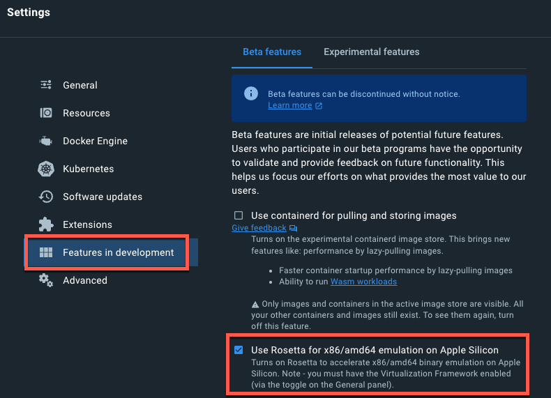
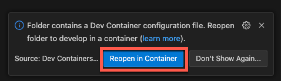
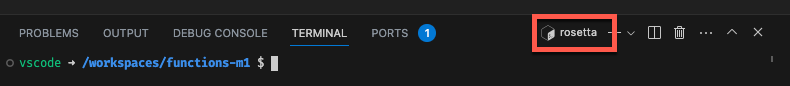

If you are an Apple user and you want to build Azure Functions using Python, then you've been out of luck. The Azure Functions core tools don't support Python functions on Arm64. There is a workaround, and this post shows you how.

## Arm64 support in Azure Functions

Apple moved to an Arm64 architecture with their Apple Silicon processors (currently M1 and M2) back in November 2020, with their entire linup now using Apple Silicon, except for the rather outdated Mac Pro. Despite this, support for running Python functions on Arm64 has not yet materialized. You can create functions with `func init` and `func new`, but when you run them, you get an error:

```bash
➜  functions-m1 func start
Found Python version 3.10.11 (python3).

Azure Functions Core Tools
Core Tools Version:       4.0.5095 Commit hash: N/A  (64-bit)
Function Runtime Version: 4.16.5.20396

[2023-05-08T21:29:33.030Z] Failed to initialize worker provider for: /opt/homebrew/Cellar/azure-functions-core-tools@4/4.0.5095/workers/python
[2023-05-08T21:29:33.030Z] Microsoft.Azure.WebJobs.Script: Architecture Arm64 is not supported for language python.
[2023-05-08T21:29:33.409Z] Failed to initialize worker provider for: /opt/homebrew/Cellar/azure-functions-core-tools@4/4.0.5095/workers/python
[2023-05-08T21:29:33.409Z] Microsoft.Azure.WebJobs.Script: Architecture Arm64 is not supported for language python.
[2023-05-08T21:29:33.558Z] A host error has occurred during startup operation '2a13f8c8-f2e4-4da0-a88c-205dbd3065c2'.
[2023-05-08T21:29:33.558Z] Microsoft.Azure.WebJobs.Script: Did not find functions with language [python].
[2023-05-08T21:29:33.564Z] Failed to stop host instance '1e7799d1-a87f-404a-9bc1-858c7724aeec'.
[2023-05-08T21:29:33.564Z] Microsoft.Azure.WebJobs.Host: The host has not yet started.
Value cannot be null. (Parameter 'provider')
```

Microsoft originally targeted support for their Python 3.10 release, but missed this. Currently they are saying it will come with Python 3.11 support, as documented in [this GitHub issue](https://github.com/Azure/azure-functions-python-worker/issues/915). Their suggested workaround involves changing your Terminal to always run under Rosetta 2 which feels like a bad way to do things. There is a better workaround, leveraging dev containers.

## Dev containers

Dev containers are docker containers that you run and connect to from VS Code. As a user these are seamless - you can still access the file system from outside of VS Code, but internally the dev environment runs in the container, with all your dependencies installed in the container instead of on your host OS. You can read about these on [the VS Code developing inside containers documentation](https://code.visualstudio.com/docs/devcontainers/containers).

Docker supports running x86 and x64 containers on Apple Silicon Macs using either QEMU emulation, or using Rosetta 2. This means you can create an x64 container and run this on your Mac, running the Azure Functions core tools inside the container! Pretty cool, hey!

## Configure docker

You need [docker](https://www.docker.com) installed, so get this installed first. Once installed, you need to configure a few things.

- From the docker menu item, select **Settings**
- From the **General** section, ensure *Use Virtualization framework* is selected

  

- From the **Features in development** section, select the **Beat Features** and select *Use Rosetta for x86/amd64 emulation on Apple Silicon*

  

- Apply these changes and docker desktop will restart.

## Create the dev container

The default Azure Functions and Python3 dev container is ideal for this as it is an x86/x64 container.

- Make sure docker is running.
- Create a folder for your Azure Functions app and open it in VS Code (or open the one you already have created)
- Ensure you have the [Dev Containers extension](https://marketplace.visualstudio.com/items?itemName=ms-vscode-remote.remote-containers) installed. This also comes with the [Remote Development extension Pack](https://marketplace.visualstudio.com/items?itemName=ms-vscode-remote.vscode-remote-extensionpack).
- Open the command palette and select *Dev Containers: Add Dev Container configuration files...*

    

- Select *Show all definitions* to see all the dev container options

    

- Search for and select *Azure Functions & Python 3*

    

- Select any other features you want. You don't need any for Azure Functions to work.

- The container files will be built, and an option will pop up to re-open the folder in the container. Select **Reopen in Container**

    

- Once the repo has been re-opened in the container, open the terminal and you will see it marked as running under Rosetta

    

- If you don't already have an Azure Functions app, you can now create one.
- Run your Azure Functions app!

    ```bash
    vscode ➜ /workspaces/functions-arm $ func start
    Found Python version 3.9.16 (python3).
    
    Azure Functions Core Tools
    Core Tools Version:       4.0.5148 Commit hash: N/A  (64-bit)
    Function Runtime Version: 4.17.3.20392
    
    
    Functions:
    
            HttpTrigger: [GET,POST] http://localhost:7071/api/HttpTrigger
    
    For detailed output, run func with --verbose flag.
    [2023-05-08T22:07:35.900Z] Worker process started and initialized.
    [2023-05-08T22:07:38.282Z] Host lock lease acquired by instance ID '0000000000000000000000008A10FEBD'.
    ```

Once you commit the devcontainer files to GitHub, you will also be able to open this in a Codespace and have it pre-configured with everything you need. You can also add more things to the container depending on your needs, such as extensions that are automatically loaded when the container is loaded, install things, whatever you need! Check out the [the VS Code developing inside containers documentation](https://code.visualstudio.com/docs/devcontainers/containers) to learn more.
