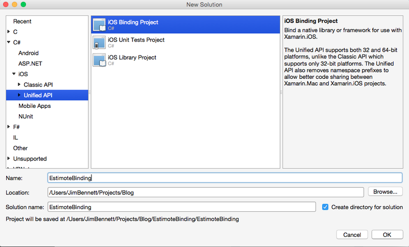

Update: Since writing this, James Montemagno from Xamarin contacted me to say they are working on an Estimote component.  This is now available on the Xamarin component store.  Check out [his blog post here](http://blog.xamarin.com/adding-real-world-context-with-estimote-beacons-and-stickers/).

<hr/>

I've been playing around with iBeacons a lot recently.  They seem a really cool technology with a load of interesting potential use cases.  My iBeacon of choice is from [Estimote](http://estimote.com), I've got some of their beacons already and have a pack of stickers on pre-order.  As well as providing the basic iBeacon functionality, they also provide a whole host of other features including accelerometers and temperature sensors.

To access all their beacon functionality, above and beyond the basics that are part of the Apple iBeacon standard, you need to use their SDK.  The Apple CoreLocation API will do the basics - ranging, notifications when going in and out of range etc., but for full access you need their SDK.  They helpfully provide it for iOS and Android, but not for Xamarin.

This is not a big deal though, as Xamarin provide an easy enough way to wrap the native SDK's.  This post will focus on how to do it for iOS.  I'll try to do it for Android later and blog about that separately.

##### Step 1 - Grab the code
The SDK code is on the [Estimote GitHub site](https://github.com/Estimote/iOS-SDK).  Clone this locally.

#### Step 2 - Create a binding project
Xamarin studio has project types for binding APIs.  Start by selecting File -> New Solution, and choosing 'iOS Binding Project' from the Unified API section of the iOS entry in the tree.  Apple requires all new apps that are submitted to support 64-bit, so to support this in our apps we need to use the new Unified APIs.



This will create a project with a couple of files in it.

* `ApiDefinition.cs` - This file will end up containing the classes created by wrapping the API.
* `StructsAndEnums.cs` - This file will contain any structus or enums that are created from the API.

We now need to add the actual library to the project, so do this by dragging it from Finder/Explorer into the project in Xamarin Studio.  Drag the `iOS-SDK\EstimoteSDK\libEstimoteSDK.a` file into your project.
One this is in the project you'll see it in the tree with an expander by it.  Expanding this will show a new file `libEstimoteSDK.linkwith.cs`.  This file contains the instructions on how to link the library, and I'll cover this in more detail later.

#### Step 3 - Generate the API
Once we have the library in place, we need to generate the API code to call it.  We could do it by hand, but that's far too much trouble.  Instead we'll use [Objective Sharpie](http://developer.xamarin.com/guides/ios/advanced_topics/binding_objective-c/objective_sharpie/), a tool from Xamarin to create the code for you.  It's currently a beta, but works fine for this SDK.  I'm hoping one day it will be built into Xamarin Studio so creating binding projects is a one step thing.
Objective Sharpie is a command line tool, you give it the header files that come with the library, tell it what SDK to use, which namespace etc. and it will do the magic.

In my case, I run the `sharpie` command it from the EstimoteSDK folder in the SDK github repository, using the following options:

```sh
sharpie bind --namespace=Estimote --sdk=iphoneos8.1 headers/*.h -unified

```

The options are:

* `bind` - this tells it to bind the header files

* `--namespace=Estimote` - this is the defult namespace used in the created files.

* `--sdk=iphoneos8.1` - this tells it to use the iOS 8.1 SDK for code generation.  You should always use the latest SDK.

* `headers/*.h` - this is the path to the header files you want to generate code for.

* `--unified` - this tells it to use the new Unified API for 64-bit support.

The code generated is in two files - `output.cs` and `output.enums.cs`. For some reason it doesn't output the files using the same naming convention as the binding projects (`ApiDefinition.cs` and `StructsAndEnums.cs`). It also doesn't add using directives to the files.

Once the code has been generated, simply copy the contents of `output.cs` into `ApiDefinition.cs` (keeping the namespaces) and `output.enums.cs` into `StructsAndEnums.cs`.

#### Step 4 - Building the code
Not as easy as you may think!  If you do a build, there will be errors.  This is because the API uses names for parameters etc. that are reserved words in C#.

For example check out the ESTBeaconManager.Constructor method:

```cs
IntPtr Constructor (ESTBeaconManagerDelegate delegate);
```

This has a parameter `delegate`, which is a reserved word in C#.  Luckily, the parameters can be renamed without any issues, so just rename this to `del` or another name of your chosing.  You'll also have to do the same in `ESTBeaconUpdateInfo`.

After changing these, build again and you'll get more errors.  These next errors are due to the interfaces in the iOS SDK deriving from `NSObject<NSCoding>` or `NSObject <NSCopying, NSCoding>`.  The resulting interfaces created by Objective Sharpie derive from `NSCoding` or `NSCopying`, and an interface cannot derive from a concrete class.  Luckily, we can just remove the all base classes, so `interface ESTBeaconVO : NSCoding` becomes `interface ESTBeaconVO`.  Do this for all other interfaces that the compiler complains about.

Again, we build, and again, more errors.  The next set are due to name casing being changed between iOS and Xamarin - namely `NSUUID` is `NSUuid`.  A quick Replace all and these are fixed.

The next set of errors are due to missing usings.  Objective Sharpie doesn't add any using directives to the generated code which is a shame.  A right click -> Resolve -> using CoreLocation; on `CLProximity` and Resolve -> using CoreBluetooth; on `CBPeripheral` and the `ApiDefinition.cs` file will now build.  You'll need to so Resolve -> using ObjCRuntime; on the `[Native]` attribute in `StructsAndEnums.cs` as well.

The code should now build.

#### Step 5 - Events instead of delegates.
Objective-C has an eventing mechanism based on delegates - you create a class that implements a specific delegate protocol and pass it to another class, which then calls back into the methods of your delegate class when things happen.  The code generated by Objective Sharpie follows this pattern as it is a one-to-one mapping to the Objective-C code.  Luckily, binding projects are smart enough to be able to translate this into events, with the help of a few attributes to help guide it when it generates these events.

Working down through the code, the first one we come to is `ESTBeaconDelegate`, used by the `ESTBeacon` class.  The delegate is used to allow the beacon to call back when the connection state changes, or if the accelerometer detects movement.

```cs
[Protocol, Model]
[BaseType (typeof (NSObject))]
interface ESTBeaconDelegate {
	// ...
}

[BaseType (typeof (NSObject))]
interface ESTBeacon {
  [Export ("delegate", ArgumentSemantic.Weak)]
  [NullAllowed]
  NSObject WeakDelegate { get; set; }
  
  [Wrap ("WeakDelegate")]
  ESTBeaconDelegate Delegate { get; set; }
  // ...
}
```

The code above has been trimmed down to just show the important stuff.  The `ESTBeacon` class has properties to store the delegate - the two different properties and the attributes allow it to strongly type the delegate class that is passed in (Objective-C uses weakly typed delegates).

Rather than use a delegate, we want to use events.  This is actually really easy, we mark the `ESTBeacon` class with an attribute to tell it which properties are used for delegates, and to tell it which delegate types to generate events for.

```cs
[BaseType (typeof (NSObject),
	Delegates=new string [] { "WeakDelegate" }, 
	Events=new Type [] {typeof(ESTBeaconDelegate)})]
interface ESTBeacon {
	// ...
```

This code tells the compiler to generate events for the `ESTBeacon` class using the `ESTBeaconDelegate` to define the events, and the delegate is set in the `WeakDelegate` property.  One of these days I'll decompile the code to see how it does all this, but I imagine it will create a private class the exposes the delegate and calls back into the `ESTBeacon` class to raise the events.

We also need to tell the compiler how to generate the event signatures for the delegate.  This is also done using an attribute, one that provides the name of the event args class.

```cs
interface ESTBeaconDelegate {

	// @optional -(void)beaconConnectionDidSucceeded:(ESTBeacon *)beacon;
	[Export ("beaconConnectionDidSucceeded:")]
	void BeaconConnectionDidSucceeded (ESTBeacon beacon);
    
    // ...
```

becomes:

```cs
interface ESTBeaconDelegate {

	// @optional -(void)beaconConnectionDidSucceeded:(ESTBeacon *)beacon;
	[Export ("beaconConnectionDidSucceeded:")]
	[EventArgs("BeaconConnectionDidSucceeded")]
	void BeaconConnectionDidSucceeded (ESTBeacon beacon);
    
    // ...
```

When the event is created it has the signature:

```cs
public event EventHandler<BeaconConnectionDidSucceededEventArgs> BeaconConnectionDidSucceeded;
```

The class `BeaconConnectionDidSucceededEventArgs` is created and wraps all the parameters in the delegate call as properties - so it will have 	 public property of type `ESTBeacon` named `Beacon`.  Note that the attribute doesn't have `EventArgs` on the end of the name - this is added automatically by the compiler.  If you do add it, you get an error:

```
BTOUCHTASK: error BI1005: btouch: EventArgs in 
EstimoteBinding.ESTBeaconDelegate.BeaconConnectionDidSucceeded attribute should not include 
the text 'EventArgs' at the end
```

This process needs to be repeated for all delegate methods and all classes that use delegates - or as much as you think you will need for internal projects.  On my long list of things to do is to look at generating these using VS2015 and see if I can automate this step using Roslyn.

#### Step 6 - Getting it ready to use with another project
The code now compiles, but as always compilable code isn't shippable code.  There's a few more things left to do.

First, we need to ensure it supports the 64-bit processors.  In the `libEstimoteSDK.linkwith.cs` you will see it is set to link with v7, v7s and the simulator:

```
LinkTarget.ArmV7 | LinkTarget.ArmV7s | LinkTarget.Simulator
```

We need to add the 64-bit processors to this list, so change it to:

```
LinkTarget.ArmV7 | LinkTarget.ArmV7s | LinkTarget.Arm64 | LinkTarget.Simulator | LinkTarget.Simulator64
```

<br/>

Secondly we should review naming.  Objective Sharpie tries, but it does get things wrong.  For example, the `beaconConnectionDidFail` method call is named wrong, instead being named by it's parameter:

```cs
// @optional -(void)beaconConnectionDidFail:(ESTBeacon *)beacon withError:(NSError *)error;
[Export ("beaconConnectionDidFail:withError:")]
void WithError (ESTBeacon beacon, NSError error);
```

This should be changed to be:

```cs
// @optional -(void)beaconConnectionDidFail:(ESTBeacon *)beacon withError:(NSError *)error;
[Export ("beaconConnectionDidFail:withError:")]
void BeaconConnectionDidFail (ESTBeacon beacon, NSError error);
```

I haven't yet worked out a pattern as to when these odd namings happen - if you work it out please let me know!.

#### Step 7 - ???
#### Step 8 - Profit!
Not really, but you now have a nice binding for the Estimote SDK.  Hopefully these instructions make sense, tweet me/mail me with any issues you may have or any questions.  Xamarin has a load of [really helpfull docs](http://developer.xamarin.com/guides/ios/advanced_topics/binding_objective-c/) covering pretty much everything you would need to know about binding.

And if you can't be bothered to do all this your self, you can just download my bindings from [my GitHub page](https://github.com/jimbobbennett/EstimoteBinding) which I am trying to keep pretty much up to date and includes a Xamarin.Forms based test app to show it all working.  I hope to have a NuGet package or a Xamarin component available soon.

