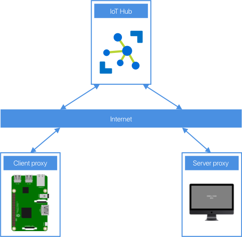

The rise of virtual education has led to sweeping changes in how students are taught. A lot of computer science lessons can be run with only small changes thanks to the cloud - [Azure Lab Services](https://azure.microsoft.com/services/lab-services/pre-configured) can provide virtual machines with developer tooling, or [GitHub Codespaces](https://github.com/features/codespaces) can replace the physical lab setups that Universities used to use.

One area that has limitations is the Internet of Things. You can't move small microcontrollers or small board computers to the cloud, posting devices is expensive and leads to support issues that often can only be resolved by posting the device back, and asking students to purchase devices is problematic as this can be expensive for a group of students who may already be paying many thousands of dollars for tuition, and in some cases not feasible due to shipping or customs issues.

Although it is impossible to re-create an IoT lab fully in a virtual setting, it is possible to make devices like Raspberry Pi's available over the internet, either from a University campus, or even from the Lecturers home (given enough upload bandwidth), and these can then be connected to microcontrollers to program these if needed. There are plenty of solutions to do this that involve opening SSH ports over the internet, but these are not the most secure as you have to have a public SSH port open.

One novel way that increases security is using [Azure IoT Hub device streams](https://docs.microsoft.com/azure/iot-hub/iot-hub-device-streams-overview?WT.mc_id=academic-7372-jabenn).

## Use device streams to proxy an SSH connection

Device streams provide secure two-way TCP tunnels via standard HTTPS connections - allowing devices to bypass firewalls and other network considerations, and avoid having SSH ports open over the internet, but still have security via IoT Hub.

You can then run server code on your local device to emulate SSH, and it can forward the connection to a device stream via IoT Hub, which streams to the client IoT device which is running client code to listen to the requests over the stream and redirect them to the local SSH port, and stream back the results, essentially using very thin proxies.

Although the Pi is connected to an IoT Hub to stream the SSH commands, it can still connect to another IoT Hub for IoT development, and run services like Azure IoT Edge. From a users perspective, it's the same as SSHing into the Pi - they connect an SSH session to the local proxy using a different port, and that logs them into the Pi. Behind the scenes the IoT Hub device streams make it work, but to the user, it's as if they connected natively.

The full process for how to set this up, as well as all the code you need to build and run the proxy is available as one of our [Lab Guides as part of the Microsoft IoT Curriculum resources](https://github.com/microsoft/iot-curriculum/blob/main/educator-guides/lab-guides/virtual-iot-lab/iot-hub-ssh-virtual-lab.md). Check out the instructions and try it out.

[github.com/microsoft/iot-curriculum/blob/main/educator-guides/lab-guides/virtual-iot-lab/iot-hub-ssh-virtual-lab.md](https://github.com/microsoft/iot-curriculum/blob/main/educator-guides/lab-guides/virtual-iot-lab/iot-hub-ssh-virtual-lab.md)
