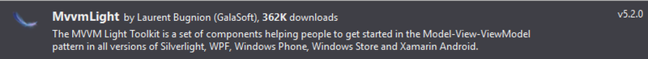
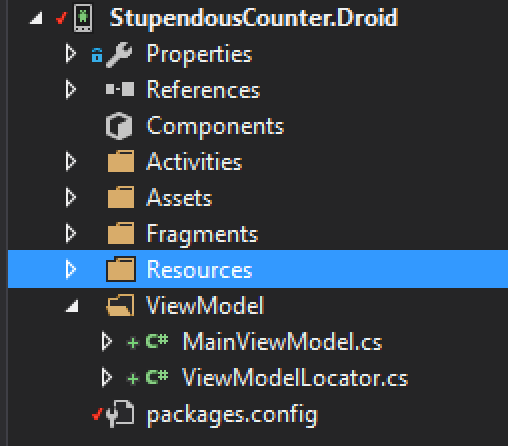
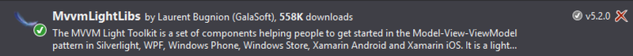
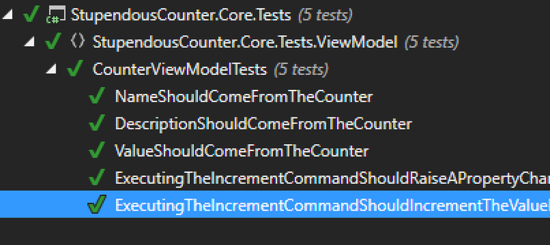

This is the third part in the my series about building an Android app using Xamarin.Android.  You can find the first part [here](/blogs/building-an-android-app-part-1/) and the second part [here](/blogs/building-an-android-app-part-2/), and I highly recommend reading these first.

#### Data binding
In the first 2 parts of this we created our basic app shell and built a core library with models that used SQLite to store and retrieve our data.  We're now going to expand on this by adding the layer in-between to bind the data to our UI.

Having been a WPF developer in the past I'm a big fan of the [MVVM pattern](https://en.wikipedia.org/wiki/Model–view–viewmodel), so I'm planning on using the same pattern here.  I won't go into the details of this pattern, so if you've never come across it before it's worth reading up as it's a useful pattern supported natively in Xamarin.Forms and on iOS and Android using tools like MVVMLight or [MVVMCross](https://github.com/MvvmCross/MvvmCross).  To help with this I'm going to use [MVVMLight](http://www.mvvmlight.net) by [Laurent Bugnion](http://www.galasoft.ch).  As the name suggests this is a light-weight MVVM library which provides the basic toolbox to allow you to use the pattern without constraining you to a particular architecture. MVVMLight has two different nuget packages to install - one for the Android app and one for our core project.

For StupendousCounter.Droid install MVVMLight.  This has all the platform specific code in (so for an Android project you get a library with Android specific code in) that allows for things like UI binding - this needs to know about the controls so needs to be platform-specific.  When installing this you may get an error about not being able to find App.Xaml - just ignore this as it isn't relevant for Android projects.  Once this is installed you will see a new folder created called `ViewModel` that contains a dummy view model and an example ViewModelLocator.  We'll come back to these later on.

<div class="image-div" style="width: 700px;">
    

    
</div>
<br/>
<div class="image-div" style="width: 300px;">
    

    
</div>
<br/>

For StupendousCounter.Core install the libs only one - MVVMLightLibs.  This has things like the base view model but nothing platform specific.

<div class="image-div" style="width: 700px;">
    

    
</div>
<br/>

###### Showing some data
Lets start by showing some data on screen.  To make it easier we'll just mock some up on startup if we don't have an existing counters.  In our `MainActivity.cs` we can add some dummy data if we are in debug (to save accidentally leaving this in in release code) just after we've setup the `DatabaseHelper`:

```
private static async Task AddDummyData()
{
    var dbHelper = new DatabaseHelper();
    if (!(await dbHelper.GetAllCountersAsync()).Any())
    {
        var counter1 = new Counter
        {
            Name = "Monkey Count",
            Description = "The number of monkeys",
            Value = 10
        };

        var counter2 = new Counter
        {
            Name = "Playtpus Count",
            Description = "The number of duck-billed platypuses",
            Value = 4
        };

        await dbHelper.AddOrUpdateCounterAsync(counter1);
        await dbHelper.AddOrUpdateCounterAsync(counter2);
    }
}
```

And call this if we're in debug in our 'OnCreate' method:

```
protected override async void OnCreate(Bundle savedInstanceState)
{
    base.OnCreate(savedInstanceState);

    var path = System.Environment.GetFolderPath(System.Environment.SpecialFolder.Personal);
    var dbPath = Path.Combine(path, "counters.db3");
    DatabaseHelper.CreateDatabase(dbPath);

# if DEBUG
    await AddDummyData();
# endif
```

Notice how we're awaiting the call to `AddDummyData`?  Yup - this is an async method we're in.  In the default `OnCreate` it's not async - but we can make it so by just adding the `async` keyword and it just works.  Which is really nice.

<div class="image-div" style="width: 300px;">
    

    
</div>
<br/>

We have some data, so lets create our first view model to display it.
When we added MVVMLight to the StupendousCounter.Droid project it created a dummy `MainViewModel` and 'ViewModelLocator'.  These are useful starting points for our code but they are not in the right place - one of the big upsides of MVVM is the separation of concerns that is gives us, so the UI is completely independent of the Model (which contains our data) and the view model (which is a converter that converts from the UI view of our data to the Models view).  Despite the view model converting from model to UI it should never contain any UI specific code - it converts the Models into a set of properties and commands that are bound to the UI in the View and allows the UI to get or set data or perform actions.  Properties are simple data types that the view can show, update and detect updates to based off the [INotifyPropertyChanged](https://msdn.microsoft.com/en-us/library/system.componentmodel.inotifypropertychanged%28v=vs.110%29.aspx?f=255&MSPPError=-2147217396) interface.  Commands are implementations of [ICommand](https://msdn.microsoft.com/en-us/library/system.windows.input.icommand(v=vs.110).aspx) that allow an event raised on the UI to run an action including checking if that action is allowed based on some criteria.  These are all non-UI specific pieces and therefore do not need to be in the UI layer, nor do they need to be platform specific.  So it's better to put them in the Core project so that if we want to port this app to iOS we don't have to re-implement the view models, just the Views.  We can also then write unit tests against them simulating the View's interaction by getting or setting properties, detecting the `PropertyChanged` event on the `INotifyPropertyChanged` interface and executing commands.

To do this just drag the folder to the StupendousCounter.Core project and delete it from StupendousCounter.Droid.  Then just update the namespaces in the 2 files to match the new location - using Resharper of course!

We need a couple of view models - one for the individual counters and one for the overall collection of counters.  

###### CounterViewModel

Lets start with the `CounterViewModel`, a view model that wraps a `Counter`:

```
using System.Threading.Tasks;
using GalaSoft.MvvmLight;
using GalaSoft.MvvmLight.Command;

namespace StupendousCounter.Core.ViewModel
{
    public class CounterViewModel : ViewModelBase
    {
        private readonly Counter _counter;
        private readonly IDatabaseHelper _databaseHelper;

        public CounterViewModel(Counter counter, IDatabaseHelper databaseHelper)
        {
            _counter = counter;
            _databaseHelper = databaseHelper;
        }

        public string Name => _counter.Name;
        public string Description => _counter.Description;
        public string Value => _counter.Value.ToString("N0");

        private RelayCommand _incrementCommand;
        public RelayCommand IncrementCommand => _incrementCommand ?? (_incrementCommand = new RelayCommand(async () => await IncrementAsync()));

        private async Task IncrementAsync()
        {
            await _databaseHelper.IncrementCounterAsync(_counter);
            RaisePropertyChanged(() => Value);
        }
    }
}
```

This view model derives from `GalaSoft.MvvmLightViewModelBase`.  This base class provides a few useful bits of functionality including an implementation of `INotifyPropertyChanged` to make it easy to raise events when properties change.  It has other cool stuff as well, but that's outside the scope of this but it's worth reading up on it.

The constructor takes a `Counter` that will provide all our data, and an `IDatabaseHelper` that we can use to update the counters value.  Note that its the interface, not the concrete `DatabaseHelper` that we use so that we can mock it later for unit tests.

The `Name` and `Description` properties are simple read-only pass throughs to the properties on the underlying `Counter`.  The `Value` property is slightly more complicated - I'm converting it to a string with no decimal places so it can be shown in a text view.  I'm using the new, cleaner [C# 6 expression bodied property](https://visualstudiomagazine.com/articles/2015/06/03/c-sharp-6-expression-bodied-properties-dictionary-initializer.aspx) syntax for these which is so much cleaner than writing the properties out in full.  These are read only as there is no need to update them directly - the only property that we can update is the value when the counter is incremented and we don't want to do this with a direct property update, instead we want to do this in the `IncrementCommand`.  This command uses a MVVMLight `RelayCommand` to wrap an async call to our `Increment` method.  This will increment the counter in the SQLite db using our database helper, then call `RaisePropertyChanged` to indicate back to the view that the value has changed so the UI should update what it shows on screen.  One thing I still think is odd is that there isn't an implementation of `ICommand` in the .Net framework - you either have to write your own or use one from a library like MVVMLight. Seems like a serious omission to me.

###### Unit testing the CounterViewModel

We've now got the view model for our counter, so before we use it we should test it (I know some people will say we should have written our tests before writing the view model but hey ho).  For this we need a basic class library called `StupendousCounter.Core.Tests`.

<div class="image-div" style="width: 700px;">
    

    
</div>
<br/>

We can add the same `NUnit` and `FluentAssertions` nuget packages as we did for the Android bases tests, and `MVVMLightLibs`.  We also want to install [Moq](https://www.nuget.org/packages/Moq/), an enjoyable mocking library that we can use to mock out the database layer.  The `CommonServiceLocator` shown in the picture below is a dependency of `MVVMLightLibs` and is installed automatically.

<div class="image-div" style="width: 700px;">
    

    
</div>
<br/>

Now we have our packages installed, lets delete the auto created `Class1.cs` and add our `CounterViewModelTests` class.  I like to keep the structure of the tests project the same as the project it's testing so I've created it in the `ViewModel` folder.

<div class="image-div" style="width: 300px;">
    

    
</div>
<br/>

```
using FluentAssertions;
using Moq;
using NUnit.Framework;
using StupendousCounter.Core.ViewModel;

namespace StupendousCounter.Core.Tests.ViewModel
{
    [TestFixture]
    public class CounterViewModelTests
    {
        private Mock<IDatabaseHelper> _mockDatabaseHelper;

        private CounterViewModel CreateCounterViewModel(int value = 10, string description = "Bar", string name = "Foo")
        {
            var counter = new Counter { Name = name, Description = description, Value = value };
            return new CounterViewModel(counter, _mockDatabaseHelper.Object);
        }

        [SetUp]
        public void SetUp()
        {
            _mockDatabaseHelper = new Mock<IDatabaseHelper>();
        }

        [Test]
        public void NameShouldComeFromTheCounter()
        {
            CreateCounterViewModel().Name.Should().Be("Foo");
        }

        [Test]
        public void DescriptionShouldComeFromTheCounter()
        {
            CreateCounterViewModel().Description.Should().Be("Bar");
        }

        [Test]
        public void ValueShouldComeFromTheCounter()
        {
            CreateCounterViewModel().Value.Should().Be("10");
        }

        [Test]
        public void ExecutingTheIncrementCommandShouldIncrementTheValueInTheDatabaseHelper()
        {
            _mockDatabaseHelper.Setup(d => d.IncrementCounterAsync(It.IsAny<Counter>())).Callback<Counter>(c => ++c.Value);
            var counter = new Counter {Value = 10};
            var vm = new CounterViewModel(counter, _mockDatabaseHelper.Object);
            vm.IncrementCommand.Execute(null);
            _mockDatabaseHelper.Verify(d => d.IncrementCounterAsync(counter));
            vm.Value.Should().Be("11");
        }

        [Test]
        public void ExecutingTheIncrementCommandShouldRaiseAPropertyChangeForValue()
        {
            var vm = CreateCounterViewModel();
            vm.MonitorEvents();
            vm.IncrementCommand.Execute(null);
            vm.ShouldRaisePropertyChangeFor(v => vm.Value);
        }
    }
}
```

Some of the tests should be self-explanatory.  The `xxxShouldComeFromTheCounter` tests verify that the values on the view model actually come from the counter.  These are great sanity tests as it's easy to copy/past properties when creating lots of passthroughs in bigger view models and forget to update the underlying property name.  For the value test we are expecting a string value, so we're comparing against a string representation of the set value.

`ExecutingTheIncrementCommandShouldIncrementTheValueInTheDatabaseHelper` is a bit more interesting.  This tests 2 things - firstly that the database helper is used to increment the counter (remember our architecture is such that the incrementation is done in the database helper to ensure we store the history, and secondly that the value is updated in the view model.  It's in this test the `Moq` is used.  In the `SetUp` method a `Mock<IDatabaseHelper>` is created - this is a dummy object that we can use to provide our own implementation of the interface.  It exposes an `Object` property that is the interface we're implementing and allows us to setup methods and properties to do what we want, and verify calls against them.  In this case in the test were setting up the `IncrementCounterAsync` method to increment the counters value.  When we execute the `IncrementCommand` it calls this method on the database helper stored in the view model, which is our mock, so our method gets called.  After the command is executed we verify that the method on the Mock was actually called, and validate that the value was incremented.  Mocks are really handy as we've managed to test code that calls the database helper without actually needing to set up a SQLite db.

The final test `ExecutingTheIncrementCommandShouldRaiseAPropertyChangeForValue` is interesting as well.  This is to validate that our UI is going to be updated.  We can take it for granted that if a `PropertyChanged` event is fired then the UI will be updated as we will be binding this property using MVVMLight later, so all we need to do is ensure that when we execute the `IncrementCommand` the correct property change event is fired.  FluentAssertions has some nice extension methods to ensure property change events are fired and these take expressions allowing the property in question to be defined in code instead of using a magic string - less fragile if the property name changes.

If you run these tests they should all pass allowing us to have some confidence in this view model.

<div class="image-div" style="width: 400px;">
    

    
</div>
<br/>

###### CountersVieModel

Once we have a view model for the individual counters we can create one for the overall list of counters.  For this we will create a new class, `CountersViewModel`.  Like the `CounterViewModel` above this will also derive from `ViewModelBase`.

```
using System.Collections.ObjectModel;
using System.Threading.Tasks;
using GalaSoft.MvvmLight;

namespace StupendousCounter.Core.ViewModel
{
    public class CountersViewModel : ViewModelBase
    {
        private readonly IDatabaseHelper _databaseHelper;

        private readonly ObservableCollection<CounterViewModel> _counters = new ObservableCollection<CounterViewModel>();
        public ReadOnlyObservableCollection<CounterViewModel> Counters { get; private set; }

        public CountersViewModel(IDatabaseHelper databaseHelper)
        {
            _databaseHelper = databaseHelper;
            Counters = new ReadOnlyObservableCollection<CounterViewModel>(_counters);
        }

        public async Task LoadCountersAsync()
        {
            var counters = await _databaseHelper.GetAllCountersAsync();
            foreach (var counter in counters)
            {
                _counters.Add(new CounterViewModel(counter, _databaseHelper));
            }
        }
    }
}
```

This is quite a simple view model - it takes the database helper and exposes a method to load the counters from the database and wrap them all in the appropriate view model.  These counters are exposed as a `ReadonlyObservableCollection<CounterViewModel>`, as opposed to a standard `ObservableCollection<CounterViewModel>`.  Most people just use observable collections to expose collections of objects in the view model, but I prefer to expose them as a read only collection.  The reason for this is the public properties and methods expose the intent and capabilities of a class, and to me exposng an observable collection that can be modified suggests that it is perfectly acceptable to modify the collection externally.  In this case we don't want it to be modified externally, and when we implement an add button we will do it via a command that adds the new counter instead of by modifiying the collection directly.  Therefore by exposing it as a read only collection we are saying that we explicitly don't want anyone else to modify it.

###### Unit testing the CountersViewModel

Despite being a simple view model we still shoudl write tests - always good to get as much converage as possible to catch any silly errors.  At the moment all we need to test is that when we load the conters they are loaded correctly so this is a simple unit test class:

```
using System.Collections.Generic;
using System.Threading.Tasks;
using FluentAssertions;
using Moq;
using NUnit.Framework;
using StupendousCounter.Core.ViewModel;

namespace StupendousCounter.Core.Tests.ViewModel
{
    [TestFixture]
    public class CountersViewModelTests
    {
        private Mock<IDatabaseHelper> _mockDatabaseHelper;

        private readonly Counter _monkeyCounter = new Counter
        {
            Name = "Monkey Count",
            Description = "The number of monkeys",
            Value = 10
        };

        private readonly Counter _platypusCounter = new Counter
        {
            Name = "Playtpus Count",
            Description = "The number of duck-billed platypuses",
            Value = 4
        };

        private static bool Matches(CounterViewModel cvm, Counter counter)
        {
            return cvm.Name == counter.Name &&
                   cvm.Description == counter.Description &&
                   cvm.Value == counter.Value.ToString("N0");
        }

        [SetUp]
        public void SetUp()
        {
            _mockDatabaseHelper = new Mock<IDatabaseHelper>();
        }

        [Test]
        public async Task LoadCountersAsyncShouldLoadTheCountersFromTheDatabase()
        {
            _mockDatabaseHelper.Setup(d => d.GetAllCountersAsync()).ReturnsAsync(new List<Counter> {_monkeyCounter, _platypusCounter});
            var vm = new CountersViewModel(_mockDatabaseHelper.Object);
            await vm.LoadCountersAsync();
            vm.Counters.Should().HaveCount(2);
            vm.Counters.Should().Contain(c => Matches(c, _monkeyCounter));
            vm.Counters.Should().Contain(c => Matches(c, _platypusCounter));
        }
    }
}
```

The single test here will load the counters and ensure they match the ones we've mocked the database helper to return.  The only lightly new thing here is this test is async - note the `async Task` return type.  This tells NUnit to run these using async/await so inside the tests we can `await` any async calls, like the `LoadCountersAsync` method on the database helper.

###### Exposing our view models

The autogenerated classes provided by MVVMLight expose a main view model and a view model locator. The `MainViewModel.cs` file isn't really of any use to us, so it can be deleted.
The `ViewModelLocator` however is useful.  It's an implementation of the service locator pattern using SimpleIoC internally.  Once tidied up and changed to suit our needs it looks like this:

```
using GalaSoft.MvvmLight.Ioc;
using Microsoft.Practices.ServiceLocation;

namespace StupendousCounter.Core.ViewModel
{
    public class ViewModelLocator
    {
        static ViewModelLocator()
        {
            ServiceLocator.SetLocatorProvider(() => SimpleIoc.Default);

            SimpleIoc.Default.Register<IDatabaseHelper>(() => new DatabaseHelper());
            SimpleIoc.Default.Register<CountersViewModel>();
        }

        public static CountersViewModel Counters => ServiceLocator.Current.GetInstance<CountersViewModel>();
    }
}
```

The hordes of comments have been removed as we don't really need them.  The clean method is also gone as again we don't need it.  The important change though is in the static constructor where we register a new `DatabaseHelper` instance as an `IDatabaseHelper`, as well as registering the `CountersViewModel` type.  These are registered against the `SimpleIoc.Default` instance, which is set up as the locator provider for the `ServiceLocator`.  `SimpleIoc.Default` is a default instance of the `SimpleIoc` container, and anything registered in a container instance is effectively a singleton inside that instance.  Having this default instance set up as the service locators provider means that whenever we access the `ServiceLocator.Current` singleton and get an instance we will get the single instance that we registered.
For example out `Counters` property gets the instance of `CountersViewModel` from the service locator, which in turn gets it from the default SimpleIoc instance, which checks if it has an instance of the type and if so returns it, if not it creates a new one injecting any constructor parameters using types also registered in the SimpleIoc instance.
If none of this makes sense then I suggest you stop reading here and read up on the [dependency injection pattern](https://en.wikipedia.org/wiki/Dependency_injection) and [service locator patterns](https://en.wikipedia.org/wiki/Service_locator_pattern).  These are pretty standard, allow for nicely decoupled applications, and are pretty fundamental to a good MVVM implementation.

The code for this can be found in GitHub on the Part3 branch at https://github.com/jimbobbennett/StupendousCounter/tree/Part3

In the [next part](/blogs/building-a-xamarin-android-app-part-4/) we'll work on the actual UI and start wiring everything up.


<hr/>


<p>
<table cellspacing="0" cellpadding="0" style='border: none;border-collapse: collapse;'>
<tr style='padding: 0;'>
<td style='padding: 0;vertical-align: top;'>
<iframe style="width:120px;height:240px;" marginwidth="0" marginheight="0" scrolling="no" frameborder="0" src="//ws-eu.amazon-adsystem.com/widgets/q?ServiceVersion=20070822&OneJS=1&Operation=GetAdHtml&MarketPlace=GB&source=ss&ref=ss_til&ad_type=product_link&tracking_id=expecti-21&marketplace=amazon&region=GB&placement=B0000250CZ&asins=B0000250CZ&linkId=&show_border=false&link_opens_in_new_window=true">
</iframe>
</td>
<td style='padding: 0px 30px;vertical-align: top;'>
<iframe style="width:120px;height:240px;" marginwidth="0" marginheight="0" scrolling="no" frameborder="0" src="//ws-eu.amazon-adsystem.com/widgets/q?ServiceVersion=20070822&OneJS=1&Operation=GetAdHtml&MarketPlace=GB&source=ss&ref=ss_til&ad_type=product_link&tracking_id=expecti-21&marketplace=amazon&region=GB&placement=B00W3G9LQI&asins=B00W3G9LQI&linkId=&show_border=false&link_opens_in_new_window=true">
</iframe>
</td>
<td style='padding: 0px 30px;vertical-align: top;'>
<iframe style="width:120px;height:240px;" marginwidth="0" marginheight="0" scrolling="no" frameborder="0" src="//ws-eu.amazon-adsystem.com/widgets/q?ServiceVersion=20070822&OneJS=1&Operation=GetAdHtml&MarketPlace=GB&source=ss&ref=ss_til&ad_type=product_link&tracking_id=expecti-21&marketplace=amazon&region=GB&placement=B00533Y2KI&asins=B00533Y2KI&linkId=&show_border=false&link_opens_in_new_window=true">
</iframe>
</td>
<td style='padding: 0px 30px;'>
<p style='color:rgb(104, 104, 104);!important;'>Continuing on from the last post where I mentioned what I was listening to whilst developing, today I'm listening to <a href='http://www.heathernova.com'>Heather Nova</a></p>
<p style='color:rgb(104, 104, 104);!important;'>Note - these are an affiliate links - if you click them and buy I get a small cut.</p>
</td>
</tr>
</table>
</p>


