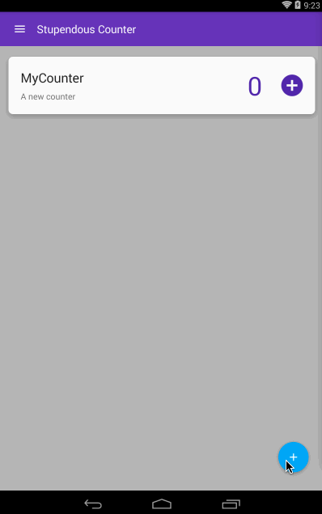
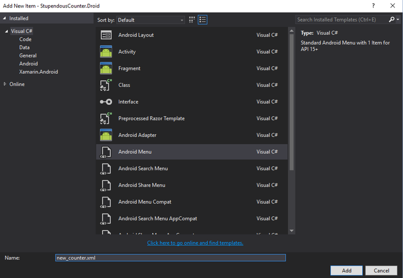
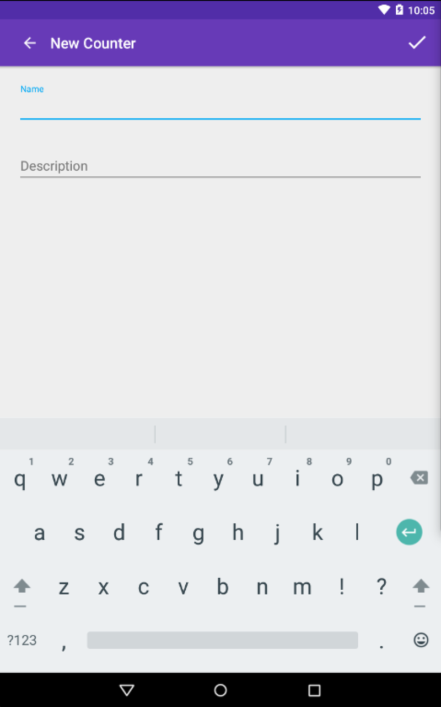

This is the fifth part in the my series about building an Android app using Xamarin.Android. I highly recommend reading these first.
The previous parts are:

* [Creating the basic app](/blogs/building-an-android-app-part-1/)
* [Defining our data](/blogs/building-an-android-app-part-2/)
* [Building view models](/blogs/building-a-xamarin-android-app-part-3/)
* [Binding the view models to the UI](/blogs/building-a-xamarin-android-app-part-4/)

#### Adding the Add button
Currently we have a nice recycler view showing our dummy counters in card views.  So the next step is to allow new counters to be added. The current way to add new items is using a floating action button - a button at the bottom of the screen that when pressed will add the new counter.

<div class="image-div" style="width: 300px;"> 
    

    
</div>
<br/>

First thing to do is add it to the layout in `counters_fragment.axml`.  At the moment this contains a `LinearLayout` but we'll need to change that to a `FrameLayout` so that the add button is correctly placed on top.  We're not using a normal button here, but a `FloatingActionButton`, a button designed to float above other controls in the view.  This means we can add a load of counters and scroll the recycler view up and down without the add button moving from it's floating location in the bottom right.

```
<FrameLayout xmlns:android="http://schemas.android.com/apk/res/android"
    xmlns:app="http://schemas.android.com/apk/res-auto"
    android:layout_width="fill_parent"
    android:layout_height="fill_parent">
    <android.support.v7.widget.RecyclerView
        android:id="@+id/countersRecyclerView"
        android:scrollbars="vertical"
        android:layout_width="fill_parent"
        android:layout_height="fill_parent"
        android:background="@color/divider" />
    <android.support.design.widget.FloatingActionButton
        android:id="@+id/floatingAddNewCounterButton"
        android:layout_width="wrap_content"
        android:layout_height="wrap_content"
        android:layout_gravity="bottom|right"
        android:layout_margin="16dp"
        android:elevation="4dp"
        android:scaleType="fitXY"
        android:src="@drawable/ic_add_white_24dp"
        app:borderWidth="0dp" />
</FrameLayout>
```

The icon being used here, `ic_add_white_24dp`, also comes from Googles material icons at https://design.google.com/icons/.  Its a 24dp icon, the recommended size for floating action buttons.  We don't need to set the colour of the action button, this automatically comes from the colours we added from Material Palette in [part 1](/blogs/building-an-android-app-part-1/).

#### Adding navigation
Now we have the add button, we need to think about what it needs to do.  We need this button to navigate to another activity where the user can enter details about the new counter and save it.  MVVMLight has a nice navigation system but we are limited in how we can use it because we are using AppCompat.  Luckily I've already created a workaround which is documented [on another blog post here](/blogs/mvvmlight-navigation-and-appcompatactivity/).  To add this working navigation we just need to add [the MVVMLight.AppCompat nuget package](https://www.nuget.org/packages/JimBobBennett.MvvmLight.AppCompat/), and set it up.  We start with the set up by changing our `BaseActivity` to derive from `AppCompatActivityBase`.
```
public abstract class BaseActivity : AppCompatActivityBase
```
Then we need to register the navigation and dialog services with the IoC container.  The concrete implementations of the services are platform specific, so we can't simply register them in the view model locator.  Instead we have to expose methods to allow the registration to happen externally so that we can call it from our Android project.  The following methods to register need to be added to the `ViewModelLoator`:
```
public static void RegisterNavigationService(INavigationService navigationService)
{
    SimpleIoc.Default.Register(() => navigationService);
}

public static void RegisterDialogService(IDialogService dialogService)
{
    SimpleIoc.Default.Register(() => dialogService);
}
```
These are then called from our `MainActivity` in a new constructor:
```
public MainActivity()
{
    var navigationService = new AppCompatNavigationService();
    ViewModelLocator.RegisterNavigationService(navigationService);
    ViewModelLocator.RegisterDialogService(new AppCompatDialogService());
}
```
Whilst we're editing the `MainActivity` it makes sense to delete the dummy counter code as well - seeing as we are adding the ability to add new counters we don't need to pre-populate the app with fake counters.  Just delete the `AddDummyData` method and the call to it.

#### Creating the new counter
To create the new counter we need to define a new activity to allow the user to enter details about the counter.  This activity needs a layout, a view model and to be wired into the navigation so that we can navigate to it from our new add button.

###### Layout
Lets start with the layout.  This needs to have text boxes so the user can enter the name and description for the counter, along with a button to create the new counter.  We're not going to bother with a cancel option - the UI will require the create button to be clicked to create the counter with back acting as a cancel, either the back button on the tool bar or the hardware back button.

```
<?xml version="1.0" encoding="utf-8"?>
<LinearLayout xmlns:android="http://schemas.android.com/apk/res/android"
    xmlns:app="http://schemas.android.com/apk/res-auto"
    android:orientation="vertical"
    android:layout_width="match_parent"
    android:layout_height="match_parent">
    <android.support.design.widget.AppBarLayout
        android:layout_height="wrap_content"
        android:layout_width="match_parent"
        android:id="@+id/toolbar_layout">
        <include
            android:id="@+id/toolbar"
            layout="@layout/toolbar"
            app:layout_scrollFlags="scroll|enterAlways" />
    </android.support.design.widget.AppBarLayout>
    <LinearLayout
        android:orientation="vertical"
        android:layout_width="match_parent"
        android:layout_height="match_parent"
        android:padding="24dp">
        <android.support.design.widget.TextInputLayout
            android:layout_width="match_parent"
            android:layout_height="wrap_content"
            android:layout_marginBottom="24dp">
            <EditText
                android:id="@+id/new_counter_name"
                android:layout_width="fill_parent"
                android:layout_height="wrap_content"
                android:hint="Name" />
        </android.support.design.widget.TextInputLayout>
        <android.support.design.widget.TextInputLayout
            android:layout_width="match_parent"
            android:layout_height="wrap_content"
            android:layout_marginBottom="24dp">
            <EditText
                android:id="@+id/new_counter_description"
                android:layout_width="fill_parent"
                android:layout_height="wrap_content"
                android:hint="Description" />
        </android.support.design.widget.TextInputLayout>
        <Button
            android:text="Create Counter"
            android:layout_width="match_parent"
            android:layout_height="wrap_content"
            android:id="@+id/new_counter_create" />
    </LinearLayout>
</LinearLayout>
```
This is a standard app bar layout showing the toolbar, same as the main layout, with text boxes for the name and description, and a 'Create Counter' button.  The cool thing we're doing here is the edit boxes.  We're not just using a boring label with a text box below, instead we're using a `TextInputLayout`.  This wraps the `EditText` so you see a hint inside the text box, then when you touch inside to enter the text the hint moves to above the box.

<div class="image-div" style="width: 300px;"> 
    

    
</div>
<br/>

###### View model
Before we create an activity to show this layout, lets create the view model.  We start by creating the `NewCounterViewModel` in our `ViewModel` folder.  The first part of this is to create the properties to hold the name and description fields.
 
```
public class NewCounterViewModel : ViewModelBase
{
    private string _name;

    public string Name
    {
        get { return _name; }
        set { Set(() => Name, ref _name, value); }
    }

    private string _description;

    public string Description
    {
        get { return _description; }
        set { Set(() => Description, ref _description, value); }
    }
}
```

This view model is derived from `ViewModelBase`, and the property setters use the base class `Set` method to not only set the value but to raise the relevant property change event.

Now we have the data part sorted, it's time to add some commands.

```
public class NewCounterViewModel : ViewModelBase
{
    private readonly IDatabaseHelper _databaseHelper;
    private readonly IDialogService _dialogService;
    private readonly INavigationService _navigationService;

    public NewCounterViewModel(IDatabaseHelper databaseHelper, IDialogService dialogService, INavigationService navigationService)
    {
        _databaseHelper = databaseHelper;
        _dialogService = dialogService;
        _navigationService = navigationService;
    }

    private RelayCommand _goBackCommand;
    public RelayCommand GoBackCommand => _goBackCommand ?? (_goBackCommand = new RelayCommand(() => _navigationService.GoBack()));

    private RelayCommand _addCounterCommand;
    public RelayCommand AddCounterCommand => _addCounterCommand ?? (_addCounterCommand = new RelayCommand(async () => await AddCounter()));

    private async Task AddCounter()
    {
        if (string.IsNullOrEmpty(Name))
        {
            await _dialogService.ShowError("The name must be set", "No name", "OK", null);
            return;
        }

        if (string.IsNullOrEmpty(Description))
        {
            await _dialogService.ShowError("The description must be set", "No description", "OK", null);
            return;
        }

        await _databaseHelper.AddOrUpdateCounterAsync(new Counter {Name = Name, Description = Description});
        _navigationService.GoBack();
    }
}
```
This adds two commands.  
The first is the `GoBackCommand`, which will be wired up to the toolbars back button.  This uses the navigation service that is injected into the constructor to navigate back - under the hood this pops the current activity off the stack and returns to the previous one, the same as the hardware back button.
The second command, `AddCounterCommand` will create and add a new command. It starts with some simple validation to ensure the values are set, and if not raises an alert using the MVVMLight dialog service injected into the constructor.  If this validation is passed the new counter is created, added to the database using the database helper injected into the constructor, and the activity is popped off the stack using the navigation service.

Like all good coders we should be testing our view model, so lets add `NewCounterViewModelTests` to the test project.
```
[TestFixture]
public class NewCounterViewModelTests
{
    private Mock<IDatabaseHelper> _mockDatabaseHelper;
    private Mock<IDialogService> _mockDialogService;
    private Mock<INavigationService> _mockNavigationService;

    [SetUp]
    public void SetUp()
    {
        _mockDatabaseHelper = new Mock<IDatabaseHelper>();
        _mockDialogService = new Mock<IDialogService>();
        _mockNavigationService = new Mock<INavigationService>();
    }

    [Test]
    public void SettingTheNameRaisesAPropertyChangedEvent()
    {
        var vm = new NewCounterViewModel(_mockDatabaseHelper.Object, _mockDialogService.Object, _mockNavigationService.Object);
        vm.MonitorEvents();
        vm.Name = "Foo";
        vm.ShouldRaisePropertyChangeFor(v => v.Name);
    }

    [Test]
    public void SettingTheDescriptionRaisesAPropertyChangedEvent()
    {
        var vm = new NewCounterViewModel(_mockDatabaseHelper.Object, _mockDialogService.Object, _mockNavigationService.Object);
        vm.MonitorEvents();
        vm.Description = "Foo";
        vm.ShouldRaisePropertyChangeFor(v => v.Description);
    }

    [Test]
    public void GoBackCommandNavigatesBackwards()
    {
        var vm = new NewCounterViewModel(_mockDatabaseHelper.Object, _mockDialogService.Object, _mockNavigationService.Object);
        vm.GoBackCommand.Execute(null);
        _mockNavigationService.Verify(n => n.GoBack(), Times.Once);
    }

    [Test]
    public void AddCommandRaisesAnErrorIfTheNameIsNotSet()
    {
        var vm = new NewCounterViewModel(_mockDatabaseHelper.Object, _mockDialogService.Object, _mockNavigationService.Object);
        vm.Description = "Bar";
        vm.AddCounterCommand.Execute(null);
        _mockDialogService.Verify(d => d.ShowError(It.IsAny<string>(), It.IsAny<string>(), It.IsAny<string>(), null), Times.Once);
        _mockDatabaseHelper.Verify(d => d.AddOrUpdateCounterAsync(It.IsAny<Counter>()), Times.Never);
    }

    [Test]
    public void AddCommandRaisesAnErrorIfTheDescriptionIsNotSet()
    {
        var vm = new NewCounterViewModel(_mockDatabaseHelper.Object, _mockDialogService.Object, _mockNavigationService.Object);
        vm.Name = "Foo";
        vm.AddCounterCommand.Execute(null);
        _mockDialogService.Verify(d => d.ShowError(It.IsAny<string>(), It.IsAny<string>(), It.IsAny<string>(), null), Times.Once);
        _mockDatabaseHelper.Verify(d => d.AddOrUpdateCounterAsync(It.IsAny<Counter>()), Times.Never);
    }

    [Test]
    public void AddComandAddsTheCounterAndNavigatesBack()
    {
        var vm = new NewCounterViewModel(_mockDatabaseHelper.Object, _mockDialogService.Object, _mockNavigationService.Object);
        vm.Name = "Foo";
        vm.Description = "Bar";
        vm.AddCounterCommand.Execute(null);
        _mockDialogService.Verify(d => d.ShowError(It.IsAny<string>(), It.IsAny<string>(), It.IsAny<string>(), null), Times.Never);
        _mockDatabaseHelper.Verify(d => d.AddOrUpdateCounterAsync(It.IsAny<Counter>()), Times.Once);
        _mockNavigationService.Verify(n => n.GoBack(), Times.Once);
    }
}
```
Because we're using dependency injection we can mock all the interfaces that are injected into the view model.  This means we can test the behaviour of the commands ensuring the `GoBackCommand` calls the relevant `GoBack` method on the navigation service, that the navigation doesn't happen if we add a counter with data missing and that if all the information is there the counter gets added to the database.  We can also check that setting the properties raises the relevant property change events.  We can get pretty awesome coverage here to ensure out view model works.

The last thing to do with the view model is to add it to our locator.  We need this so that the IoC container can resolve the constructor injection.

```
static ViewModelLocator()
{
    ...
    SimpleIoc.Default.Register<NewCounterViewModel>();
}

public const string NewCounterPageKey = "NewCounterPage";

public static NewCounterViewModel NewCounter => ServiceLocator.Current.GetInstance<NewCounterViewModel>();
```

Here we register it with the IoC container in the constructor.  Unfortunately SimpleIoC only supports singletons, so we have to always deal with a single instance - something we will have to consider later on.
Once registered we can expose a static property to return the instance, and a constant that defines a key for it.  This key will be registered with the navigation service once we have defined the activity.

###### Activity
We have our layout and we have our view model, so now we can create the Activity that brings it all together.

Lets start with the basics:
```
[Activity(Label = "New Counter")]
public class NewCounterActivity : BaseActivity
{
    protected override int LayoutResource => Resource.Layout.new_counter;

    public override bool OnOptionsItemSelected(IMenuItem item)
    {
        if (item.ItemId == Android.Resource.Id.Home)
        {
            ViewModel.GoBackCommand.Execute(null);
            return true;
        }
        return base.OnOptionsItemSelected(item);
    }
}
```

Here we're creating the activity, derived from our `BaseActivity`.  We override the `LayoutResource` to point to our new layout.  We also override 'OnOptionsItemSelected' to detect if the `Home` button is pressed, executing the command on our view model to navigate backwards.

Next we need to wire up the `NewCounterViewModel`.  We do this in the `OnCreate` method and store it in a public property (more on this later).  As mentioned earlier the IoC container only stores singletons, so we need to clear the data before we can use it to stop the view showing the name and description of the previous counter that was added.

```
public NewCounterViewModel ViewModel { get; private set; }

protected override void OnCreate(Bundle savedInstanceState)
{
    base.OnCreate(savedInstanceState);            
    ViewModel = ViewModelLocator.NewCounter;
    ViewModel.Name = string.Empty;
    ViewModel.Description = string.Empty;
}
```

Then we need to add public properties for the controls on our view.

```
private EditText _name;
public EditText Name => _name ?? (_name = FindViewById<EditText>(Resource.Id.new_counter_name));

private EditText _description;
public EditText Description => _description ?? (_description = FindViewById<EditText>(Resource.Id.new_counter_description));

private Button _createCounter;
public Button CreateCounter => _createCounter ?? (_createCounter = FindViewById<Button>(Resource.Id.new_counter_create));
```

These properties will resolve the widgets by looking for them in the layout, and once found stored in a field so we only need to do one lookup.

Lastly we need to bind the controls to the properties on the view model using the MVVMLight binding mechanism.  And this is where the public visibility of the properties comes into play.

```
private readonly List<Binding> _bindings = new List<Binding>();

protected override void OnCreate(Bundle savedInstanceState)
{
    ...
    Bind();
}

private void Bind()
{
    _bindings.Add(this.SetBinding(() => ViewModel.Name, () => Name.Text, BindingMode.TwoWay));
    _bindings.Add(this.SetBinding(() => ViewModel.Description, () => Description.Text, BindingMode.TwoWay));
    CreateCounter.SetCommand(nameof(Button.Click), ViewModel.AddCounterCommand);
}
```

In out `OnCreate` method we call a new method, `Bind`, that uses MVVMLight to bind up the properties.  MVVMLight has extension methods for binding properties and commands.  We call `SetBinding` passing in an expression that points to the source for the binding, an expression that points to the target, and the binding mode.

Behind the scenes the `SetBinding` method will resolve the expressions to the public properties on the object that the extension method is called on.  So for example in the first binding it looks at the source expression and finds the `ViewModel` property (remember from before that we made this property public), and on that view model finds the `Name` property.  It then looks at the target expression and resolves the public `Name` property on the Activity (the EditText public property we added earlier).  It will start by copying the value from the source by evaluating the `ViewModel.Name` property and setting it on the `Name.Text` property.  Then based on the binding mode it will wire up listeners for value changes.  We're using `BindingMode.TwoWay` so we need a two-way binding - changes in the source update the target and changes in the target update the source.  This means the binding will listen for property change events on the `ViewModel` and if one is raised for the `Name` property it will update the control, and it will listen for changes to the text of the `Name` edit text control, and if the test changes it will update the view model.
The `SetBinding` creates a weak binding, so we need to keep a reference to it to stop the garbage collector from cleaning up.  This is what the `_bindings` list is for.

As well as binding the properties, we need to bind the command.  This is done using the `SetCommand` extension method.  This takes the name of the event and a command to bind to.  It will find the event with the given name on the object the extension method is called on, and when that event is fired it will execute the command.  It also checks the `CanExecute` status of the command and will enable or disable the button depending on the value.  This is a nice way to enable or disable UI functionality from the view model.

Almost there - we now have an activity with a UI and a view model.  Now we need to navigate to it.

###### Navigating to the new activity
Navigation in MVVMLight is based around the idea of registering an activity against a key in your platform specific code, and navigating to that key in the portable code.
Registration happens when we first register the navigation service in the `MainActivity` constructor.  We call the `Configure` method passing in the key we defined in our `ViewModelLocator` earlier, and the type of Activity we want created when we navigate to this key.

```
public MainActivity()
{
    ....
    var navigationService = new AppCompatNavigationService();
    navigationService.Configure(ViewModelLocator.NewCounterPageKey, typeof(NewCounterActivity));
    ...
}
```

We can then add a command to the `CountersViewModel` to do this navigation using an injected `INavigationService`.
```
public CountersViewModel(IDatabaseHelper databaseHelper, INavigationService navigationService)
{
    ...
    _navigationService = navigationService;
    ...
}

private RelayCommand _addNewCounterCommand;
public RelayCommand AddNewCounterCommand => _addNewCounterCommand ?? (_addNewCounterCommand = new RelayCommand(AddNewCounter));

private void AddNewCounter()
{
    _navigationService.NavigateTo(ViewModelLocator.NewCounterPageKey);
}
```

This command when executed will call the `NavigateTo` method on the `INavigationService` passing the key that we defined earlier.  Once we make this call the navigation service does everything for us - creating the activity and pushing it onto the top of the navigation stack.  And because we're good developers we can add a unit test to our `CountersViewModelTests` to verify this as well.

```
[Test]
public void ExecutingAddNewCounterCommandShouldNavigateToTheNewCounterActivity()
{
    var vm = new CountersViewModel(_mockDatabaseHelper.Object, _mockNavigationService.Object);
    vm.AddNewCounterCommand.Execute(null);
    _mockNavigationService.Verify(n => n.NavigateTo(ViewModelLocator.NewCounterPageKey), Times.Once);
}
```

Finally we need to bind this command to the UI inside the `CountersFragment` using the MVVMLight `SetCommand` extension method we discussed above.

```
private FloatingActionButton _floatingActionButton;

public override View OnCreateView(LayoutInflater inflater, ViewGroup container, Bundle savedInstanceState)
{
    ...
    _floatingActionButton = view.FindViewById<FloatingActionButton>(Resource.Id.floatingAddNewCounterButton);
    _floatingActionButton.SetCommand(nameof(FloatingActionButton.Click), ViewModelLocator.Counters.AddNewCounterCommand);
    ...
}
```

Now this is all done we can run the app and test the navigation.

<div class="image-div" style="width: 400px;"> 
    

    
</div>
<br/>

###### Updating the counters in the UI
If you run and test this you will be able to add a new counter, but the list of counters won't be updated.  Recycler views are not able to automatically detect changes to the underlying collection. The final piece of the adding counters puzzle is to wire this up.
The best way to handle this is from the database layer up - we can raise an event in our database helper when the counters are changed, detect this in the counters view model and update our UI.

Let's start with the database helper by adding an event to our `IDatabaseHelper` interface:
```
event EventHandler CountersChanged;
```
Then we implement it in `DatabaseHelper`.
```
public async Task AddOrUpdateCounterAsync(Counter counter)
{
    ...
    OnCountersChanged();
}

public event EventHandler CountersChanged;

private void OnCountersChanged()
{
    CountersChanged?.Invoke(this, new EventArgs());
}
```
Notice the new C# 6 null-conditional operator.  This will check the value of `CountersChanged` and if this is null do nothing, otherwise it will call the `Invoke` method.  Lovely clean code!

We have our event, so lets wire it up in our `CountersViewModel` to update the counters we expose in the view model.
```
public CountersViewModel(IDatabaseHelper databaseHelper, INavigationService navigationService)
{
    ...
    _databaseHelper.CountersChanged += async (s, e) => await LoadCountersAsync();
    ...
}

public async Task LoadCountersAsync()
{
    _counters.Clear();
    ...
}
```
We're listening on the event and when it is fired reloading the counters from the SQLite database.  We're re-using the `LoadCountersAsync` method so we have to tweak it to always clear the collection before populating it with the data loaded from the database helper.

We now have our observable collection changing when the database changes, so we can listen on this to update the view.  This can be handled in the `CountersAdapter` - the component in the recycler view that adapts the counters collection to the UI.

```
public CountersAdapter()
{
    ((INotifyCollectionChanged)ViewModelLocator.Counters.Counters).CollectionChanged += OnCollectionChanged;
}

private void OnCollectionChanged(object sender, NotifyCollectionChangedEventArgs notifyCollectionChangedEventArgs)
{
    NotifyDataSetChanged();
}
```

In here we handle the collection change method and when fired call `NotifyDataSetChanged`, a method that tells the recycler view to update the items in the UI.  The `Counters` property on the `CountersViewModel` is a `ReadOnlyObservableCollection` which implements `INotifyCollectionChanged` explicitly, so we have to cast it to get access to the `CollectionChanged` event.

Note that this is not the most performant way of doing this.  Every action on the collection will cause the entire UI to be updated.  The reload is a clear then add of items one by one, so for example if there are 5 counters the `CollectionChanged` event will be raised 6 times and the UI will be fully rebuilt 6 times.  The use of `NotifyDataSetChanged` will also cause an entire UI rebuild - there are other notify methods that handle single item adds, deletes or moves which could be used to improve performance.  We could also improve the performance by implementing our own collection and only raising the event once.  In this case we don't have to worry too much - we don't need to be lightening fast as will only have a few items.

#### Lets test it all out
Now everything is wired up, lets take the app for a spin.

<div class="image-div" style="width: 400px;"> 
    

    
</div>
<br/>

<hr/>

#### Update

After feedback from the comments against this post, lets tweak the UI to have a button on the toolbar to create the counter instead of on the bottom of the view.

First we need to remove the button from the bottom of the `new_counter.axml` layout file - just need to delete the `Button` element.

Next we need a menu.  The way extra items are added to the toolbar is by creating a menu and inflating it into the toolbar.  There is a visual studio template for menus, so right click on the 'Resources/menu' folder and add a new item using the Android menu template called `new_counter_menu.xml`.

<div class="image-div" style="width: 700px;"> 
    

    
</div>

In this menu we need to add one item for the new counter button.

```
<?xml version="1.0" encoding="utf-8" ?>
<menu xmlns:android="http://schemas.android.com/apk/res/android"
      xmlns:app="http://schemas.android.com/apk/res-auto">
  <item android:id="@+id/action_create_counter"
        app:showAsAction="always"
        android:icon="@drawable/ic_done_white_48dp"/>
</menu>
```

The icon being used here is the done icon from Google's material icons mentioned above.  Download this one and copy it to the various drawable folders.
Notice as well the `showAsAction` property comes from the `xmlns:app="http://schemas.android.com/apk/res-auto"` namespace - if you use it from the `android` namespace then the menu item will appear on the overflow menu without an icon. 

Now we have our menu, we need to wire it up in the `NewCounterActivity`.  We can start here by deleting the `CreateCounter` button and all references to it.  Then we need to create the new menu in the toolbar.  This is done by overriding the `OnCreateMenuItems` method and loading our new menu into the toolbar in there.

```
public override bool OnCreateOptionsMenu(IMenu menu)
{
    base.OnCreateOptionsMenu(menu);
    Toolbar.InflateMenu(Resource.Menu.new_counter_menu);            
    return true;
}
```

Last thing to do is to handle the menu click in the `OnOptionsItemSelected` method.  When the new menu item is selected we need to execute the same command the previous button used.

```
public override bool OnOptionsItemSelected(IMenuItem item)
{
    switch (item.ItemId)
    {
        case Android.Resource.Id.Home:
            ViewModel.GoBackCommand.Execute(null);
            return true;
        case Resource.Id.action_create_counter:
            ViewModel.AddCounterCommand.Execute(null);
            return true;
        default:
            return base.OnOptionsItemSelected(item);
    }
}
```

Done!

<div class="image-div" style="width: 400px;"> 
    

    
</div>

<br/>

The code for this can be found in GitHub on the Part5 branch at https://github.com/jimbobbennett/StupendousCounter/tree/Part5

In the next part we'll work on deleting counters.

