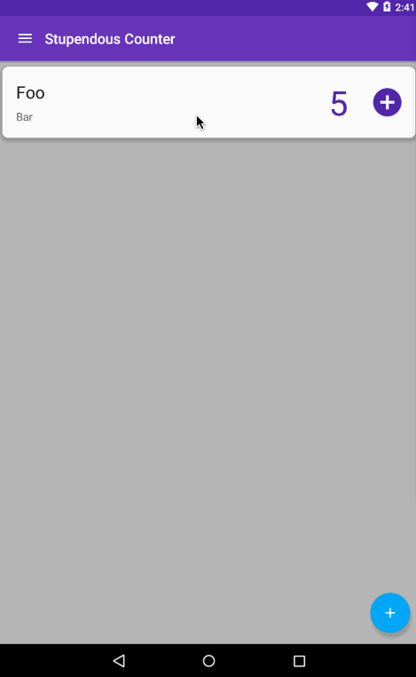

This is the sixth part in the my series about building an Android app using Xamarin.Android. I highly recommend reading the rest of the series first. 
The previous parts are:

* [Creating the basic app](/blogs/building-an-android-app-part-1/)
* [Defining our data](/blogs/building-an-android-app-part-2/)
* [Building view models](/blogs/building-a-xamarin-android-app-part-3/)
* [Binding the view models to the UI](/blogs/building-a-xamarin-android-app-part-4/)
* [Adding the add button](/blogs/building-a-xamarin-android-app-part-5/)

#### Editing and deleting our counters
So far we have a pretty nice but simple app - we can add new counters and increment them.  The next thing we need to add is the ability to edit or delete a counter.  Lets start at the bottom of our stack and work up to the UI.
We need to be able to edit or delete the counter - so we need a way to update the record or delete the row in out SQLite db, we need commands on our ViewModel to expose this, and we need a nice UI to handle the user interaction.

###### Basic UI design
Before we begin though, we should consider how the user will delete a counter, so that we can implement it in the correct way.  Our recycler view showing the counters is our way to interact with them - tapping on the plus button will increment the counter, so it makes sense to use this to drive editing a counter.  We already make use of tapping on the plus button, so a simple tap on the recycler view item may not be the best way to drive the edit (it would be too easy to tap the wrong thing and edit instead of incrementing the counter).  Instead we can take advantage of one of Androids other UI paradigm - the long touch.  If a user performs a long touch on the counter in our recycler view we can show a new activity where they can edit the name or description of the counter, or delete it (and we can re-use this screen later to show the counters history).

<div class="image-div" style="width: 300px;"> 
    

    
</div>
<br/>

Lets crack on with the implementation.

###### Database
In our `DatabaseHelper` we already have the ability to update counters using the `AddOrUpdateCounterAsync` method, so all we need to do is add an async delete method that takes a counter and deletes the row from SQLite.
This needs to be added to the interface:

```
public interface IDatabaseHelper
{
    Task DeleteCounterAsync(Counter counter);
    ...
}
```

And the implementation:
```
public async Task DeleteCounterAsync(Counter counter)
{
    var connection = new SQLiteAsyncConnection(_dbPath);
    await connection.DeleteAsync(counter);
    OnCountersChanged();
}
```

After the row is deleted we also need to raise the `CountersChanged` event to notify anything that is interested, such as our `CountersViewModel` that the counters have changed.

And obviously as we are good developers we need some tests for this in our Android unit test suite in the `DatabaseHelperTests` fixture to cover the deleting of rows and raising the collection changed event:

```
[Test]
public void DeletingACounterShouldDeleteTheCounter()
{
    var dbfile = Path.Combine(RootPath, Guid.NewGuid().ToString("N") + ".db3");

    DatabaseHelper.CreateDatabase(dbfile);

    var db = new DatabaseHelper();
    var counter = new Counter
    {
        Name = "TestCounter",
        Description = "A test counter"
    };
            
    var res = Task.Run(async () =>
    {
        await db.AddOrUpdateCounterAsync(counter);
        return 0;
    }).Result;
            
    var counters = Task.Run(async () => await db.GetAllCountersAsync()).Result;
            
    counters.Should().HaveCount(1);
            
    res = Task.Run(async () =>
    {
        await db.DeleteCounterAsync(counter);
        return 0;
    }).Result;

    counters = Task.Run(async () => await db.GetAllCountersAsync()).Result;
    counters.Should().HaveCount(0);
}

[Test]
public void DeletingACounterShouldRaiseTheCollectionChangedEvent()
{
    var dbfile = Path.Combine(RootPath, Guid.NewGuid().ToString("N") + ".db3");

    DatabaseHelper.CreateDatabase(dbfile);

    var db = new DatabaseHelper();
    var counter = new Counter
    {
        Name = "TestCounter",
        Description = "A test counter"
    };

    var res = Task.Run(async () =>
    {
        await db.AddOrUpdateCounterAsync(counter);
        return 0;
    }).Result;

    var eventRecorder = new EventRecorder(db, nameof(DatabaseHelper.CountersChanged));
    eventRecorder.RecordEvent();
            
    res = Task.Run(async () =>
    {
        await db.DeleteCounterAsync(counter);
        return 0;
    }).Result;

    eventRecorder.Should().HaveCount(1);
}
```

###### ViewModel
What we need here is a ViewModel that exposes properties for the name and description of our counter, as well as providing a mechanism to save or delete it.  We could build a new ViewModel for this, but we already have 2 ViewModels that represent counters with various levels of functionality on them - a `NewCounterViewModel` that allows the setting of the `Name` and `Description` properties, as well as a command to save the new counter to the database, and a `CounterViewModel` that has a readonly view of the counters details with a command to increment it's value.  Ideally we should follow the [DRY principle](https://en.wikipedia.org/wiki/Don%27t_repeat_yourself) and only have one, so instead of adding a new one, lets take this opportunity of refactoring the code to have only one ViewModel, and add our new requirements to it.

So lets take the `CounterViewModel` and make this work for all our scenarios.  First we need to change the `Name` and `Description` properties.  These are currently read only and just return the value from the counter.  What we'll do with these is make them read/write properties with a property change notification and a backing field, and set them in the constructor.  We don't want to use passthrough properties, we need a backing field.  This is because we want to allow the user to cancel their changes when they edit, if we pass the value straight through to the counter when we set it we will have to store the original value somewhere to allow us to revert it.  It's easier to save the values in a field and only apply them to the counter if the user saves the changes.

```
public CounterViewModel(Counter counter, IDatabaseHelper databaseHelper)
{
    ...
    Name = counter.Name;
    Description = counter.Description;
}

private string _name;
public string Name
{
    get { return _name; }
    set { Set(ref _name, value); }
}

private string _description;
public string Description
{
    get { return _description; }
    set { Set(ref _description, value); }
}
```

The `NewCounterViewModel` also has commands to add a new counter and navigate back.  The call on the database helper to add the new counter is the same as the one we will need to use to save the edits, `AddOrUpdateCounterAsync`, so lets copy the `AddCounterCommand` from the `NewCounterViewModel` and rename it to `SaveCommand` so it can be used for both new and edits.  We'll also need to add the `IDialogService` and `INavigationService` to the constructor parameters so they can be used by this command.

```
public CounterViewModel(Counter counter, IDatabaseHelper databaseHelper, IDialogService dialogService, INavigationService navigationService)
{
    _dialogService = dialogService;
    _navigationService = navigationService;
    ...
}

private RelayCommand _saveCommand;
public RelayCommand SaveCommand => _saveCommand ?? (_saveCommand = new RelayCommand(async () => await SaveAsync()));

private async Task SaveAsync()
{
    if (string.IsNullOrEmpty(Name))
    {
        await _dialogService.ShowError("The name must be set", "No name", "OK", null);
        return;
    }

    if (string.IsNullOrEmpty(Description))
    {
        await _dialogService.ShowError("The description must be set", "No description", "OK", null);
        return;
    }

    _counter.Name = Name;
    _counter.Description = Description;
    await _databaseHelper.AddOrUpdateCounterAsync(_counter);
    _navigationService.GoBack();
}
```

There is one code change made here as well - in the `NewCounterViewModel` a new `Counter` was created with the values from the properties.  Here  we use the `_counter` field, and update the values from our properties.

We can then add the `GoBackCommand` as well.

```
private RelayCommand _goBackCommand;
public RelayCommand GoBackCommand => _goBackCommand ?? (_goBackCommand = new RelayCommand(() => _navigationService.GoBack()));
```

Next we need to add the `DeleteCommand` to expose the new delete functionality we've added to the database helper.

```
private RelayCommand _deleteCommand;
public RelayCommand DeleteCommand => _deleteCommand ?? (_deleteCommand = new RelayCommand(async () => await DeleteAsync()));

private async Task DeleteAsync()
{
    if (await _dialogService.ShowMessage($"Are you sure you want to delete {Name}?", "Delete counter", "Yes", "No", null))
    {
        await _databaseHelper.DeleteCounterAsync(_counter);
        _navigationService.GoBack();
    }
}
```

Nothing unexpected or new here - we show a dialog confirming with the user that they want to delete, and if they say yes delete the counter from the database and navigate back.

To test this we also need to copy the tests from the `NewCounterViewModelTests` fixture, making the relevant changes to change the type of view model that is constructed.  We can then also add some tests for the `DeleteCommand`, as well as ensuring the saving tests will copy the values to the counter.

```
[Test]
public void ExecutingTheSaveCommandUpdatesTheChangesOnTheCounter()
{
    var counter = new Counter {Value = 10, Name = "Name", Description = "Description"};
    var vm = new CounterViewModel(counter, _mockDatabaseHelper.Object, _mockDialogService.Object, _mockNavigationService.Object);
    vm.Name = "New Name";
    vm.Description = "New Description";
    vm.SaveCommand.Execute(null);
    counter.Name.Should().Be("New Name");
    counter.Description.Should().Be("New Description");
}

[Test]
public void ExecutingTheSaveCommandUpdatesTheCounterInTheDatabase()
{
    var counter = new Counter { Value = 10, Name = "Name", Description = "Description" };
    var vm = new CounterViewModel(counter, _mockDatabaseHelper.Object, _mockDialogService.Object, _mockNavigationService.Object);
    vm.Name = "New Name";
    vm.Description = "New Description";
    vm.SaveCommand.Execute(null);
    _mockDatabaseHelper.Verify(d => d.AddOrUpdateCounterAsync(counter));
}

[Test]
public void ExecutingTheSaveCommandNavigatesBack()
{
    var vm = CreateCounterViewModel();
    vm.SaveCommand.Execute(null);
    _mockNavigationService.Verify(n => n.GoBack());
}

[Test]
public void ExecutingTheDeleteCommandConfirmsTheDelete()
{
    var vm = CreateCounterViewModel();
    vm.DeleteCommand.Execute(null);
    _mockDialogService.Verify(d => d.ShowMessage($"Are you sure you want to delete {vm.Name}?", "Delete counter", "Yes", "No", null));
}

[Test]
public void ExecutingTheDeleteCommandAndSelectingYesOnTheDialogDeletesTheCounter()
{
    var counter = new Counter { Value = 10, Name = "Name", Description = "Description" };
    var vm = new CounterViewModel(counter, _mockDatabaseHelper.Object, _mockDialogService.Object, _mockNavigationService.Object);
    _mockDialogService.Setup(d => d.ShowMessage($"Are you sure you want to delete {vm.Name}?", "Delete counter", "Yes", "No", null))
        .ReturnsAsync(true);
    vm.DeleteCommand.Execute(null);
    _mockDatabaseHelper.Verify(d => d.DeleteCounterAsync(counter), Times.Once);
}

[Test]
public void ExecutingTheDeleteCommandAndSelectingNoOnTheDialogDoesNotDeleteTheCounter()
{
    var counter = new Counter { Value = 10, Name = "Name", Description = "Description" };
    var vm = new CounterViewModel(counter, _mockDatabaseHelper.Object, _mockDialogService.Object, _mockNavigationService.Object);
    _mockDialogService.Setup(d => d.ShowMessage($"Are you sure you want to delete {vm.Name}?", "Delete counter", "Yes", "No", null))
        .ReturnsAsync(false);
    vm.DeleteCommand.Execute(null);
    _mockDatabaseHelper.Verify(d => d.DeleteCounterAsync(counter), Times.Never);
}
```

After doing this we can tidy up by deleting the `NewCounterViewModel` and `NewCounterViewModelTests` classes.  We also need to make the new code work.  At the moment the `NewCounterActivity` uses a `NewCounterViewModel`, and gets it from the `ViewModelLocator`, clearing the values each time.  We can delete it from the `ViewModelLocator`, change the type of the `ViewModel` property on the activity to be `CounterViewModel`, change the command that gets called to save, and create a new one with a new counter.

```
public CounterViewModel ViewModel { get; private set; }

protected override void OnCreate(Bundle savedInstanceState)
{
    ...
    ViewModel = GetCounterViewModel();
    ...
}

protected virtual CounterViewModel GetCounterViewModel()
{
    return new CounterViewModel(new Counter(),
        ViewModelLocator.DatabaseHelper,
        ViewModelLocator.DialogService,
        ViewModelLocator.NavigationService);
}

public override bool OnOptionsItemSelected(IMenuItem item)
{
    switch (item.ItemId)
    {
        ...
        case Resource.Id.action_save_counter:
            ViewModel.SaveCommand.Execute(null);
            return true;
        ...
    }
}
```

Notice how the `GetCounterViewModel` is protected and virtual?  We'll see why later when we look at creating the views.

We then need to update the `CountersViewModel` to pass the new parameters to the constructor for our `CounterViewModel`.  These extra parameters need to be added to the constructor so that the IoC container can populate them, then passed through once the `CounterViewModels` are created.

```
public CountersViewModel(IDatabaseHelper databaseHelper, INavigationService navigationService, IDialogService dialogService)
{
    _navigationService = navigationService;
    _dialogService = dialogService;
    ...
}

public async Task LoadCountersAsync()
{
    ...
    foreach (var counter in counters)
        _counters.Add(new CounterViewModel(counter, _databaseHelper, _dialogService, _navigationService));
}
```

Also here the `CountersViewModelTests` should be updated to mock up these extra parameters and pass them through when constructing the `CounterViewModels`.

We're almost there with the ViewModels part.  The last thing to think about is how we are actually going to start the editing process.  Android has a UI paradigm of a long press on an item in a list that leads to extra functionality, such as editing.  We can use this here - the user can long press on the counters in our recycler view and we can open an edit activity.  To make this work we need to add a command to our `CounterViewModel` that using the `INavigationService` to navigate to a new screen, passing the counter through.  First we define a new key for this in our `ViewModelLocator`.

```
public const string EditCounterPageKey = "EditCounterPage";
```

Then we add the command to our `CounterViewModel`.

```
private RelayCommand _editCommand;
public RelayCommand EditCommand => _editCommand ?? (_editCommand = new RelayCommand( Edit));

private void Edit()
{
    _navigationService.NavigateTo(ViewModelLocator.EditCounterPageKey, _counter);
}
```

Then we add a test to the `CounterViewModelTests`.

```
[Test]
public void ExecutingTheEditCommandNavigatesToTheEditScreen()
{
    var counter = new Counter();
    var vm = new CounterViewModel(counter, _mockDatabaseHelper.Object, _mockDialogService.Object, _mockNavigationService.Object);
    vm.EditCommand.Execute(null);

    _mockNavigationService.Verify(n => n.NavigateTo(ViewModelLocator.EditCounterPageKey, counter));
}
```

Done.  We now have everything in our ViewModels ready to start on the views.

###### Views

We need to do a few things with our views to get editing working - we need to handle the long press on the recycler view to launch the editing, then create a new activity and layout for the editing screen.

Lets start with the long press.  This is easy enough to implement in our existing `CounterViewHolder` class - we just add an event handler and execute our command from there.

```
public CounterViewHolder(View itemView) : base(itemView)
{
    ..
    itemView.LongClick += ItemLongClick;
}

private void ItemLongClick(object sender, View.LongClickEventArgs e)
{
    _counterViewModel.EditCommand.Execute(null);
}
```

Android also supports a nice animation for this - tap and see a highlight starting at the touch point and spreading out.  

<div class="image-div" style="width: 600px;"> 
    

    
</div>
<br/>

This is easy enough to implement, we just need to change the foreground of the `CardView` in the `counter_view.axml` layout file to use a stock Android selectable item background.

```
<android.support.v7.widget.CardView 
...
    android:foreground="?android:attr/selectableItemBackground">
```

We've got the long click looking awesome, and we've got the command executing.  Now lest create an activity that the command can launch.  For this we can create `EditCounterActivity`, and instead of deriving from `BaseActivity` like all the others, instead we can derive from `NewCounterActivity`.  This activity already has most of what we need - it has a layout that shows the name and description in edit controls which we can reuse, it has a save button, it uses the right ViewModel type.  All we need to change when we override it is how it creates the ViewModel, and add an extra menu item for the delete button.

Remember earlier we created a protected virtual method in the `NewCounterActvity` that creates a new `CounterViewModel`?  Well the reason for creating it as a virtual is that we can override it in our `EditCounterViewModel` and create a new one wrapping the counter passed to our navigation call in the `EditCommand` of the `CounterViewModel`.

```
protected override CounterViewModel GetCounterViewModel()
{
    var navigationService = ViewModelLocator.NavigationService;
    var counter = (Counter) ((AppCompatNavigationService) navigationService).GetAndRemoveParameter(Intent);
    return new CounterViewModel(counter,
        ViewModelLocator.DatabaseHelper,
        ViewModelLocator.DialogService,
        navigationService);
}
```

We have to cate the `INavigationService` to a `AppCompatNavigationService` to get data out of it.  This is because data passing is very platform specific, we need to give it the `Intent` that was used to launch the activity so that it can get the data out, and this is Android specific.  The interface is designed to be portable so contains no platform specific code, so we cast to the Android variant to get the data out.

Next we need the delete button on the menu.  For this we need a new menu called `edit_counter_menu.xml` containing this button.

```
<?xml version="1.0" encoding="utf-8" ?>
<menu xmlns:android="http://schemas.android.com/apk/res/android"
      xmlns:app="http://schemas.android.com/apk/res-auto">
  <item android:id="@+id/action_delete_counter"
        app:showAsAction="always"
        android:icon="@drawable/ic_delete_white_48dp"/>
</menu>
```

Th image here, `ic_delete_white_48dp` is once again dowloaded from [Google's material icons](https://design.google.com/icons/) and dropped into all the drawable folders.

In our activity we now need to create the menu, and handle when it gets pressed.

```
public override bool OnCreateOptionsMenu(IMenu menu)
{
    base.OnCreateOptionsMenu(menu);
    Toolbar.InflateMenu(Resource.Menu.edit_counter_menu);
    return true;
}

public override bool OnOptionsItemSelected(IMenuItem item)
{
    switch (item.ItemId)
    {
        case Resource.Id.action_delete_counter:
            ViewModel.DeleteCommand.Execute(null);
            return true;
        default:
            return base.OnOptionsItemSelected(item);
    }
}
```

These work the same way as the `NewCounterActivity` described in an earlier post.. The base calls in both these methods call down to the `NewCounterActivity` so that the original menu with the save button is created and handled.

The last little but we need to do is a UI tweak.  The `NewCounterActivity` sets the title to **New Counter**, but it would look nicer if we show that we are editing a counter. Also by default Android will set the focus on the first edit view, where MVVMLight sets the text, the focus ends up at the start of the text instead of the end.  We can get round this by calling `SetSelection` on the `Name` edit view in our `OnCreate` method after we bind the data in the base `OnCreate` method.

```
protected override void OnCreate(Bundle savedInstanceState)
{
    base.OnCreate(savedInstanceState);
    Title = $"Edit {ViewModel.Name}";
    Name.SetSelection(Name.Text.Length);
}
```

The last thing we need to do is wire up this activity to the new key we created for navigation in the `ViewModelLocator`.  All our wire ups are done in the `MainActivity` so lets add another entry.

```
public MainActivity()
{
    ...
    navigationService.Configure(ViewModelLocator.EditCounterPageKey, typeof(EditCounterActivity));
}
```

Done!

###### Lets try it all out

We have our database code written, we have our ViewModels working and our UI wired up.  Lets try it out.

<div class="image-div" style="width: 400px;"> 
    

    
</div>
<br/>

The code for this can be found in GitHub on the Part6 branch at https://github.com/jimbobbennett/StupendousCounter/tree/Part6

In the next part we'll look at showing the history information that we're storing against each counter.

