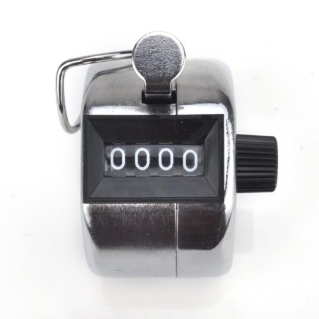
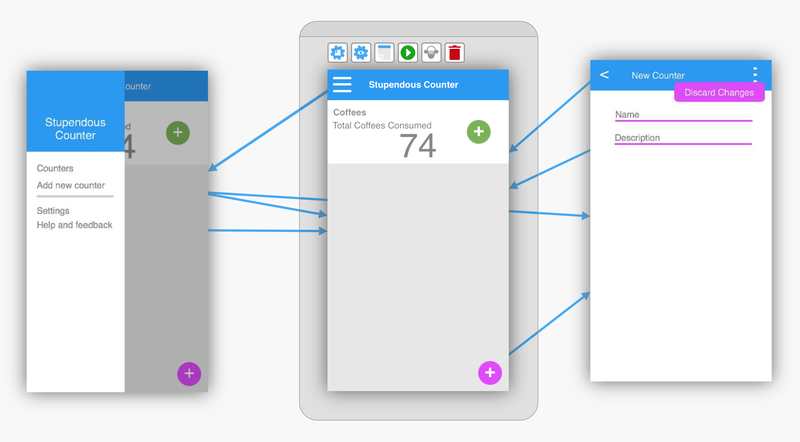
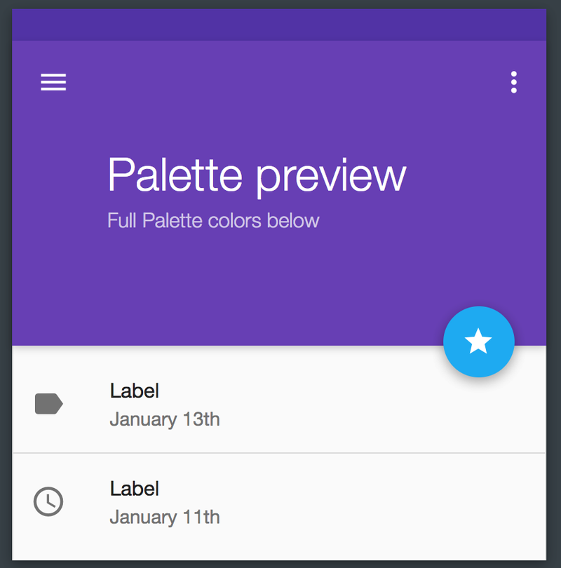
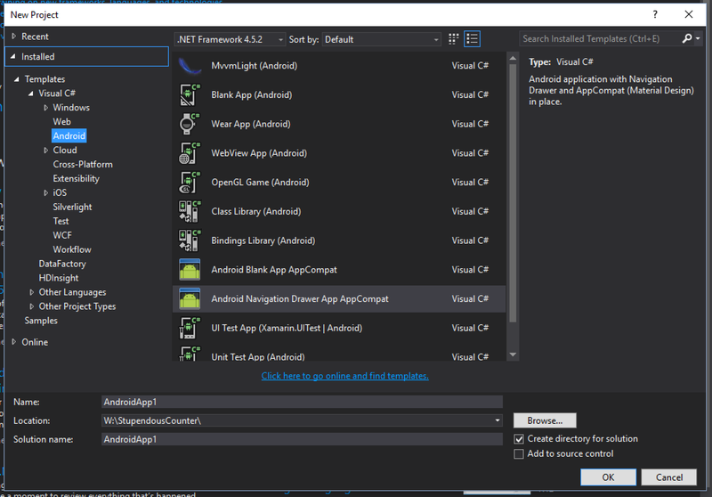
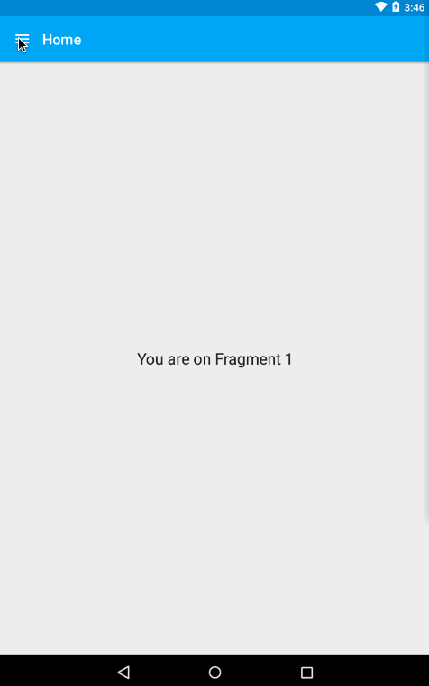
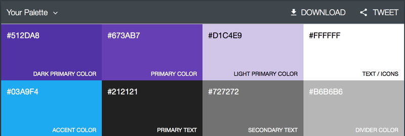
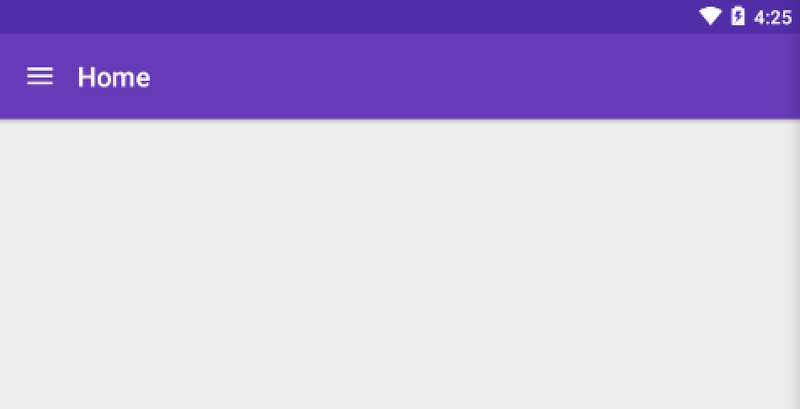
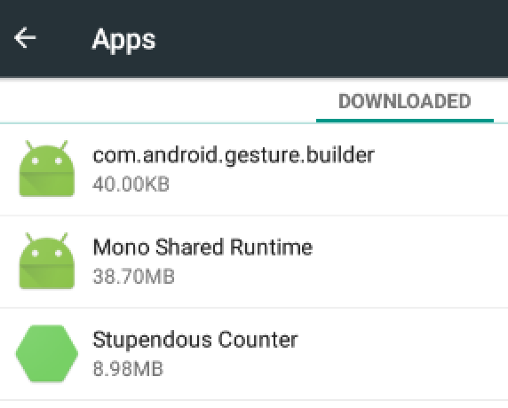
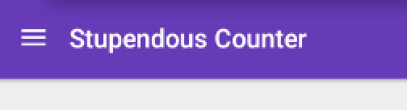

I've got a bit of time off between finishing my career as a slave to the world of finance IT and starting a new and exciting job as a Xamarin mobile app developer in New Zealand, so I thought I'd try to brush up on my Xamarin.Android knowledge as in the past I've mainly focused on iOS.

So to help me do this, I've decided to build and publish an app, and document the process.  So over the next few posts I'll be covering the development of Stupendous Counter - the most amazing counter app ever!

### Stupendous Counter

The purpose of this app is simple - to count things.  Think of it as an automated version of something like this:

    

    

Obviously being an app it should be a bit more advanced, so I'll be adding multiple named counters, count history with fancy charts, location based counts and other funky tools.

#### Design
First thing to do is to design the UI and flow of the app.  I find this a good way to start as it gives me a feel for the views I need to create, the structure of the data I need to store and manipulate and allows me to test the UI out on paper before committing to writing code.

I've been playing with a few tools to aid in design, and currently using [Fluid UI](https://www.fluidui.com).  It has a free tier that allows wireframe design, which is what I've been using.  As well as allowing you to wireframe your UI, you can also setup transitions between screens to test out your UI flow.

The design I've come up with is a fairly boring, bog standard Android app with all the usual bits - a navigation drawer that's poor UI, a [hamburger menu](http://exisweb.net/mobile-menu-abtest) and a [floating action button that does something you don't do very often](https://medium.com/tech-in-asia/material-design-why-the-floating-action-button-is-bad-ux-design-acd5b32c5ef#.babzdcoxi).

Here's a screenshot of the final design for the first version of the app:

And heres the transitions:

    

    

 

For the colour scheme I used [Material Palette](http://www.materialpalette.com) which is an awesome tool for choosing colours that work well together in a material design app or website.  As a traditional developer I'm bad at design and UI so I enlisted the help of my 3 year old daughter to choose the colours - a process that took ages as she was enjoying 'playing colours on daddy's computer'.

    

    

 

#### Let's get coding
And the best way to write code?  Get a tool to do it.  To create the basic app structure with styles, navigation buttons etc. you need a lot of boiler plate code.  Luckily James Montemagno from Xamarin has done the hard work for us with his [Xamarin.Android templates for Visual Studio](http://motzcod.es/post/123682330002/new-improved-xamarinandroid-templates-for).  These templates provide the boiler plate code for a basic AppCompat app, or an AppCompat app with a navigation drawer.

    

    

 

To start with, I'm going to create a Navigation Drawer App called StupendousCounter.Droid.  Note the name ends in .Droid, not .Android - otherwise you get a load of namespace clashes with the Android namespace).

    

    

 

Once the app is created, it looks like this:

    

    

 

First thing to do is to make it more like what I'm after.  The App name is wrong, the colours don't match the scheme chosen by my daughter.

###### Colours
Setting the colours is easy.  In the template there is already a style defined in `Resources/values/styles.xml` which references colours defined in `Resources/values/colors.xml`.  In the colors.xml file are a set of colour properties that match the output from Material Palette:

 

 

These colours can be downloaded as an XML file and the values copied in - you can't just drop the xml file in as the names don't write match - for example it's primaryDark in the template generated code and primary_dark in the material Palette output, but it's pretty obvious which value to copy into each field.
Once done the app looks a bit more like what we're after:

    

    

 

###### App name
The App name is in two parts - first the app name in the manifest file which defines the name given in the app settings, second the activity name that appears on the launcher.
The app name in the manifest file (`Properties\AndroidManifest.xml`) is defined as `android:label="@string/app_name"`, so correctly referring to a strings resource file located at `Resouces\values\strings.xml`. This is the recommended way to handle all text in your app so that you can easily localise it as described on the [Android developer docs](http://developer.android.com/training/basics/supporting-devices/languages.html).  Setting the app name is therefore nice and easy, just change the strings.xml to have `<string name="app_name">Stupendous Counter</string>`.  You may need to restart you emulator after re-deploying the app - XAP doesn't update the name in the settings until you restart.

The main activity is not set up like this though - the template creates it with a hard-coded label of "Home". I'd like this to match the app name so it's consistent, so it's a simple case of changing it to match the manifest: `[Activity(Label = "@string/app_name", ...)]`.  Android uses the @ symbol to indicate a resource, so this syntax will correctly load the activities label from the string resources.

Once done it looks like this:

<table cellspacing="0" cellpadding="0" style='border: none;border-collapse: collapse;'>
<tr style='padding: 0;vertical-align: top;'>
<td style='padding: 0;vertical-align: top;'>

    

    

</td>
<td style='padding: 0px 10px;vertical-align: top;'>

    

    

</td>
<td style='padding: 0;vertical-align: top;'>

    

    

</td>
</tr>
</table>
 

Done!  Now we have a nice navigation drawer based app shell with the right name and the correct colours.  In the [next part](/blogs/building-an-android-app-part-2/) we'll start adding some functionality.
The code for this is on Github here: https://github.com/jimbobbennett/StupendousCounter/tree/Part1
The code in the Part1 branch is the code for this part.  The changes we make in later blog posts will be in other branches.

 

#### Some useful bits
Here's a couple of useful tips I cam across when writing this:
###### Debugging XAP when using a VM
My developer setup is a MacBook Pro running Windows 10 through Parallels and using Visual Studio 2015, with Xamarin Android Player installed as a Mac app, not a windows App (I use it from Xamarin Studio running on the Mac as well, so saving space/download time when upgrading etc. by only having it once).  It's pretty easy to run and debug Android apps on a player running natively on the Mac from VS on a Windows VM - instructions are [here](https://developer.xamarin.com/guides/android/deployment,_testing,_and_metrics/android-player-with-visual-studio-in-vm/).

###### Big shoutout to Cockos
The animated Gifs in this blog post were captured using [LICEcap from Cockos](http://www.cockos.com/licecap/), an awesome free .Gif capture tool.

<table cellspacing="0" cellpadding="0" style='border: none;border-collapse: collapse;'>
<tr style='padding: 0;'>
<td style='padding: 0;vertical-align: top;'>
<iframe style="width:120px;height:240px;" marginwidth="0" marginheight="0" scrolling="no" frameborder="0" src="//ws-eu.amazon-adsystem.com/widgets/q?ServiceVersion=20070822&OneJS=1&Operation=GetAdHtml&MarketPlace=GB&source=ss&ref=ss_til&ad_type=product_link&tracking_id=expecti-21&marketplace=amazon&region=GB&placement=B00FLW5G74&asins=B00FLW5G74&linkId=&show_border=false&link_opens_in_new_window=true">
</iframe>
</td>
<td style='padding: 0px 30px;'>

And as a side line I'll also be listing the music I'm listening to when developing.  Right now I'm listening to 'The Shocking Miss Emerald' by <a href='http://www.caroemerald.com'>Caro Emerald</a>.

Note - this is an affiliate link - if you click here and buy I get a small cut.

</td>
</tr>
</table>

