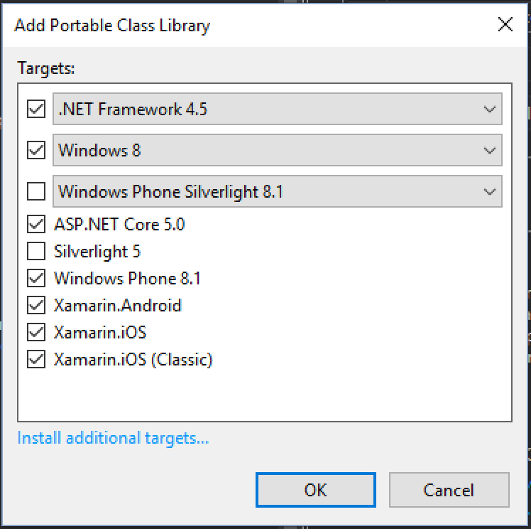

This is the second part in the my series about building an Android app using Xamarin.Android.  You can find the first part [here](/blogs/building-an-android-app-part-1/), and I highly recommend reading that first.

#### Time to think about data
<div class="image-div" style="width: 200px;">
    

    
</div>
<br/>

In the last post we put together the basic app shell, colour scheme etc.  Now lets think about the data model, and how we are going to persist the data - it's no good having a counter if the data is lost every time the app is restarted.  For persistence we'll simply use SQLite as we just need something to be stored locally for now.

The basic set of classes we need are something to represent a counter with its name, description and current value, and a way of storing the dates the counters were incremented.  This historical data would allow us to see when counters were incremented - for example it may be nice to see that your 'cup of coffee' count is 74 but it would also be nice to show that in a chart showing cups per day instead of just the total.

###### PCL
Now 'because we're not animals' (phrase &copy;2016 [Mike James]()) I'll be putting all the data and business logic into a portable class library (PCL) so that we can easily port this to another platform if required.  If you don't know what a PCL is I suggest you [read the docs](https://developer.xamarin.com/guides/cross-platform/application_fundamentals/pcl/).

First we create the PCL - I'm going to call it StupendousCounter.Core.

<div class="image-div" style="width: 700px;">
    

    
</div>
<br/>

When you create a PCL you have to select which targets it supports so that VS can ensure the right subset of the .Net framework is available.  The following targets need to be selected:

<div class="image-div" style="width: 400px;">
    

    
</div>
<br/>

Once created we can delete the class1.cs file that is auto generated.

###### SQLite
Next, we're going to need to add SQLite.  There's a number of different nuget packages we could add, and a selection of ways we can do this but for this we're going to use [SQLite-net-pcl](https://www.nuget.org/packages/sqlite-net-pcl/).  Note that this is the SQLite-net**-pcl** version, not the base SQLite-net version which won't work with a PCL.  This nuget package needs to be added to both projects - the .Core and the .Droid.

It's really easy to create classes that can be stored in SQLite - it can store simple data types out of the box and has attributes to handle fun things like auto-incrementing primary keys.

This is the class we'll be using for our counters.  This is defined in `Counter.cs`:

```
using SQLite;

namespace StupendousCounter.Core
{
    public class Counter
    {
        [PrimaryKey, AutoIncrement]
        public int Id { get; set; }

        public string Name { get; set; }
        public string Description { get; set; }
        public long Value { get; set; }
    }
}
```

<br/>

And this is the counter history, defined in `CounterIncrementHistory.cs`:

```
using System;

namespace StupendousCounter.Core
{
    public class CounterIncrementHistory
    {
        [Indexed]
        public int CounterId { get; set; }
        public DateTime IncrementDateTimeUtc { get; set; }
    }
}
```

<br/>

Note the `[Indexed]` attribute on the CounterId so that this column gets indexed.

That's the data classes sorted, now we need to think about how we store and retrieve this data.

###### Database connection
To help us handle the relationships between the counter and it's history, and to abstract away the database from the application (good [separation of concerns](https://en.wikipedia.org/wiki/Separation_of_concerns) helps with unit testing which we'll add later), we'll need to create a database helper.  This will contain methods to retrieve all counters, create a new one, update an existing one or increment the counter (and persist the change to the history).
We start by creating an interface that defines our helper.  It needs to be an interface so that we can [mock it out later when unit testing](https://github.com/Moq/moq4).

Here's the interface code defined in `IDatabaseHelper.cs`:

```
using System.Collections.Generic;
using System.Threading.Tasks;

namespace StupendousCounter.Core
{
    public interface IDatabaseHelper
    {
        Task AddOrUpdateCounterAsync(Counter counter);
        Task IncrementCounterAsync(Counter counter);
        Task<IEnumerable<Counter>> GetAllCountersAsync();
        Task<IEnumerable<CounterIncrementHistory>> GetCounterHistoryAsync(int counterId);
    }
}
```

<br/>

Notice all the methods are set up ready to use async/await because we're writing modern code and want to do it properly!

Now lets start constructing the implementation (or to be honest lets get [Resharper](https://www.jetbrains.com/resharper/) to create our implementation) in `DatabaseHelper.cs`:

```
using System.Collections.Generic;
using System.Threading.Tasks;

namespace StupendousCounter.Core
{
    public class DatabaseHelper : IDatabaseHelper
    {   
        public async Task AddOrUpdateCounterAsync(Counter counter)
        {
            throw new System.NotImplementedException();
        }

        public async Task IncrementCounterAsync(Counter counter)
        {
            throw new System.NotImplementedException();
        }

        public async Task<IEnumerable<Counter>> GetAllCountersAsync()
        {
            throw new System.NotImplementedException();
        }

        public async Task<IEnumerable<CounterIncrementHistory>> GetCounterHistoryAsync(int counterId)
        {
            throw new NotImplementedException();
        }
    }
}
```

<br/>

SQLite is a file based database - it stores it's data in a single .db file that is stored locally on the device.  This location is different depending on which OS it's running on, so Android puts these files in one place, iOS somewhere different.  This means that we have to do some work in the Android project itself to construct the path to the database file, and this path needs to be available to our database helper implementation.  We also need to initialise the database to create the tables that will be storing our data.  The simplest way to do this is to have a static initialisation method that we call from the MainActivity:

```
    public class DatabaseHelper : IDatabaseHelper
    {
        public static void CreateDatabase(string dbPath)
        {}
```

<br/>

In Android the correct place to store your SQLite database files according to Xamarin is in the personal folder, which is defined quite helpfully in `System.Environment.SpecialFolder.Personal`.  Honestly I've yet to find out exactly why this is the recommended place, so if you know please let me know!

In our `MainActivity.cs`, in the `OnCreate` method we can grab this folder, add a db file and pass that to the CreateDatabase method on our database helper:

```
protected override void OnCreate(Bundle savedInstanceState)
{
    base.OnCreate(savedInstanceState);
    var path = System.Environment.GetFolderPath(System.Environment.SpecialFolder.Personal);
    var dbPath = Path.Combine(path, "counters.db3");
    DatabaseHelper.CreateDatabase(dbPath);
```

<br/>

There are nicer ways of doing this, and we'll improve this in a later part, so don't be too offended by this implementation.

For the body of the `CreateDatabase` we store the db file path, open the database and create all the tables.  Luckily SQLite is smart enough to not create the tables if they already exist, so this can be run as many times as you want without worrying about corrupting data.

```
private static string _dbPath;
public static void CreateDatabase(string dbPath)
{
    _dbPath = dbPath;
    using (var connection = new SQLiteConnection(dbPath, SQLiteOpenFlags.Create|SQLiteOpenFlags.ReadWrite))
    {
        connection.CreateTable<Counter>();
        connection.CreateTable<CounterIncrementHistory>();
    }
}
```

<br/>

Now lets implement the main logic.  First up, `AddOrUpdateCounterAsync`:

```
public async Task AddOrUpdateCounterAsync(Counter counter)
{
    var connection = new SQLiteAsyncConnection(_dbPath);
    if (counter.Id == 0)
        await connection.InsertAsync(counter);
    else
        await connection.InsertOrReplaceAsync(counter);
}
```

<br/>

This method checks the id on the counter - if it's 0 then its a new counter and is inserted, otherwise it's updated. Remember our Id field had the `[PrimaryKey]` attribute, so that's how SQLite can know which counter to update.
For the update we use the `InsertOrReplace` method, and this checks the Id against the database and if it's not found then it inserts the item, otherwise it replaces it.  Now this sounds a lot like what we've implemented ourselves, so why do we do the check for an Id of 0 and call `Insert` if found?  The reason is the `[AutoIncrement]` attribute.  This tells SQLite to automatically increment the id to get the next one - so if we have 10 items in the database and we insert one more it gets its id set to 11.  If we insert this counter using `Insert` then the id on our object gets updated - so we can see the new Id in the Counter instance that is passed in.  If we call `InsertOrReplace` it doesn't update the instance passed id.  I'm not sure if this is by design or a bug but it's a bit annoying, hence the workaround of calling `Insert` if the id is 0.  This way once this method is called we can always trust the id of the Counter we passed in.

Second up is `IncrementCounterAsync`:

```
public async Task IncrementCounterAsync(Counter counter)
{
    var connection = new SQLiteAsyncConnection(_dbPath);

    counter.Value++;
    await AddOrUpdateCounterAsync(counter);
    var history = new CounterIncrementHistory
    {
        CounterId = counter.Id,
        IncrementDateTimeUtc = DateTime.UtcNow
    };

    await connection.InsertAsync(history);
}
```

<br/>

This is a little bit more involved.  First up it increments the value, then updates the entry in the database to reflect the new value (using our `AddorUpdateAsync` method to ensure the Id on the Counter is updated).  Next we create a history entry, then this history entry gets inserted.  Note that the timestamp is stored as UTC time - this allows the times to be adjusted for wherever the user is and if they increment in a different time zone the data doesn't get out of whack.

Thirdly we need to implement `GetAllCountersAsync`:

```
public async Task<IEnumerable<Counter>> GetAllCountersAsync()
{
    var connection = new SQLiteAsyncConnection(_dbPath);
    return await connection.Table<Counter>().ToListAsync();
}
```

<br/>

The generic `Table<T>` method on the connection returns the table that stores the given type, and from there we get it back as a list of Counters from the database.
Just be aware though - these will be new instances.  So if you add a Counter then get all the Counter you have added will be a different instance than the Counter in the collection with the same Id.

Finally we need to implement `GetCounterHistoryAsync`:

```
public async Task<IEnumerable<CounterIncrementHistory>> GetCounterHistory(int counterId)
{
    var connection = new SQLiteAsyncConnection(_dbPath);
    return await connection.Table<CounterIncrementHistory>().Where(c => c.CounterId == counterId).ToListAsync();
}
```

<br/>

This queries the history based off the counter id.

This is our database connection all finished - so now lets test it.  We haven't wired it up to the UI yet, so lets test it by building some unit tests.

#### Unit testing our database connection
The best way to verify everything is working is with a stack of unit tests.  Normally when writing C# code you create a console application or a class library and create your tests in there.  This works well for simple cases, but with SQLite I don't think it quite cuts the mustard.  The problem is the platform specific implementation of SQLite might be different on Android (the platform we're targeting) and Windows (the platform the tests would be run on).
Luckily there is a way to easily run unit tests on Android - a Xamarin Android Unit test project.  So lets start be creating a new project of this type.

<div class="image-div" style="width: 700px;">
    

    
</div>
<br/>

This project creates an Android app that runs our unit tests.  It uses a custom variant of NUnit called `Xamarin.Android.NUnitLite`, but for all intents and purposes this can be used like NUnit.
The app runs like any other Android app and has a 'Run Tests' button.  This will work through all classes in the project with the NUnit `[TestFixture]` attribute and run all methods with the `[Test]` attribute, dumping their output to the screen.

<div class="image-div" style="width: 300px;">
    

    
</div>
<br/>

We do have to install a couple of other nuget packages as well - first we need SQLite-pcl-net of course.  Second we need FluentAssertions.Xamarin - simply because I love the assertion syntax of Fluent Assertions and this is a version that runs on mobile.

Once all these packages are installed, we can bin the auto-created tests file and create our own called `DatabaseHelpersTests.cs`.

###### Writing our first test
Lets start with a simple test to start with which is to test that a newly inserted Counter gets its Id set.
In our `DatabaseHelpersTests.cs` first we mark the class with the `[TestFixture]` attribute
```
[TestFixture]
public class DatabaseHelperTests
```

<br/>

Then we can create our first test:

```
[Test]
public void InsertingACounterShouldSetItsIdAsync()
{
    var dbfile = Path.Combine(RootPath, Guid.NewGuid().ToString("N") + ".db3");

    DatabaseHelper.CreateDatabase(dbfile);

    var db = new DatabaseHelper();
    var counter = new Counter
    {
        Name = "TestCounter",
        Description = "A test counter"
    };

    counter.Id.Should().Be(0);

    var res = Task.Run(async () =>
    {
        await db.AddOrUpdateCounterAsync(counter);
        return 0;
    }).Result;

    counter.Id.Should().Be(1);
}
```

<br/>

What this test does is create a database with a new unique name (so we can ensure the database is clean), it then creates a new counter and verifies the Id is 0 (love me that assertion syntax!). 
The next is the odd bit.  If you create an async unit test it seems to hang when running it on the simulator, so to work around it I have to run the async code in a Task that is waited for.  This works.  Very annoying, but not much else we can do.
Once the counter is inserted we assert that the counter is updated to 1.

Launching the test app and clicking 'Run Tests' will run this test and you'll see it pass, with '1 test passed' showing on the app.

I'll add a selection of other tests as well, and these can all be seen in the code on GitHub in the Part2 branch at [https://github.com/jimbobbennett/StupendousCounter/tree/Part2](https://github.com/jimbobbennett/StupendousCounter/tree/Part2).

In the [next part](/blogs/building-a-xamarin-android-app-part-3/) we'll start wiring the UI up to the data using [MVVMLight](http://www.mvvmlight.net).

<hr/>

<p>
<table cellspacing="0" cellpadding="0" style='border: none;border-collapse: collapse;'>
<tr style='padding: 0;'>
<td style='padding: 0;vertical-align: top;'>
<iframe style="width:120px;height:240px;" marginwidth="0" marginheight="0" scrolling="no" frameborder="0" src="//ws-eu.amazon-adsystem.com/widgets/q?ServiceVersion=20070822&OneJS=1&Operation=GetAdHtml&MarketPlace=GB&source=ss&ref=ss_til&ad_type=product_link&tracking_id=expecti-21&marketplace=amazon&region=GB&placement=B00E4JGPO8&asins=B00E4JGPO8&linkId=&show_border=false&link_opens_in_new_window=true">
</iframe>
</td>
<td style='padding: 0px 30px;vertical-align: top;'>
<iframe style="width:120px;height:240px;" marginwidth="0" marginheight="0" scrolling="no" frameborder="0" src="//ws-eu.amazon-adsystem.com/widgets/q?ServiceVersion=20070822&OneJS=1&Operation=GetAdHtml&MarketPlace=GB&source=ss&ref=ss_til&ad_type=product_link&tracking_id=expecti-21&marketplace=amazon&region=GB&placement=B00JLZVJSM&asins=B00JLZVJSM&linkId=&show_border=false&link_opens_in_new_window=true">
</iframe>
</td>
<td style='padding: 0px 30px;vertical-align: top;'>
<iframe style="width:120px;height:240px;" marginwidth="0" marginheight="0" scrolling="no" frameborder="0" src="//ws-eu.amazon-adsystem.com/widgets/q?ServiceVersion=20070822&OneJS=1&Operation=GetAdHtml&MarketPlace=GB&source=ss&ref=ss_til&ad_type=product_link&tracking_id=expecti-21&marketplace=amazon&region=GB&placement=B008CYV046&asins=B008CYV046&linkId=&show_border=false&link_opens_in_new_window=true">
</iframe>
</td>
<td style='padding: 0px 30px;'>
<p style='color:rgb(104, 104, 104);!important;'>Continuing on from the last post where I mentioned what I was listening to whilst developing, today I'm listening to <a href='http://www.nicolabenedetti.co.uk'>Nicola Benedetti</a></p>
<p style='color:rgb(104, 104, 104);!important;'>Note - these are an affiliate links - if you click them and buy I get a small cut.</p>
</td>
</tr>
</table>
</p>

