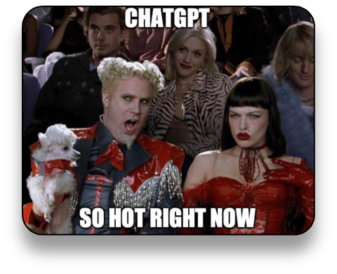

ChatGPT is the latest big thing, reaching over 100 million users in just 2 months. It's being used by millions of people for all manner of tasks, and it feels like every day there are 10 new startups leveraging either ChatGPT or the large language models (LLMs) that power it.



So what if you want to build your own version of ChatGPT, or another app that leverages an LLM? Out of the box, LLMs just provide an API to send a prompt and get a response, so what tools are there to help?

One tool is Semantic Kernel, an open source .NET library from Microsoft that is designed to do a lot of the heavy lifting when it comes to interacting with LLMs.


**If you prefer video, here's a 10 minute video version of this blog post**



## How does ChatGPT work with an LLM?

ChatGPT allows you to have a conversation with a large language model, with ChatGPT being able to base the response to one question on the results of previous questions.

For example, if you ask it:

> What is the most recent star wars movie?


It will respond something like:

> The most recent Star Wars movie is "Star Wars: The Rise of Skywalker," which was released in December 2019. It is the ninth and final installment in the Skywalker saga.


If you then ask a follow up question such as:

> Who is the main character?

The response will 'know' that the question refers to the movie the Rise of Skywalker:

> The main character in "Star Wars: The Rise of Skywalker" is Rey, played by Daisy Ridley. She is a powerful Jedi who is trying to find her place in the galaxy and confronts the evil First Order, led by Kylo Ren, played by Adam Driver. The movie also features other beloved characters from the Star Wars franchise, such as Finn, Poe Dameron, Chewbacca, and C-3PO.

LLMs, the core technology behind ChatGPT, don’t chat – they take a prompt and return a response, that’s all. To chat, they need to be guided by having access to the previous questions and responses.

ChatGPT works by doing the following:

* The user enters a question, referred to as a prompt
* This prompt is enriched by a system prompt that helps guide the LLM, such as 'you are a helpful chatbot'
* The prompt is sent to the LLM and the response is returned to the user
* The user enters a second question
* This time the prompt is enriched by the system prompt as well as the previous question and response
* The prompt is sent to the LLM and the response is returned to the user

For example, when the second question is sent, the full prompt might be:

> You are a helpful chatbot. You were asked 'What is the most recent star wars movie?' and you answered 'The most recent Star Wars movie is "Star Wars: The Rise of Skywalker," which was released in December 2019. It is the ninth and final installment in the Skywalker saga'. Who is the main character?

To implement your own ChatGPT you need to implement code to get the prompt from the user, enrich it with a system prompt, send it to the LLM, get the response, then enrich further questions with the previous questions and responses.

## How can semantic kernel help?

Semantic Kernel provides a load of features to help you implement this:

* Services to interact with LLMs from OpenAI either directly or via the Azure OpenAI service
* System prompts to pre-configure the conversation
* Chat history, or 'memory'
* Semantic functions that can be defined in code such as getting user input and returning the response, or defined as prompts that can be sent to the LLM
* Function pipelines to chain semantic functions
* Core skills such as interacting with HTTP APIs or files.

### Semantic functions and pipelines

The core of semantic kernel is a pipeline that runs a series of functions. These functions either take text, return text, or both. Large language models work with text, so text is the main way to interact. The idea of the pipeline is text is passed through from function to function.

For example, for a ChatGPT clone, you could have a pipeline that gets input from the user, sends it to the LLM with the previous questions and responses, then send the response back to the user.

For a sample project, check out [github.com/jimbobbennett/console-gpt](https://github.com/jimbobbennett/console-gpt).

In this code, there is a `ConsoleGPTService` that has a pipeline:

```csharp
ISKFunction[] pipeline = {_speechSkill["Listen"], _chatSkill["Prompt"], _speechSkill["Respond"]};
await _semanticKernel.RunAsync(pipeline);
```

This pipeline runs 3 semantic functions, routing the output of one into the input of the other. Semantic functions are C# functions that are marked with an attribute and loaded into the pipeline.

The `Listen` function in this code is defined in the `ConsoleSkill` and gets data from the console:

```csharp
[SKFunction("Get console input.")]
[SKFunctionName("Listen")]
public Task<string> Listen(SKContext context)
{
    return Task.Run(() => Console.ReadLine());
}
```

This returns what the used inputs, and this is passed to the `Prompt` semantic function in the `ChatSkill`:

```csharp
[SKFunction("Send a prompt to the LLM.")]
[SKFunctionName("Prompt")]
public async Task<string> Prompt(string prompt)
{
    _chatHistory.AddUserMessage(prompt);
    var reply = await _chatCompletion.GenerateMessageAsync(_chatHistory, _chatRequestSettings);

    // Add the interaction to the chat history.
    _chatHistory.AddAssistantMessage(reply);

    return reply;
}
```

This uses the `AddOpenAIChatCompletionService`, a service provided by the semantic kernel to interact with OpenAI. This service is a chat service, so manages history - when you call it you pass the complete chat history including a system prompt that sets up the conversation, and all the prompts and responses.

The output of this is then passed to a `Respond` semantic function to write it to the console:

```csharp
[SKFunction("Write a response to the console.")]
[SKFunctionName("Respond")]
public Task<string> Respond(string message, SKContext context)
{
    return Task.Run(() => Console.WriteLine(message));
}
```

By using semantic functions you can quickly swap out functions by implementing the same signature in multiple places and bringing the one you want into the semantic kernel. You can also construct pipelines on the fly, adding sections if you need.

Semantic functions can also be created using prompts rather than code. For example:

```csharp
var poemPrompt = """
  Take this "{{$INPUT}}" and convert it to a poem in iambic pentameter.
  """;

_poemFunction = _semanticKernel.CreateSemanticFunction(poemPrompt);
```

You can then add this to the pipeline, and the output from the previous function in the pipeline is passed to the `{{$INPUT}}` variable in the prompt. In this case using the LLM to convert to a poem.

```csharp
ISKFunction[] pipeline = {_speechSkill["Listen"], _chatSkill["Prompt"], _poemFunction, _speechSkill["Respond"]};
await _semanticKernel.RunAsync(pipeline);
```

This means for the prompt:

> What is the most recent star wars movie?

You might get this poem:

> The Force of Fate has brought us here,
> 
> To see the Rise of Skywalker near,
> 
> The ninth and final part of this tale,
> 
> Released in December, 'twas no fail.
> 
> Star Wars, the movie, we all know,
> 
> The saga of the Skywalkers show,
> 
> The Force will live on, we can see,
> 
> In this movie, 'tis our destiny.

## Get the code

You can get the code on my [console-gpt repo on GitHub](https://github.com/jimbobbennett/console-gpt).

<div class="github-card" data-github="jimbobbennett/console-gpt" data-width="400" data-height="" data-theme="default"></div>
<script src="//cdn.jsdelivr.net/github-cards/latest/widget.js"></script>

## Learn more

Here are some more resources for Semantic Kernel

* [The Semantic Kernel documentation on Microsoft Learn](https://learn.microsoft.com/semantic-kernel)
* [The Semantic Kernel repo on GitHub](https://github.com/microsoft/semantic-kernel)
* [The Semantic Kernel Discord](https://aka.ms/sk/discord)
* [The Semantic Kernel blog](https://devblogs.microsoft.com/semantic-kernel/)