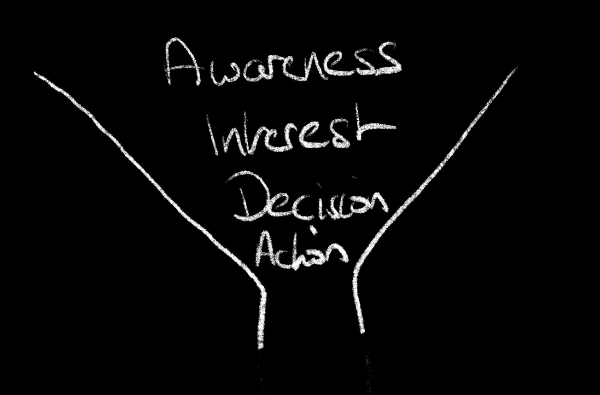
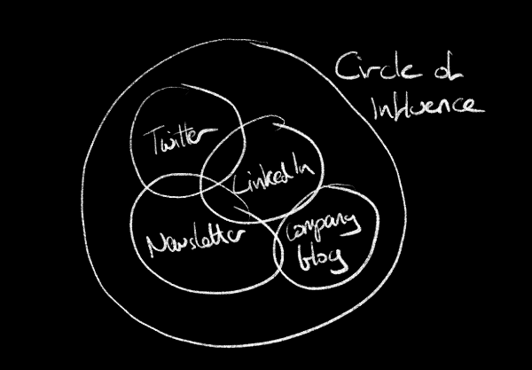
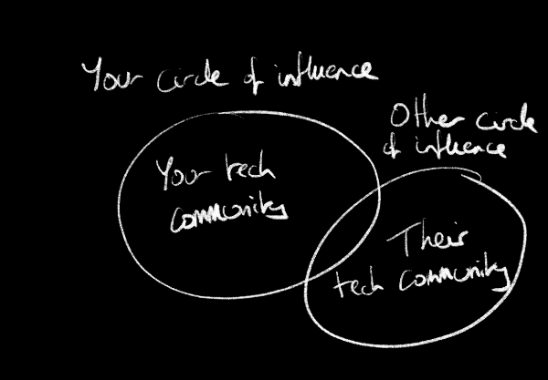
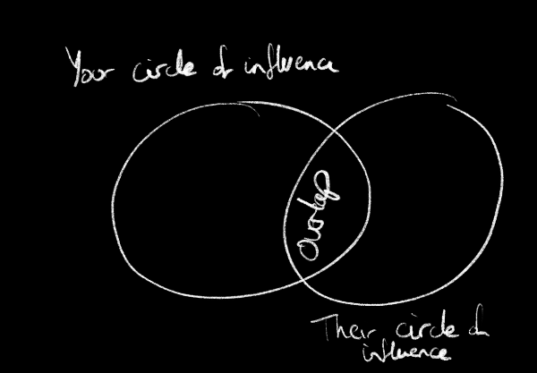
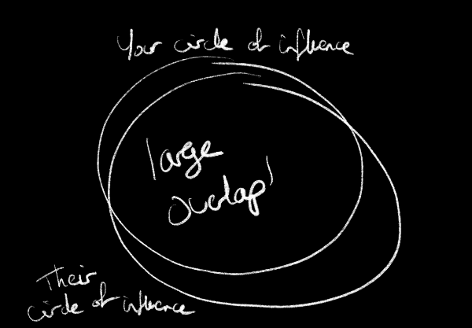

> This is the first part of a multipart blog post focusing on looking at DevRel through the idea of circles of influence.

As [dev rel people](/blogs/so-what-is-devrel/), part of our job is to drive awareness of our product. If you think in terms of sales/marketing, this is feeding the top of the funnel. If you think in terms of the [developer journey](https://www.devrel.agency/developerjourney), this is the discover phase.

However you look at it, it is about helping developers to discover your product, inspiring them to evaluate it, learn more, and ultimately use it in their day to day.

This post focuses on being better at driving awareness by considering circles of influence, and looking at how you can collaborate with others to drive more awareness.

## Successfully driving awareness

What does success look like when driving awareness? I’m sure there are many opinions on this, but mine is simple:

> How can I make a **new** audience aware of product/feature/thing?

Emphasis on the **new** part. To be successful we need to focus on that new. This can be completely new people who are not aware of your product, or existing customers who are not aware of feature X, or new product Y.

## Dev Rel circle of influence

As dev rel people, we all have what I think of as a _circle of influence_, either personally or on our company properties. This might be our social followers, the subscribers to our newsletter, readers of our employers blog, or folks who follow us in other ways. Although we want to grow this circle, in general this stays reasonably static with steady growth as we do more activities.

Each of these content and social locations has a circle of influence, and they all wrap up to your one overarching circle of influence, encompassing personal and company circles.

If we just use these same circles to promote our thing, then we are at risk of preaching to the converted. It’s hard to get net new signups by tweeting to the same circle of people, once we reach saturation there is no more potential customers to reach.

Although it can be good to reach the same circle, for example to keep customers updated on new features, or support community heroes, we risk the echo chamber. The same people attend your livestream and you are spending hours with no quantifiable return on your time as you are not driving awareness. The same people attend your Twitter space, or watch your talk, or read your blog.

To drive more awareness, you need to grow that audience.

## Grow your audience

To get more return on your efforts and grow that new audience, you need to do one of 2 things:

- Grow your circle of influence
- Overlap with someone else’s circle of influence.

The first part is outside the scope of this post, the rest of this post focuses on the second.

## Overlap with another circle of influence

The easiest way to two your circle of influence is to leverage the connections you already have to create collaborative content. By that I mean build new content with someone else who has a circle of influence, that way your content reaches their circle as well as yours.

### Collaboration on content

As dev rel people, we create content. Some of this content is directly about our product, but very few products are used completely in isolation. Instead we integrate with others. Sometimes directly - using a web framework on a site deployed to a hosting provider, sometimes indirectly - using AI dev tool to write code to talk to a service.

It’s very normal for us to create this kind of content, so the obvious thing to do is to do this in collaboration with a dev rel for that integration. This is a win-win situation. You both have content that is relevant to your product, it’s been easier to create as 2 of you are working on it, and most importantly this overlaps your circles of influence.

For example, at Pieces we have an AI tool that leverages a range of context such as code snippets. If I wanted to write code using a specific cloud service, chances are I have a range of code snippets saved, such as the code to save an object into storage, or post a message to a queue.

If I write a blog post about ‘using Pieces to manage code snippets to interact with cloud service’, not only does it show a real world use case for Pieces, but it also shows a way to interact with the cloud service easier. This is great content for me and can reach my circle of influence when published to my audience. if however, I collaborate on this with a dev rel from the cloud service, the content will then reach their circle of influence as well.

Suddenly they reach my circle of influence, and I reach theirs. This increases the reach of the content, and drives that awareness we want towards new developers. And importantly this is a mutually beneficial relationship. I’m not taking advantage of someone else’s influence, we are sharing our reach.

### The Venn diagram of circles of influence

When we think of collaboration, we need to consider 2 things:

- Is there a logical content overlap that tells a good story?
- Do we have a sufficiently unique circle of influence?

The first point refers to the content. Is it worth us collaborating? If there is no logical story, then no. A blog post on using a flutter UI component with a k8s management pipeline makes no sense. This content won’t resonate with our audience. Instead we want to collaborate with people who are likely to have an interest in using both products. Using Pieces with a popular cloud tool for example, lots of Pieces users want to use various cloud tools, and cloud tool users may want to manage code snippets and can benefit from Pieces. For collaborative content to work there needs to be overlap in the needs, desires, or tech stacks of the audience.

On the other hand, we don’t want our circles of influence to overlap too much. If the Venn diagram of my circle of influence and my collaborators is a circle, then we fail in our goal of reaching new developers.

How do you ensure this? I don’t have a magic formula, it’s all gut feel, but sometimes just looking at the number of mutuals on social can be enough. Harder with things like corporate blog reach, so a lot is finger in the air guess work. The best way is to try it, track metrics, and see if there is net new growth. If you collaborate with multiple people you should be able to measure from new sign ups what topics work well and double down on those.

## Fairness of contributions

Now this benefit is not always equal - sometimes the collaborator has a much bigger reach, or a much smaller reach. Personally I believe in sharing the love, so the way you ‘pay back’ working with someone with a much larger audience is by working with someone else with a smaller audience. We are a community of dev rel people, so we help the community without transactionality. If you work for a very small, new, growing company then you don’t have much reach to bring to a FAANG dev rel for example, but pay it back later. Collaborate now, then as you grow, support the next generation of dev rels with small circles of influence.

## Conclusion

We all have a circle of influence. To avoid constantly speaking to the same people, consider how collaborations can increase the circle of influence of both you and your collaborators. 