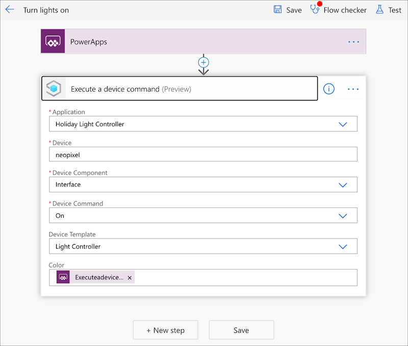
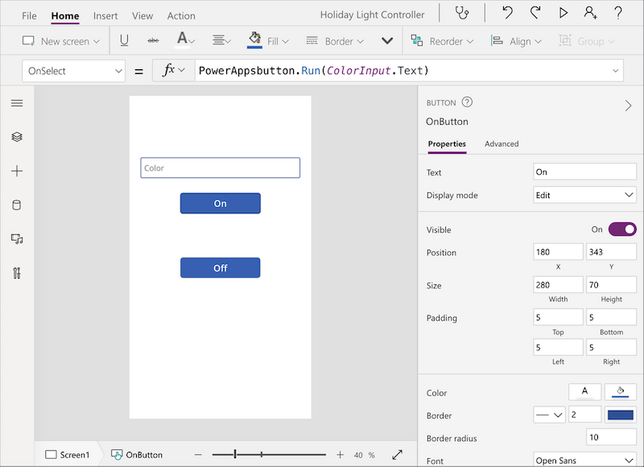

As the nights draw in here in the northern hemisphere, there are a number of winter celebrations that happen - and one thing they all have in common is lights.

In the past I've just purchased strings of lights from the nearest retailer, strung them up to a tree or around my house, and fought with remote controls or buttons to get the color I wanted.

Well this year I decided to do something better and build IoT powered holiday lights, controlled by a Power App built with no code!


The hardware would be based around [WS2812B programmable LED strips (also referred to as Neopixels)](https://www.amazon.com/gp/product/B07FVPN3PH), controlled by a [Raspberry Pi Zero W](https://www.raspberrypi.org/products/raspberry-pi-zero-w). Software wise, the Pi would run some Python code to talk to [Azure IoT Central](https://azure.microsoft.com/services/iot-central) - an IoT software as a service platform that can send commands to the Pi to turn the lights on or off. A [Power App](https://powerapps.microsoft.com/) would then be used to control IoT Central via a mobile app - written with no code! All these cloud services can be used for free, which is even better!

> You can find a full hands-on guide to building this your self with detailed instructions and all the code in my [Neopixel Holiday Lights GitHub Repo](https://github.com/jimbobbennett/NeopixelHolidayLights)

## Hardware needed

To create this, you will need the following hardware:

* A Raspberry Pi that can connect to the internet such as a Pi Zero W or a Pi 3/4, with appropriate SD card and power supply
* A strip of WS212B programmable LEDs
* A 5v power supply - either a USB to terminal block lead or a 5v DC converter
* Jumper wires

To wire the hardware, connect the positive lead or pin on the LEDs to the positive terminal on the 5v power supply, Connect the negative lead or pin to both the negative terminal on the power supply, and a GND GPIO pin on the Raspberry Pi. Some LED strips have twin negative leads for this reason, otherwise you'll need to solder or attach more leads as necessary. Finally attach the control pin to GPIO pin 18 on the Raspberry Pi. You can find details on the pin numbers in the [Raspberry Pi GPIO documentation](https://www.raspberrypi.org/documentation/usage/gpio/).


## Azure IoT Central

[Azure IoT Central](https://azure.microsoft.com/services/iot-central) is a software as a services platform that allows you to build the cloud infrastructure and security for your IoT apps with no code. It is based around device templates - a description of the data that a device can send to the cloud, and commands the cloud can send to the device to instruct it to do something.

Start by heading to [apps.azureiotcentral.com](https://apps.azureiotcentral.com/) and creating a new app. Although IoT Central is a paid service, you can use it for free. There is a free tier, but apps created using this are deleted after 7 days, so go for one of the standard tiers. Both the standard tiers offer 2 devices for free, so you can control your Pi without paying anything.

You will need an Azure Subscription to sign up, so if you don't have one you can sign up for free. Students can sign up at [azure.microsoft.com/free/students](https://azure.microsoft.com/free/students/) to get $100 of credit for a year, renewing every year, otherwise sign up at [azure.microsoft.com/free](https://azure.microsoft.com/free/) to get $200 of credit that lasts 30 days.

Once you have your app created, create a device template with 2 commands and a property. The commands will turn the lights on and off, and the property will allow the color to be persisted so restarting the Pi means the lights will re-light with the last color set.

Name one of the commands `On` and make it take a request parameter called `Color`. Name the other command `Off` with no request parameter. Create the property called `Color` as a `string`. Publish this template, then create a new device using it. Once you've created the device, grab the connection details.

## Program the Pi

Next step is to program the Pi to connect to IoT Central, receive the commands and turn on the lights. This can be done in Python. Make sure your Pi is using the latest Raspberry Pi OS, with all the latest updates and is connected to the internet. You can use either the Lite or Desktop version - for a project like this where the Pi is running headless I like to use the Lite version to allow me to use smaller SD cards and boot the Pis faster.

> To program the Pi, you can use your favorite Python tool. I personally recommend using [Visual Studio Code](https://code.visualstudio.com/), a free, open source developer text editor that has extensions for a variety of languages, including the [PyLance extension for Python](https://devblogs.microsoft.com/python/announcing-pylance-fast-feature-rich-language-support-for-python-in-visual-studio-code/). If you are using the full desktop version of Raspberry Pi OS, you can [install VS Code locally](/blogs/run-visual-studio-code-on-a-raspberry-pi), otherwise use the [Remote SSH extension](https://code.visualstudio.com/docs/remote/ssh) to code remotely on a Pi 3 or 4, or the [SSH File system extension](https://marketplace.visualstudio.com/items?itemName=Kelvin.vscode-sshfs) to code remotely on a Pi Zero.

First you need to install some Pip packages. These need to be installed using `sudo` - to control the Neopixels you need to run the code as a super user. Install the following:

```bash
rpi_ws281x 
adafruit-circuitpython-neopixel
azure-iot-device
python-dotenv
```

The first 2 packages provide control for the LEDs, the `azure-iot-device` package has the Python code for devices to connect to IoT Central, and `python-dotenv` is used to load secrets from .env files to avoid things like API keys being uploaded to source code control.

Once these are installed, create a file called `.env` on the Pi in whatever folder you want to create the code in to store the connection details for the IoT Central device, and add the following:

```ini
ID_SCOPE=<ID scope>
DEVICE_ID=<device id>
PRIMARY_KEY=<primary key>
```

Replace `<ID scope>` with the value of the ID Scope from the IoT Central device connection dialog. Replace `<device id>` with the device ID, and the `<primary key>` with the primary key.

Next create a file called `app.py` and add the following code. You can also find this code in [the GitHub repo tha accompanies this post](https://github.com/jimbobbennett/NeopixelHolidayLights/blob/main/code/iot-controlled/app.py).

```python
import asyncio
import board
import neopixel
import os
from azure.iot.device.aio import IoTHubDeviceClient, ProvisioningDeviceClient
from azure.iot.device import MethodResponse
from dotenv import load_dotenv

# Define the NeoPixel strip setting:
# The pin the control wire is connected to (18 in this code)
# The length of the strip (150 LEDs in this code)
# The brightness (0.2 on a scale of 0-1)
# If the colors are written as soon as the values are updated, or if they need to be
# updated all at once as soon as the values are set
pixels = neopixel.NeoPixel(board.D18, 150, brightness=0.2, auto_write=False)

# Load the IoT Central connection details from a .env file
load_dotenv()
id_scope = os.getenv('ID_SCOPE')
device_id = os.getenv('DEVICE_ID')
primary_key = os.getenv('PRIMARY_KEY')

# Declare the device client so it can be used from all the function
device_client = None

# Provisions the device with the Azure device provisioning service or returns
# the connection details if the device is already provisioned
async def register_device():
    provisioning_device_client = ProvisioningDeviceClient.create_from_symmetric_key(
        provisioning_host='global.azure-devices-provisioning.net',
        registration_id=device_id,
        id_scope=id_scope,
        symmetric_key=primary_key,
    )

    return await provisioning_device_client.register()

# Sets the color of the Neopixels based on a color string coming in.
# This color string is a 6 character code, 2 characters for red, 2 for green
# and 2 for blue. These 2 characters are a HEX value from 00 to FF.
# For example FF0000 is full red, no green or blue. FFFFFF is white, 000000 is off.
# Once the color is set, write it back to the IoT Central property via a device twin
async def set_color(color):
    # split in the color string into the red, green and blue components, and convert these
    # to valid hex strings
    r = '0x' + color[0:2]
    g = '0x' + color[2:4]
    b = '0x' + color[4:6]

    # Convert hext to numerical values
    r_value = int(r, 0)
    g_value = int(g, 0)
    b_value = int(b, 0)

    print('Updating color: r =', r_value, ', g =', g_value, ', b =', b_value)

    # Set all the pixels to the new color
    pixels.fill((r_value, g_value, b_value))

    # Show the color on all the pixels
    pixels.show()

    # Write the color back as a property
    # Properties are written to the device twin, so patch the reported properties
    # with the color
    patch = {'Color':color}
    print("Sending patch:", patch)
    await device_client.patch_twin_reported_properties(patch)

# IoT Central command handler
# IoT Central commands are implemented as IoT Hub direct methods
async def command_handler(method_request):
    print("Message received:", method_request.name)
    print("Message payload:", method_request.payload)

    # Determine how to respond to the command based on the IoT Hub direct method method name
    # which is the same as the IoT Central command name
    if method_request.name == "On":
        # For an On request, set the color based on the payload
        await set_color(method_request.payload)
        print("executed on")
    elif method_request.name == "Off":
        # For an Off request, set the color to 000000, which turns the pixels off
        await set_color("000000")
        print("executed off")
    else:
        print("Received unknown method: " + method_request.name)

    # Method calls have to return a response so IoT Central knows it was handled correctly,
    # So send a 200 response to show we handled this
    payload = {"result": True}
    status = 200

    # Send the response
    method_response = MethodResponse.create_from_method_request(method_request, status, payload)
    await device_client.send_method_response(method_response)

async def property_handler(patch):
    print("Patch received:", patch)
    if 'Color' in patch:
        await set_color(patch['Color'])

# The main async function that runs the app
async def main():
    global device_client
    
    # Regsiter the Pi as an IoT device in IoT Central
    registration_result = await register_device()

    # Build the IoT Hub connection string from the registration details
    # IoT Central sits on top of IoT Hub, and the Python SDK only supports IoT Hub,
    # So to talk to IoT central the IoT Hub connection string needs to be built from details
    # from registering the device with the provisioning service
    conn_str='HostName=' + registration_result.registration_state.assigned_hub + \
                ';DeviceId=' + device_id + \
                ';SharedAccessKey=' + primary_key

    # The client object is used to interact with your Azure IoT Central app via IoT Hub, so create this 
    # from the connection string
    device_client = IoTHubDeviceClient.create_from_connection_string(conn_str)

    # Connect the client to IoT Hub
    print('Connecting')
    await device_client.connect()
    print('Connected')

    # IoT Central stores properties in the device twin, so read this to see if we have a color
    # stored from the last run for the lights. This way when the device starts up it can set the color
    # to the last setting
    twin = await device_client.get_twin()
    print('Got twin: ', twin)

    # Load the color from the reported properties of the twin if it exists
    if 'reported' in twin and 'Color' in twin['reported']:
        await set_color(twin['reported']['Color'])

    # Set the method request handler on the client to handle IoT Central commands
    device_client.on_method_request_received = command_handler

    # Handle updates to the color property from IoT Central
    device_client.on_twin_desired_properties_patch_received = property_handler

    # Define a message loop that keeps the app alive whilst listening for commands
    async def main_loop():
        while True:
            await asyncio.sleep(1)

    # Wait for user to indicate they are done listening for method calls
    await main_loop()

    # Finally, disconnect
    await device_client.disconnect()

# Start the async app running
if __name__ == "__main__":
    asyncio.run(main())
```

Read the code and the comments to see what it does.

This code will connect to the Azure device provisioning service to authenticate the device using the settings from the `.env` file, then connect. It will load the properties to see if a color has already been set, and if so set the Neopixels to that color. It will then listen for commands to change the color of the Neopixels or turn them off.

Run the code as sudo with the following command:

```bash
sudo python3 app.py
```

The app will start up and connect. You can then run the commands in IoT Central to control the lights.

The color for the On command should be given as a string value representing a Hex string. It will be 6 characters long, with 2 characters each representing the R, G and B values with values from 0-255 (`00` - `FF`). For example, red is `FF0000`, green is `00FF00`, blue is `0000FF`, yellow is `FFFF00`, white is `FFFFFF`.

## Set up a Power App

Power Apps allow you to build apps with low or no code, by creating flows that connect logic and services, and connecting these to a UI designed on a canvas.

You will need a Power Apps account to create one, and if you don't have one you can sign up for a [community plan](https://powerapps.microsoft.com/communityplan/). This will give you a free environment for learning and building your own apps.

Start by creating a flow in the Power App. This should use the **Create from Template** option selecting **Power Apps button**. Name this flow `Turn lights on` and add an *Azure IoT Central V3* connector (**NOT** the V2 connector). Select your IoT Central app, add the device id, set the device template, select the capability, then select the *On* command. A new box will appear for the color to pass to this command, so select this box and select **Ask in Power Apps** from the box that appears. Then save the flow.



Create another flow for the *Off* command called `Turn lights off`.

Once you have the flows, create an app, Drag a text input and two buttons to the canvas and align then in a column.

Name the text input `ColorInput`, remove the default value and change the hint to color.

Name one button `On` and select the **Action** tab on the ribbon, then select **Power Automate**. From the popup, select the *Turn lights on* flow. It will take a few seconds to add the flow. When it does a half complete function will appear in the function bar. Pass the `Text` property of the `ColorInput` control into:

```csharp
PowerAppsbutton.Run(ColorInput.Text)
```

Name the other button `Off` and add the *Turn lights off* flow to it. The function for this doesn't need any parameters, so just close the brackets.



Make sure the app is running on the Pi, then save and test the Power App using the **Preview this app** button on the toolbar.

## Done!

Your app is now complete! Mount the lights somewhere and control them from the Power App. You can you can run it on your phone. Install the **Power Apps** app from the [Apple App Store](https://apps.apple.com/us/app/power-apps/id1047318566) or [Google Play Store](https://play.google.com/store/apps/details?id=com.microsoft.msapps), log in, select your app and use it to control your lights.

## Learn more

You can learn more about Azure IoT Central and the Microsoft Power Platform via Microsoft Learn, a hands-on, self-guided learning platform from Microsoft.

* [Develop IoT Central applications with IoT Central](https://docs.microsoft.com/learn/paths/develop-iot-solutions-with-azure-iot-central)
* [Microsoft Power Platform Fundamentals](https://docs.microsoft.com/learn/paths/power-plat-fundamentals/)
