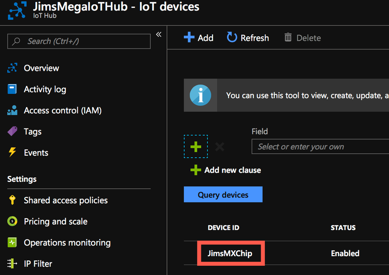
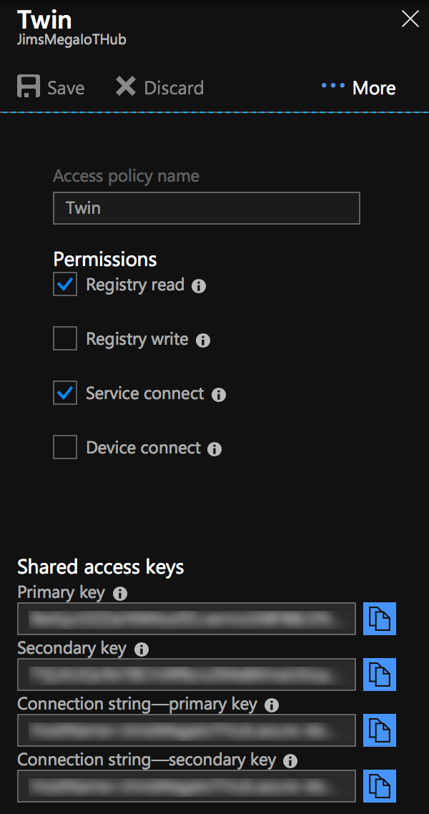
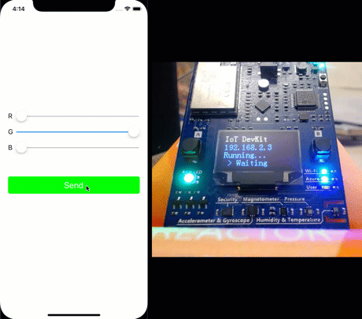

I've just finished watching the [latest episode of Five Things](https://channel9.msdn.com/Shows/5-Things/Five-IoT-Devices-You-Should-Have-Bought-Yesterday/?WT.mc_id=mxchip-blog-jabenn), where [Suz Hinton](https://twitter.com/noopkat) talks with [Burke](https://twitter.com/burkeholland) about [Goo Goo Clusters](https://googoo.com) and IoT devices.

<a href="https://googoo.com">
<div class="image-div" style="max-width:400px;">
    

    
</div>
</a>

One of the devices Suz showed was the [Azure IoT DevKit](https://microsoft.github.io/azure-iot-developer-kit/) - an arduino compatible board made by [MXChip](http://mxchip.com/az3166) that works beautifully with Azure, even down to having an Azure LED on board to show when it is connected. This is a great little board with a whole load of sensors and other gubbins built in.

<div class="image-div" style="max-width:400px;">
    

    
</div>

I have one of these boards thanks to Suz, so I thought it would be a good opportunity to get it out again and see how easy it would be to get my phone to control the board via Azure, with the eventual goal of doing some kind of holiday hack such as using it to control Christmas lights.

### Getting started with the IoT DevKit

* Buy one! Lots of links here - http://mxchip.com/az3166. These boards are around $40 so not too expensive - maybe put one on your Christmas list.
* Follow the first part of the [Getting Started](https://github.com/Microsoft/vscode-iot-workbench/blob/master/docs/iot-devkit/devkit-get-started.md) guide to [prepare your hardware](https://github.com/Microsoft/vscode-iot-workbench/blob/master/docs/iot-devkit/devkit-get-started.md#prepare-your-hardware), [configure WiFi](https://github.com/Microsoft/vscode-iot-workbench/blob/master/docs/iot-devkit/devkit-get-started.md#configure-wi-fi) and [install the development environment](https://github.com/Microsoft/vscode-iot-workbench/blob/master/docs/iot-devkit/devkit-get-started.md#install-development-environment).
* Sign up for an Azure account. If you don't already have an Azure account, you will need to sign up for one. There is a free tier that at the time of writing gives US$200 for the first 30 days, loads of services for free for 12 months, and a range of services free forever. You can sign up [for the free tier here](https://aka.ms/FreeAz)!

Once done your board will be ready to program.

### Controlling the board from the cloud

My plan is to build an app where I can set a color and have the LED on the board match that color. The architecture I want is something like this:

<div class="image-div" style="max-width:600px;">
    

    
</div>

Part of this is easy - a mobile app talking to an Azure Functions back end over a REST API. The new bit for me is the big __?__, the bit where the IoT device talks to the back end.

#### Azure IoT

Azure has some great services for managing IoT devices, all based around [IoT Hub](https://docs.microsoft.com/azure/iot-hub/?WT.mc_id=mxchip-blog-jabenn). IoT Hub is a managed service that provides a central resource for two-way communication with IoT devices. You can register devices in the hub, configure them individually or en-masse, send and receive data using standard messaging protocols like [MQTT](http://mqtt.org), or manage the devices including updating firmware.

One feature that it also supports is [device twins](https://docs.microsoft.com/azure/iot-hub/iot-hub-devguide-device-twins/?WT.mc_id=mxchip-blog-jabenn).

<div class="image-div" style="max-width:400px;">
    

    
</div>

Device twins are JSON documents that store information such as state or configuration. These exist on both the device and the Azure IoT hub and are kept in sync, so if you update a value on the device it syncs to the cloud and vice versa. This is perfect for my app - I can encode the RGB value for the LED into a device twin and update it from my Azure function. This update will then be pushed to the device where it can be parsed and the LED color changed to match.

> If you want to see this in action, then there is a great demo project available [here](https://github.com/Microsoft/vscode-iot-workbench/blob/master/docs/iot-devkit/devkit-state.md) that creates a web site that can turn the LED on/off and set the color. It doesn't go into how it works, just shows you that it does so I thought it would be more fun to try to build it myself. The rest of this post covers how I did it instead of just following this walkthrough.

#### Creating an IoT hub

The first thing I needed to do was to create an IoT workbench project and set up the IoT hub and device. This can be done from inside VSCode using the [Azure IoT Workbench extension](https://marketplace.visualstudio.com/items?itemName=vsciot-vscode.vscode-iot-workbench&WT.mc_id=mxchip-blog-jabenn). Launch VSCode, then plug in the IoT Dev Kit.

To create a new IoT workbench project:

* Launch the command palette and select __IoT Workbench: New__.
* Give it a folder to create the project in
* Give the project a name
* Select the IoT DevKit device.
* Create a project with an Azure IoT Hub
* Use the default sketch file name (sketch files are C code files that are run on the IoT device)

Once the project has been created, the IoT hub needs to be created and the device needs to be registered with the hub. Again, this can be done from inside VS Code.

* Launch the command palette and select __IoT Workbench: Cloud__
* Select __Azure Provision__
* Select a subscription, signing into Azure if necessary
* Create a new resource group or select an existing one
* Create a new IoT Hub in a location near you
* Select the _F1_ free tier. If you already have a free tier set up for another project then use an _S_ tier - the _B_ tiers don't support device twins, and the _F1_ tier acts like an _S_ tier but with limits on messages.
* Give the IoT Hub a name - this will need to be globally unique across Azure.
* The IoT Hub will now be provisioned, and this will take a few minutes to complete.

Once the Hub has been provisioned, the device will need to be provisioned, and this step will start automatically once the Hub has been created.

* Create a new IoT device
* Give the device a name. Each device will need to have a unique name in the IoT hub.

Once done you will be able to navigate to your IoT Hub in the [Azure Portal](https://portal.azure.com/?WT.mc_id=mxchip-blog-jabenn) and see your device.

<div class="image-div" style="max-width:400px;">
    

    
</div>

Finally the IoT device needs to know the connection string so that it can connect to the IoT Hub.

* Put the IoT device into configuration mode by holding the __A__ button on the device, tapping the __Reset__ button, then releasing the __A__ button.

<div class="image-div" style="max-width:400px;">
    

    
</div>

* From the command palette select __IoT Workbench: Device__
* Select __Config Device Settings__
* Select __Config Device Connection String__
* Select __Select IoT Hub Device Connection String__

A notification will pop up once done. The IoT device can then be rebooted by disconnecting and re-connecting it, and when it's booted it will be connected to the IoT Hub, as indicated by the blue Azure LED being lit.

<div class="image-div" style="max-width:400px;">
    

    
</div>

#### Adding code to handle the device twin

The device is configured, so now it needs some code to detect updates to the device twin and update the LED color.

The code for this is [here](https://github.com/jimbobbennett/IoTLedColorChanger/blob/master/DevKit/Device/device.ino). Copy this code into the sketch file in the IoT project (the `.ino` file). The interesting parts of this code are the `setup` and `loop` methods.

###### The setup method

```c
void setup()
{
  ...
  DevKitMQTTClient_Init(true);
  DevKitMQTTClient_SetDeviceTwinCallback(DeviceTwinCallback);
}
```

The [`setup` method](https://www.arduino.cc/en/Reference/Setup?setlang=en) is a special method that is called every time the device starts up or is rest. This method is used to initialize things, such as the WiFi and connectivity to IoT Hub. 

* The `DevKitMQTTClient_Init` call initializes the MQTT client to connect to Azure IoT Hub. 

* The call to `DevKitMQTTClient_SetDeviceTwinCallback` sets up a callback for any updates to the device twin on the IoT Hub. In the `DeviceTwinCallback` function, the JSON payload is parsed looking for one of these values:
  * `"rgbLEDR"` - The red value for the LED from 0 to 255
  * `"rgbLEDG"` - The Green value for the LED from 0 to 255
  * `"rgbLEDB"` - The Blue value for the LED from 0 to 255

  Once these values are found they are stored in global variables.

###### The loop method

The other method of interest is the [`loop` method](https://www.arduino.cc/en/Reference/Loop?setlang=en). This method is a special one that is called repeatedly by the OS on a loop. This method sets up the LED based on the on/off and RGB values stored in the global variables then applies these to the LED. It then sleeps for a bit and loops again.

###### Deploying the code

Once you've added the code, it needs to be deployed to the device:

* Select __IoT Workbench: Device__ from the command palette
* Select __Device Upload__

The code will be compiled, uploaded to the device, and the device will reboot. After rebooting it will be ready to sync data using the device twin.

> Once the code has been deployed, the IoT device can be unplugged from your computer and connected to another power supply if needed. The connection to a computer is only needed for configuration and uploading code, when running it just needs power through the USB port, nothing else.

#### Testing out the device twin

Once the device reboots, it will start listening to updates to the device twin. The device twin can be updated in code, but a simple way to get started is using the [Azure portal](https://portal.azure.com/?WT.mc_id=mxchip-blog-jabenn).

From inside the portal:

* Open up the newly created IoT hub
* Select _Explorers->IoT devices_
* Select the IoT device from the list
* Select __Device twin__ from the menu across the top

<div class="image-div" style="max-width:400px;">
    

    
</div>

This will show the device twin JSON document in an editor. This document can be updated, and once the update is saved it will be sent to the device. To turn the LED on on the IoT device, values for `rgbLEDR`, `rgbLEDG` and `rgbLEDB` need to be added to the existing _properties->desired_ node in the JSON document:

```json
{
  ...
  "properties": {
    "desired": {
      "rgbLEDR": 0,
      "rgbLEDG": 255,
      "rgbLEDB": 0,
  ...
}
```

Once these values are added and the document saved, the LED will light up in bright green. Then changing these values will cause the LED to change color.

<div class="image-div" style="max-width:400px;">
    


    
</div>

#### Updating the device twins from an Azure function

The device is working, so the next step is to create a back end that can be called from a mobile app to update the device twin. For this I'm going to use an Azure Function. This will be an HTTP trigger that listens for a POST with a body containing JSON with values for `red`, `green` and `blue`. This JSON will be parsed and the values used to update the digital twin:

```json
{
  "red" : 0,
  "green" : 0,
  "blue" : 255
}
```

To help with Azure IoT projects, there is a [Microsoft.Azure.Devices](https://www.nuget.org/packages/Microsoft.Azure.Devices/) NuGet package. This contains a `RegistryManager` class that can be used to manage devices, and this `RegistryManager` is created using a connection string for the IoT Hub.

Each IoT Hub can have multiple connection strings, all based around their different [permissions](https://docs.microsoft.com/azure/iot-hub/iot-hub-devguide-security#access-control-and-permissions/?WT.mc_id=mxchip-blog-jabenn). To control a device twin you need these [permissions](https://docs.microsoft.com/azure/iot-hub/iot-hub-devguide-security#iot-hub-permissions/?WT.mc_id=mxchip-blog-jabenn):

* __Registry Read__ - Allows reading from the IoT registry
* __Service Connect__ - Allows connections to the IoT Hub to manage devices and setting, this is designed for services to connect, as opposed to devices connecting.

From inside the portal:

* Open up the newly created IoT hub
* Select _Settings->Shared access policies_
* Click __+ Add__ to create a new shared access policy, call it _Twin_ and allow _Registry Read_ and _Service Connect_
* Save this, and copy one of the connection strings using the __Copy__ button next to it

<div class="image-div" style="max-width:300px;">
    

    
</div>

Once the connection string has been created it can be used to create the `RegistryManager`, ideally by setting this in the function app settings.

```cs
var connectionString = Environment.GetEnvironmentVariable("iotHubConnectionString");
var registryManager = RegistryManager.CreateFromConnectionString(connectionString);
```

The device twin can then be retrieved using the `RegistryManager` and the name of the IoT device that was used when it was registered in the Hub (again ideally as a setting):

```cs
var  deviceName = Environment.GetEnvironmentVariable("iotHubDevice");
var twin = await registryManager.GetTwinAsync(deviceName);
```

This twin can then be updated by passing a JSON string containing a patch to apply, and the values in the patch are applied to the twin. In this case, the `rgbLEDR`, `rgbLEDG` and `rgbLEDB` values need to be added to the `desired` node in the `properties` node, and this can be done by creating an anonymous type with the right names and serializing it to JSON.

```cs
var patch = new
{
    properties = new
    {
        desired = new
        {
            rgbLEDR = red,
            rgbLEDG = green,
            rgbLEDB = blue,
        }
    }
};

var jsonPatch = JsonConvert.SerializeObject(patch);
```

This patch is then used to update the twin:

```cs
await registryManager.UpdateTwinAsync(twin.DeviceId, jsonPatch, twin.ETag);
```

That's all that is needed to update the twin. The full code for this function is available [here](https://github.com/jimbobbennett/IoTLedColorChanger/blob/master/BackEnd/IotLedColorChanger.Functions/IoTFunctions.cs). To test this out:

* Set the appropriate values for the connection string and device hub in the `local.settings.json` file
* Run the function app using the local functions host
* Post a JSON document to the function using a tool such as [Postman](https://www.getpostman.com/apps)
* The LED will change color based on the JSON that was posted

Once the function is running, it can be deployed to Azure so that it can be called from a mobile app. Once deployed, the application settings will need to be set for the IoT Hub connection string and device name. This function can then be called by a tool like Postman to verify it is working.

#### Building the mobile app

The mobile app is pretty simple - three sliders and a button. Use the sliders to set RGB values, the button changes color as they slide, and when you tap the button it sends the RGB value to the back end. I built the app using [Fabulous](https://github.com/fsprojects/Fabulous), a F# MVU architecture that sits on top of [Xamarin](https://visualstudio.microsoft.com/xamarin/?WT.mc_id=mxchip-blog-jabenn). The code for this is pretty simple, with the values from the sliders being passed to an `HTTP.AsyncRequest` from [FSharp.Data](http://fsharp.github.io/FSharp.Data/index.html). This calls the Azure Functions back end to update the device twin.

Here's the app running in all it's glory!

<div class="image-div" style="max-width:500px;">
    

    
</div>

#### Summary

This post showed how to control the LED on an MXChip board using Azure device twins. 

All the code for this is on my [GitHub](https://github.com/jimbobbennett/IoTLedColorChanger).

Here's some further reading:

* Learn more about the Azure IoT hub [here](https://azure.microsoft.com/services/iot-hub/?WT.mc_id=mxchip-blog-jabenn)
* [Places to buy an MXChip board](http://mxchip.com/az3166)
* Microsoft.Azure.Devices API docs: [docs.microsoft.com](https://docs.microsoft.com/dotnet/api/overview/azure/iot/client/?WT.mc_id=mxchip-blog-jabenn)
* [Fabulous getting started guide](https://github.com/fsprojects/Fabulous)
* [Goo Goo Clusters](https://googoo.com) - feel free to buy me some!


