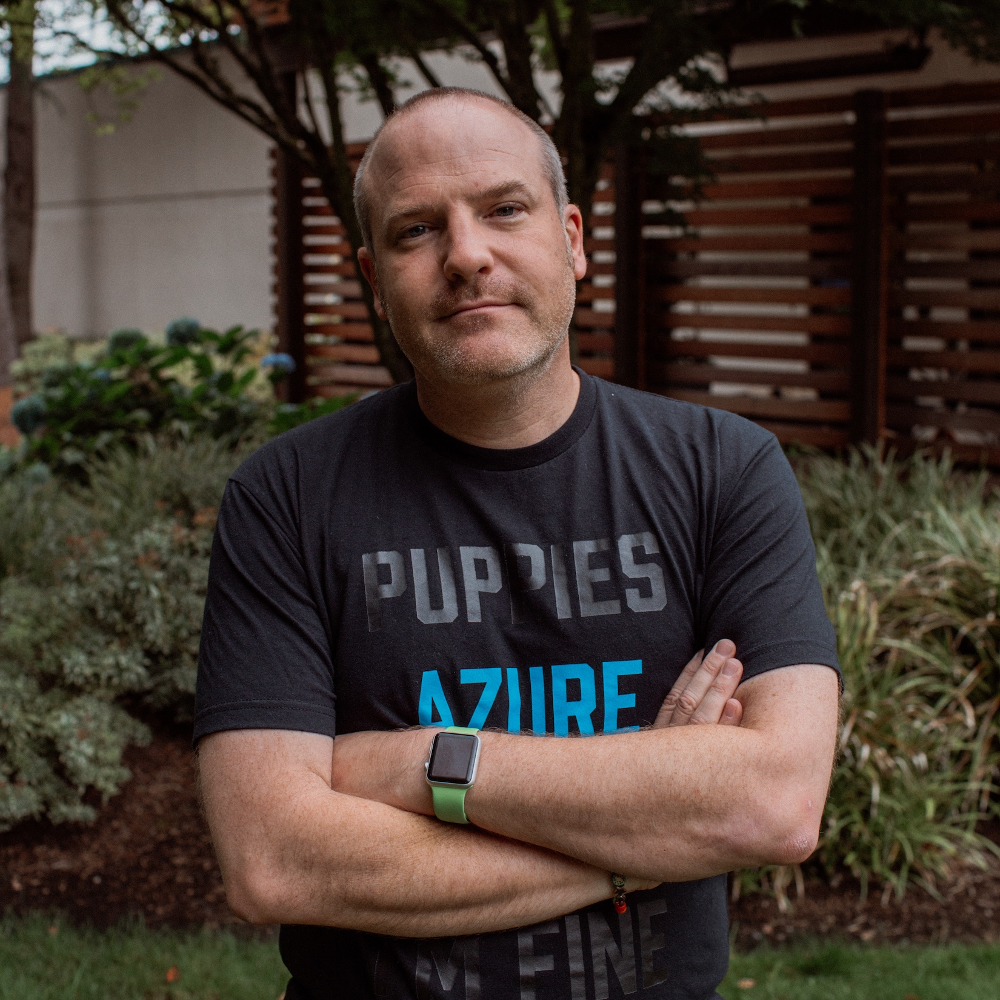
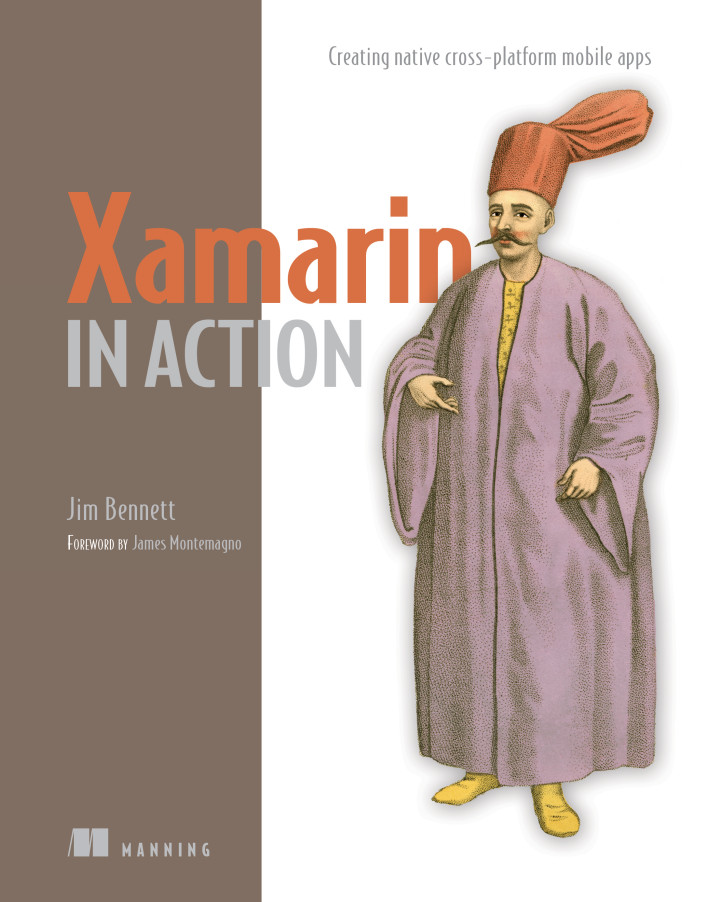

  <table style='border:0px'>
    <tr style='background-color:rgba(0, 0, 0, 0);'>
      <td style='width:15%'>
      </td>
      <td style='width:15%'>
      </td>
      <td>
        

          
        

      </td>
      <td style='width:15%'>
        <table style='border:0px'>
          <tr style='background-color:rgba(0, 0, 0, 0);'>
            <td>
              
            </td>
          </tr>
          <tr style='background-color:rgba(0, 0, 0, 0);'>
            <td>
              
            </td>
          </tr>
          <tr style='background-color:rgba(0, 0, 0, 0);'>
            <td>
              
            </td>
          </tr>
          </tr>
        </table>
      </td>
      <td style='width:15%'>
      </td>
    </tr>
  </table>

  

<table style='border:0px'>
    <tr style='background-color:rgba(0, 0, 0, 0);'>
      <td style='width:20%'/>
      <td style='width:20%'>

      </td>
      <td style='width:20%'>
              
      </td>
      <td style='width:20%'>
              
      </td>
      <td style='width:20%'/>
    </tr>
  </table>

<h3>C# and mobile geek, Xamarin MVP and Certified Mobile App developer, Microsoft MVP, blogger, speaker, author and technology enthusiast.</h3>
<h6>&nbsp; Reading, UK</h6>
 

  <table style='border:0px'>
    <tr style='background-color:rgba(0, 0, 0, 0);'>
      <td style='padding-right:20px;padding-left:20px;'>
        

          <a href="http://xam.jbb.io">
           
          </a>
        

      </td>
      <td style='padding-right:20px;padding-left:20px;'>
        

          <a href="/blogs/">
           
          </a>
        

      </td>
      <td style='padding-right:20px;padding-left:20px;'>
        

          <a href="http://github.com/jimbobbennett">
           
          </a>
        

      </td>
      <td style='padding-right:20px;padding-left:20px;'>
        

          <a href="http://www.linkedin.com/pub/jim-bennett/20/448/367">
           
          </a>
        

      </td>
      <td style='padding-right:20px;padding-left:20px;'>
        

          <a href="http://twitter.com/jimbobbennett">
           
          </a>
        

      </td>
      <td style='padding-right:20px;padding-left:20px;'>
        

          <a href="https://www.youtube.com/channel/UCdjvkLLbsQnOilmaMrriTeQ">
           
          </a>
        

      </td>
      <td style='padding-right:20px;padding-left:20px;'>
        

          <a href="mailto:jim@jimbobbennett.io">
           
          </a>
        

      </td>
    </tr>
    <tr style='background-color:rgba(0, 0, 0, 0);'>
      <td style='padding-right:20px;padding-left:20px;'>
        

          <a href="http://xam.jbb.io">
            Xamarin In Action
          </a>
        

      </td>
      <td style='padding-right:20px;padding-left:20px;'>
        

          <a href="/blogs/">
            Blog
          </a>
        

      </td>
      <td style='padding-right:20px;padding-left:20px;'>
        

          <a href="http://github.com/jimbobbennett">
            GitHub
          </a>
        

      </td>
      <td style='padding-right:20px;padding-left:20px;'>
        

          <a href="http://www.linkedin.com/pub/jim-bennett/20/448/367">
            LinkedIn
          </a>
        

      </td>
      <td style='padding-right:20px;padding-left:20px;'>
        

          <a href="http://twitter.com/jimbobbennett">
            Twitter
          </a>
        

      </td>
      <td style='padding-right:20px;padding-left:20px;'>
        

          <a href="https://www.youtube.com/channel/UCdjvkLLbsQnOilmaMrriTeQ">
            YouTube
          </a>
        

      </td>
      <td style='padding-right:20px;padding-left:20px;'>
        

          <a href="mailto:jim@jimbobbennett.io">
            Email
          </a>
        

      </td>
    </tr>
  </table>

  <table style='border:0px'>
    <tr style='background-color:rgba(0, 0, 0, 0);'>
      <td style='padding-right:10px;padding-left:10px;'>
        

          <a href="http://xam.jbb.io">
           
          </a>
        

      </td>
      <td style='padding-right:10px;padding-left:10px;'>
        

          <a href="/blogs/">
           
          </a>
        

      </td>
      <td style='padding-right:10px;padding-left:10px;'>
        

          <a href="http://github.com/jimbobbennett">
           
          </a>
        

      </td>
      <td style='padding-right:10px;padding-left:10px;'>
        

          <a href="http://www.linkedin.com/pub/jim-bennett/20/448/367">
           
          </a>
        

      </td>
    </tr>
    <tr style='background-color:rgba(0, 0, 0, 0);'>
      <td style='padding-right:10px;padding-left:10px;'>
        

          <a href="http://xam.jbb.io">
            Xamarin In Action
          </a>
        

      </td>
      <td style='padding-right:10px;padding-left:10px;'>
        

          <a href="/blogs/">
            Blog
          </a>
        

      </td>
      <td style='padding-right:10px;padding-left:10px;'>
        

          <a href="http://github.com/jimbobbennett">
            GitHub
          </a>
        

      </td>
      <td style='padding-right:10px;padding-left:10px;'>
        

          <a href="http://www.linkedin.com/pub/jim-bennett/20/448/367">
            LinkedIn
          </a>
        

      </td>
    </tr>
  </table>
  <table style='border:0px'>
    <tr style='background-color:rgba(0, 0, 0, 0);'>
      <td style='padding-right:10px;padding-left:10px;padding-top:40px;'>
        

          <a href="http://twitter.com/jimbobbennett">
           
          </a>
        

      </td>
      <td style='padding-right:10px;padding-left:10px;padding-top:40px;'>
        

          <a href="https://www.youtube.com/channel/UCdjvkLLbsQnOilmaMrriTeQ">
           
          </a>
        

      </td>
      <td style='padding-right:10px;padding-left:10px;padding-top:40px;'>
        

          <a href="mailto:jim@jimbobbennett.io">
           
          </a>
        

      </td>
    </tr>
    <tr style='background-color:rgba(0, 0, 0, 0);'>
      <td style='padding-right:10px;padding-left:10px;'>
        

          <a href="http://twitter.com/jimbobbennett">
            Twitter
          </a>
        

      </td>
      <td style='padding-right:15px;padding-left:15px;'>
        

          <a href="https://www.youtube.com/channel/UCdjvkLLbsQnOilmaMrriTeQ">
            YouTube
          </a>
        

      </td>
      <td style='padding-right:10px;padding-left:10px;'>
        

          <a href="mailto:jim@jimbobbennett.io">
            Email
          </a>
        

      </td>
    </tr>
  </table>

<table style='border:0px;border-spacing:0px'>
  <tr style='background-color:rgba(0, 0, 0, 0)'>
    <td class='hide-for-small-only' style='vertical-align: top;'></td>
    <td>
      
I am an international C# geek who has spent time hanging around in finance, startups and mobile app development shops for the past 20 years in 4 different continents.  I have been a Xamarin Certified Developer since April 2015, a <a href='https://xamarin.com/mvp'>Xamarin MVP</a> since January 2016 and a <a href='https://mvp.microsoft.com/en-us/PublicProfile/5002370?fullName=Jim%20%20Bennett'>Microsoft MVP</a> since January 2017.  When I'm not building mobile apps using Xamarin I can be found blogging, talking at meet ups and conferences, playing with iBeacons and creating open source projects in GitHub.  I am one of the co-organisers of the <a href="http://www.meetup.com/Auckland-Xamarin-Meetup/">Auckland Xamarin Meetup</a>, as well as the author of <a href="http://xam.jbb.io">Xamarin In Action</a>, published by Manning.

      
I am incredibly passionate about good, clean, well tested code.  I am a huge fan of deleting code and replacing it with less code - one of my favourite sayings is 'the closest you can get to bug free code is code that isn't there'.

      
I also have a great love of sharing knowledge with people who want to learn, be it mentoring and training enthusiastic junior developers, sharing knowledge of new technologies with people who want to discover awesome new things or organising user group meetings to bring together like-minded people.

    </td>
    <td class='hide-for-small-only' style='vertical-align: top;'></td>
  </tr>
</table>

    
#### Books
    
##### [Xamarin In Action, published by Manning](http://xam.jbb.io)
    

<table style='border:0px;border-spacing:0px'>
  <tr style='background-color:rgba(0, 0, 0, 0)'>
    <td style='padding-right:10px;padding-left:10px;width:20%;vertical-align=top;'>
     
    </td>
    <td style='padding-right:10px;padding-left:10px;'>
     

Xamarin in Action teaches you how to build Xamarin apps on iOS and Android from scratch while maximizing code re-use. This layer-by-layer guide starts by showing you the MVVM design pattern and explaining how it increases code sharing. Next, you'll start building an app from the ground up. You'll learn all the different layers inside a well written Xamarin app and discover how most of your code can be shared between iOS and Android. You'll look at how this code sharing can be best designed to allow unit testing of your business layer as well as your UI logic. Then you'll dig in to code that can’t be shared, like user interface code that's device specific. Finally, you'll learn how to take your app from final code to a tested and deployed version on the relevant store. By the end, you'll be able to build a high quality production-ready Xamarin app on iOS and Android from scratch with a high level of code reuse.

    </td>
  </tr>
</table>

<table style='border:0px;border-spacing:0px'>
  <tr style='background-color:rgba(0, 0, 0, 0);'>
    <td style='padding-right:10px;padding-left:10px;padding-bottom:10px'>
     
    </td>
</tr>
  <tr style='background-color:rgba(0, 0, 0, 0);'>
    <td style='padding-right:10px;padding-left:10px;'>
     

Xamarin in Action teaches you how to build Xamarin apps on iOS and Android from scratch while maximizing code re-use. This layer-by-layer guide starts by showing you the MVVM design pattern and explaining how it increases code sharing. Next, you'll start building an app from the ground up. You'll learn all the different layers inside a well written Xamarin app and discover how most of your code can be shared between iOS and Android. You'll look at how this code sharing can be best designed to allow unit testing of your business layer as well as your UI logic. Then you'll dig in to code that can’t be shared, like user interface code that's device specific. Finally, you'll learn how to take your app from final code to a tested and deployed version on the relevant store. By the end, you'll be able to build a high quality production-ready Xamarin app on iOS and Android from scratch with a high level of code reuse.

    </td>
  </tr>
</table>

    
##### Technical review - [Xamarin Mobile Application Development](http://www.amazon.co.uk/gp/product/1484202155/ref=as_li_qf_sp_asin_il_tl?ie=UTF8&camp=1634&creative=6738&creativeASIN=1484202155&linkCode=as2&tag=expecti-21) by [Dan Hermes](https://twitter.com/lexiconsystems)
    
I helped Dan with this book by reviewing the code samples and text, and providing code changes, bug fixes and improvement suggestions.
    

    
#### Meetups
    
###### [Auckland Xamarin Meetup](https://www.meetup.com/Auckland-Xamarin-Meetup/)
    
I am one of the co-organisers of the Auckland Xamarin Meetup, we meet about every 6-8 weeks and host talks on a wide variety of Xamarin based topics. I have given talks at this meetup covering a [review of the Evolve conference](https://www.meetup.com/Auckland-Xamarin-Meetup/events/231907388/) and [UI testing](https://www.meetup.com/Auckland-Xamarin-Meetup/events/233436741/).
We also hosted a [Xamarin Dev Days](https://ti.to/xamarin/dev-days-auckland), with over 80 attendees.
    

</iframe>
 
    
###### Other meetups
    
I am a regular speaker at other meetups, including giving at [deeper dive into Xamarin for the North Shore .Net user group](https://www.meetup.com/North-Shore-NET-User-Group/events/233958669/), and speaking about using iBeacons with Xamarin at multiple Xamarin or mobile meetups in the UK.
    

    
#### Conference Talks
##### [Adding platform-specific magic to cross-platform Xamarin Forms apps](http://ndcsydney.com/talk/adding-platform-specific-magic-to-cross-platform-xamarin-forms-apps/) ([Slides](https://www.slideshare.net/JimBennett10/adding-platform-specific-magic-to-crossplatform-xamarin-forms-apps))

Xamarin Forms is a fantastic abstraction on top of iOS, Android, Windows and Mac. It allows you to write one UI that is shared between platforms using the underlying UI controls native to each OS. The downside to this is the lowest-common-denominator model - only the features that are available on all platforms are provided out of the box. Luckily Xamarin provides a swathe of techniques to allow you to add platform specific tweaks.

This session looks at some of these techniques, from the small number of platform specifics provided out of the box by Xamarin, to writing effects and implementing your own custom renderers. Each technique will be demonstrated with a live coded example showing just how easy they are to get working.

##### Making your native apps even more cross-platform using MVVM at the [Microsoft Cross-Platform Dev Summit 2017 in Vietnam](https://www.microsoftevents.com/profile/form/index.cfm?PKformID=0x13066884b54) ([Slides](https://www.slideshare.net/JimBennett10/cross-platform-xamarin-apps-with-mvvm))
    
This session looked at MVVM and how you could use it with native Xamarin apps to increase the amount of cross-platform testable code in your mobile apps.
##### [Please bring me coffee - using iBeacons to seamlessly engage with apps - Xamarin included!](https://channel9.msdn.com/Events/Ignite/New-Zealand-2016/M324) at [MS Ignite NZ 2016](https://msignite.nz/) ([Slides](https://sec.ch9.ms/sessions/ignite/New-Zealand-2016/M324.pptx))
This session introduces iBeacons and discusses how to use them to build context aware applications, and what types of problems those applications can solve. It looks at how you can notify an app when you are near an iBeacon and how you can use them to track indoor location. It also discusses the downsides, such as security concerns and problems around beacon deployments. As well as discussing the concepts it also contains a live coding Xamarin demo showing just how easy it is to beacon-enable your apps, with live demos of notifications and indoor location tracking.
    
<iframe src="https://channel9.msdn.com/Events/Ignite/New-Zealand-2016/M324/player" width="560" height="315" allowFullScreen frameBorder="0">
</iframe>
 
    
##### [Clicking on the real world with iBeacon and Eddystone](https://www.youtube.com/watch?v=vQqIXKU98LI&index=2&list=PLgfItgHIHF6tlGoUO6BJmSvuFW3dS3wkv) at [Xamarin Evolve 2016](https://evolve.xamarin.com) ([Slides](http://www.slideshare.net/JimBennett10/clicking-on-the-real-world-with-ibeacon-and-eddystone))
Contextual awareness is a fast-growing trend in mobile development. In this session, I take you through a quick overview of beacon technology, including Apple's iBeacons and Google's Eddystone, before diving into some code. I even build a simple app live on stage to demonstrate how you can detect and wake up beacons, as well as detect user proximity to beacons.
    


    
#### Blogging
    
##### [Expecting Someone Geekier](http://www.jimbobbennett.io)
    
This is my own blog where I blog about a range of topics from technology to food (I am a great lover of both).  The blog is hosted on [Ghost.org](http://ghost.org) using an [open source theme that I have created.](https://github.com/jimbobbennett/FauxGhost)

##### [Core Java Interview Questions - Technical tests](http://www.corejavainterviewquestions.com/technical-tests/)
    
I was asked by [Sam Atkinson](http://www.samatkinson.me), the creator of [Core Java Interview Questions](http://www.corejavainterviewquestions.com) to write a guest blog about an area of interviewing developers that is important to me.  My post was all about technical testing and the particular way I like to do it to help developers show off their skills in the way that is of most benefit to them.
    

    
#### Podcasts
    
##### [The Jim and Tonic Show](https://www.jimandtonic.show)
A regular podcast where I interview other members of the Microsoft [Cloud Developer Advocacy team](https://developer.microsoft.com/en-us/advocates/).
    

  

    
##### [Core Java Interview Questions episode 4](http://www.corejavainterviewquestions.com/podcast4/)
    
Due to the popularity of my blog post on technical testing, I was invited to join [Sam](http://www.samatkinson.me) for an episode of his [Core Java Interview Questions Podcast](http://www.corejavainterviewquestions.com/category/blog-2/podcast/).  What was only meant to be a 20 minute discussion turned into a good hour of conversation all around how we like to perform technical testing of candidates, and was recorded in one take with no editing.  Shortly after this episode was published the podcast briefly topped the Software How-To category on iTunes, above Hansleminutes and dotNetRocks.

#### Videos

##### [Building iBeacon Apps with Xamarin](https://youtu.be/7mSPxrgWv_I)
    
This is a tutorial video that explains the basics of iBeacon app development, then demonstrates with live code examples how to build your first iBeacon app.
    


    
#### Visual Studio Extensions
##### [MvvmCross Template Pack](http://addins.monodevelop.com/Project/Index/227) for Visual Studio for Mac
    
This extension adds a new solution type to Visual Studio for Mac to allow you to create a single solution containing a core project, and iOS app and an Android app all using MvvmCross.  I wrote about how to build this [on my blog](https://www.jimbobbennett.io/creating-an-add-in-for-xamarin-studio/).
    
##### [MvvmCross for Visual Studio](https://visualstudiogallery.msdn.microsoft.com/96b3d919-0277-4f63-92a3-a7bf3e7cd384)
    
This extension adds a new solution type to Visual Studio to allow you to create a cross platform MvvmCross solution targeting iOS, Android, UWP and WPF.
    

    
#### Apps
    
##### Second Screen for Plex (Now removed from the app store)
    
This app is an add on for the [Plex](http://plex.tv) ecosystem - it connects to your running Plex server and shows you details about what is currently being watched, including cast and IMDB links.
It was built using Xamarin.Forms and uses two of my open source libraries - [JimLib.Xamarin](https://github.com/jimbobbennett/JimLib.Xamarin) for the app framework and [RestAndRelax for Plex](https://github.com/jimbobbennett/RestAndRelaxForPlex) for the Plex communication.
    

    
#### Open source projects
    
##### [My open source projects on GitHub](https://github.com/jimbobbennett)
    
I have created a number of open source projects and am continually contributing to these and creating more.
Some highlights include:
    
###### [Forms Community Toolkit](https://github.com/FormsCommunityToolkit)
    
A toolkit of effects, controls and other components for Xamarin Forms projects (contributor).
    
###### [Stupendous Counter](https://github.com/jimbobbennett/StupendousCounter)
A simple Xamarin.Android app that has an accompanying blogging series showing the creation of an entire mobile app from concept to execution.
    
###### [JimLib](https://github.com/jimbobbennett/JimLib)
    
A portable class library implementation of a basic MVVM framework
    
###### [JimLib.Xamarin](https://github.com/jimbobbennett/JimLib.Xamarin)
An extension of the JimLib MVVM framework designed to provide a basic application framework for Xamarin.Forms applications.
    
###### [FauxGhost](https://github.com/jimbobbennett/FauxGhost)
    
A blog theme for Ghost.org that I use for my own blog.
    
###### [Gists](https://gist.github.com/jimbobbennett)
    

    
#### Certifications and Awards
    

  <table style='border:0px'>
    <tr style='background-color:rgba(0, 0, 0, 0)'>
      <td style='width:25%'>
        
      </td>
      <td>
        <h3>Xamarin Certified Mobile Developer</h3>
        Expires April 2017
      </td>
    </tr>
  </table>
  <table style='border:0px'>
    <tr style='background-color:rgba(0, 0, 0, 0)'>
      <td style='width:2.5%'>
      </td>
      <td style='width:20%'>
        
      </td>
      <td style='width:2.5%'>
      </td>
      <td>
        <h3>Xamarin MVP</h3>
        Awarded January 2016
      </td>
    </tr>
  </table>
  <table style='border:0px'>
    <tr style='background-color:rgba(0, 0, 0, 0)'>
      <td style='width:2.5%'>
      </td>
      <td style='width:20%'>
        
      </td>
      <td style='width:2.5%'>
      </td>
      <td>
        <h3>Microsoft MVP</h3>
        Awarded January 2017
      </td>
    </tr>
  </table>

#### Education
    

  <table style='border:0px'>
    <tr style='background-color:rgba(0, 0, 0, 0);'>
      <td style='width:25%'>
        
      </td>
      <td>
        <h3>MChem in Computer Aided Chemistry</h3>
        Awarded June 1999
      </td>
    </tr>
  </table>

#### Employment History

<table style='width:100%;border:1px solid rgba(238, 118, 0, 0.3);border-spacing:0px'>
  <tr style='background-color:rgba(0, 0, 0, 0);'>
    <th class='hide-for-small-only imageCol' style='text-align:left;background-color:rgba(238, 118, 0, 0.3)'>
        

        
</th>
    <th style='text-align:left;background-color:rgba(238, 118, 0, 0.3)'>
      <h3>EROAD (New Zealand)</h3>
      <h6>Mobile Application Developer</h6>
      
<h6>February 2016 - Current</h6>

    </th>
    <th class='hide-for-small-only' style='text-align:right;background-color:rgba(238, 118, 0, 0.3);width:35%'>
      <h6>February 2016 - Current</h6>
    </th>
  </tr>
  <tr style='background-color:rgba(0, 0, 0, 0);'>
    <td colspan='3'>
      

        
Xamarin

        
Xamarin.Forms

        
Xamarin.Android

        
Xamarin.iOS

        
C#

        
UITest

        
Android

        
iOS

        
Mentorship

        
Video creation

        
Content creation

        
Blogging

      

    </td>
  </tr>
</table>
<table style='width:100%;border:1px solid rgba(238, 118, 0, 0.3);border-spacing:0px'>
  <tr style='background-color:rgba(0, 0, 0, 0);'>
    <th class='hide-for-small-only imageCol' style='text-align:left;background-color:rgba(238, 118, 0, 0.3)'>
      
    </th>
    <th style='text-align:left;background-color:rgba(238, 118, 0, 0.3)'>
      <h3>Barclays (UK)</h3>
      <h6>Software Developer (contract)</h6>
      
<h6>November 2014 - December 2015</h6>

    </th>
    <th class='hide-for-small-only' style='text-align:right;background-color:rgba(238, 118, 0, 0.3);width:35%'>
      <h6>November 2014 - December 2015</h6>
    </th>
  </tr>
  <tr style='background-color:rgba(0, 0, 0, 0);'>
    <td colspan='3'>
      

        
C#

        
WPF

        
Git

        
Code Review

        
MongoDB

        
Performance

        
F#

        
Evangelism

      

    </td>
  </tr>
</table>
<table style='width:100%;border:1px solid rgba(238, 118, 0, 0.3);border-spacing:0px'>
  <tr style='background-color:rgba(0, 0, 0, 0);'>
    <th class='hide-for-small-only imageCol' style='text-align:left;background-color:rgba(238, 118, 0, 0.3)'>
      <h1></h1>
    </th>
    <th style='text-align:left;background-color:rgba(238, 118, 0, 0.3)'>
      <h3>Sabbatical (Thailand)</h3>
      
<h6>July 2014 - November 2014</h6>

    </th>
    <th class='hide-for-small-only' style='text-align:right;background-color:rgba(238, 118, 0, 0.3);width:30%'>
      <h6>July 2014 - November 2014</h6>
    </th>
  </tr>
  <tr style='background-color:rgba(0, 0, 0, 0);'>
    <td colspan='3'>
      

        
C#

        
Xamarin.Forms

        
Xamarin.iOS

        
Xamarin.Android

        
Node.js

        
REST

        
Git

        
MongoDB

        
OpenSource

      

    </td>
  </tr>
</table>
<table style='width:100%;border:1px solid rgba(238, 118, 0, 0.3);border-spacing:0px'>
  <tr style='background-color:rgba(0, 0, 0, 0);'>
    <th class='hide-for-small-only imageCol' style='text-align:left;background-color:rgba(238, 118, 0, 0.3)'>
      
    </th>
    <th style='text-align:left;background-color:rgba(238, 118, 0, 0.3)'>
      <h3>Nephila Capital (Bermuda)</h3>
      <h6>Senior Software Developer (contract)</h6>
      
<h6>November 2013 - June 2014</h6>

    </th>
    <th class='hide-for-small-only' style='text-align:right;background-color:rgba(238, 118, 0, 0.3);width:30%'>
      <h6>November 2013 - June 2014</h6>
    </th>
  </tr>
  <tr style='background-color:rgba(0, 0, 0, 0);'>
    <td colspan='3'>
      

        
C#

        
WPF

        
UI

        
Git

        
Jira

        
Agile

        
PowerShell

        
RequirementsAnalysis

      

    </td>
  </tr>
</table>
<table style='width:100%;border:1px solid rgba(238, 118, 0, 0.3);border-spacing:0px'>
  <tr style='background-color:rgba(0, 0, 0, 0);'>
    <th class='hide-for-small-only imageCol' style='text-align:left;background-color:rgba(238, 118, 0, 0.3)'>
      
    </th>
    <th style='text-align:left;background-color:rgba(238, 118, 0, 0.3)'>
      <h3>CLSA (Hong Kong)</h3>
      <h6>IT Team Lead</h6>
      
<h6>September 2011 - October 2013</h6>

    </th>
    <th class='hide-for-small-only' style='text-align:right;background-color:rgba(238, 118, 0, 0.3);width:30%'>
      <h6>September 2011 - October 2013</h6>
    </th>
  </tr>
  <tr style='background-color:rgba(0, 0, 0, 0);'>
    <td colspan='3'>
      

        
C#

        
WPF

        
UI

        
RealTime

        
Jira

        
Agile

        
TeamCity

        
DevLead

      

    </td>
  </tr>
</table>
<table style='width:100%;border:1px solid rgba(238, 118, 0, 0.3);border-spacing:0px'>
  <tr style='background-color:rgba(0, 0, 0, 0);'>
    <th class='hide-for-small-only imageCol' style='text-align:left;background-color:rgba(238, 118, 0, 0.3)'>
      
    </th>
    <th style='text-align:left;background-color:rgba(238, 118, 0, 0.3)'>
      <h3>HSBC (UK & Hong Kong)</h3>
      <h6>External Consultant (Contract)</h6>
      
<h6>September 2007 - May 2011</h6>

    </th>
    <th class='hide-for-small-only' style='text-align:right;background-color:rgba(238, 118, 0, 0.3);width:30%'>
      <h6>September 2007 - May 2011</h6>
    </th>
  </tr>
  <tr style='background-color:rgba(0, 0, 0, 0);'>
    <td colspan='3'>
      

        
C#

        
WPF

        
WinForms

        
SQLServer

        
TeamCity

        
RemoteWorking

      

    </td>
  </tr>
</table>
<table style='width:100%;border:1px solid rgba(238, 118, 0, 0.3);border-spacing:0px'>
  <tr style='background-color:rgba(0, 0, 0, 0);'>
    <th class='hide-for-small-only imageCol' style='text-align:left;background-color:rgba(238, 118, 0, 0.3)'>
      
    </th>
    <th style='text-align:left;background-color:rgba(238, 118, 0, 0.3)'>
      <h3>RBS (UK)</h3>
      <h6>Software Developer (Contract)</h6>
      
<h6>February 2007 - September 2007</h6>

    </th>
    <th class='hide-for-small-only' style='text-align:right;background-color:rgba(238, 118, 0, 0.3);width:30%'>
      <h6>February 2007 - September 2007</h6>
    </th>
  </tr>
  <tr style='background-color:rgba(0, 0, 0, 0);'>
    <td colspan='3'>
      

        
C#

        
TestAutomation

      

    </td>
  </tr>
</table>
<table style='width:100%;border:1px solid rgba(238, 118, 0, 0.3);border-spacing:0px'>
  <tr style='background-color:rgba(0, 0, 0, 0);'>
    <th class='hide-for-small-only imageCol' style='text-align:left;background-color:rgba(238, 118, 0, 0.3)'>
      
    </th>
    <th style='text-align:left;background-color:rgba(238, 118, 0, 0.3)'>
      <h3>Barclays (UK)</h3>
      <h6>Software Developer (contract)</h6>
      
<h6>September 2005 - February 2007</h6>

    </th>
    <th class='hide-for-small-only' style='text-align:right;background-color:rgba(238, 118, 0, 0.3);width:30%'>
      <h6>September 2005 - February 2007</h6>
    </th>
  </tr>
  <tr style='background-color:rgba(0, 0, 0, 0);'>
    <td colspan='3'>
      

        
C++

        
Java

        
VBA

      

    </td>
  </tr>
</table>
<table style='width:100%;border:1px solid rgba(238, 118, 0, 0.3);border-spacing:0px'>
  <tr style='background-color:rgba(0, 0, 0, 0);'>
    <th class='hide-for-small-only imageCol' style='text-align:left;background-color:rgba(238, 118, 0, 0.3)'>
      
    </th>
    <th style='text-align:left;background-color:rgba(238, 118, 0, 0.3)'>
      <h3>Nomura (UK)</h3>
      <h6>Software Developer</h6>
      
<h6>May 2004 - September 2005</h6>

    </th>
    <th class='hide-for-small-only' style='text-align:right;background-color:rgba(238, 118, 0, 0.3);width:30%'>
      <h6>May 2004 - September 2005</h6>
    </th>
  </tr>
  <tr style='background-color:rgba(0, 0, 0, 0);'>
    <td colspan='3'>
      

        
C++

        
VBA

      

    </td>
  </tr>
</table>
<table style='width:100%;border:1px solid rgba(238, 118, 0, 0.3);border-spacing:0px'>
  <tr style='background-color:rgba(0, 0, 0, 0);'>
    <th class='hide-for-small-only imageCol' style='text-align:left;background-color:rgba(238, 118, 0, 0.3)'>
      
    </th>
    <th style='text-align:left;background-color:rgba(238, 118, 0, 0.3)'>
      <h3>IDBS (UK)</h3>
      <h6>Software Developer</h6>
      
<h6>September 1999 - May 2004</h6>

    </th>
    <th class='hide-for-small-only' style='text-align:right;background-color:rgba(238, 118, 0, 0.3);width:30%'>
      <h6>September 1999 - May 2004</h6>
    </th>
  </tr>
  <tr style='background-color:rgba(0, 0, 0, 0);'>
    <td colspan='3'>
      

        
C++

        
MFC

        
COM

        
TDD

        
Oracle

      

    </td>
  </tr>
</table>

