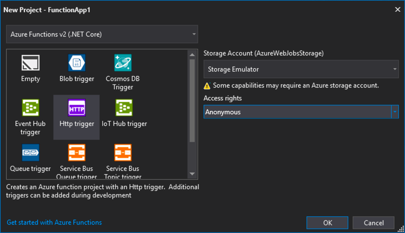
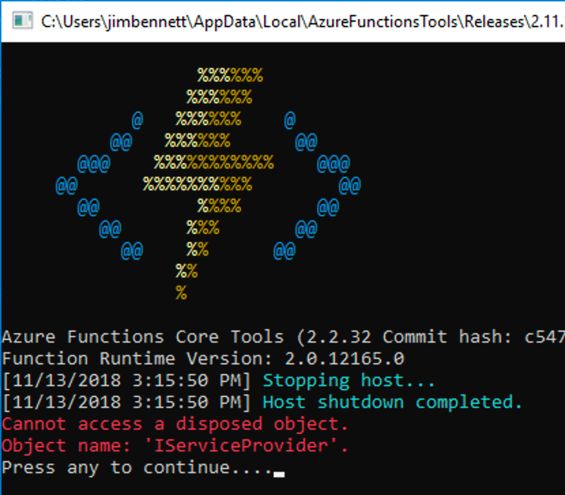
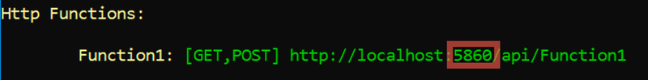

__Dentists don't want you to know these 5 tips that show how easy it is to run multiple Azure Functions apps locally and debug them all at the same time!__

__Number 3 will shock you!__


<div class="image-div" style="max-width:250px;">
    

    
</div>

Enough ClickBait nonsense, on to the post. 

I recently built a [demo app](https://github.com/jimbobbennett/AzurePhotoSharer) that has two Azure Functions projects in it - one using the new V2 Functions runtime and written in C#, and one using the old V1 runtime so that it can access some .NET framework bits and written in F#.

One of the really cool features that Azure Functions offers is the ability to [run your functions locally](https://docs.microsoft.com/azure/azure-functions/functions-develop-local/?WT.mc_id=debugfunctionslocally-blog-jabenn) with a full debugging experience, and this is supported in Visual Studio 2017 as well as VSCode. 

> This post focuses on how to do this in VS2017. For VSCode, follow [these instructions](https://code.visualstudio.com/tutorials/functions-extension/run-app/?WT.mc_id=debugfunctionslocally-blog-jabenn).

This post looks at:

* Debugging [one function app](#OneApp)
* How to run [multiple function apps](#ManyApps) at the same time
* How to [debug multiple functions apps](#DebugManyApps) at the same time using Visual Studio 2017

<a id="OneApp">
    
####  Debugging one Function app
    
</a>

This is easy to try out yourself, just create a new Azure Functions app in Visual Studio, add a breakpoint in the HTTP trigger then start debugging. The Azure Function app will launch in a local functions host, and your trigger will be available locally on `http://localhost:7071/api/Function1` - so listening on port `7071`. You can launch your favorite browser, navigate to this URL and your breakpoint will be hit, giving a full debugging experience with watch, edit and continue and all the normal bells and whistles.

Create one of these:

<div class="image-div" style="max-width:600px;">
    

    
</div>

Use these settings (V2, HTTP Trigger, Anonymous):

<div class="image-div" style="max-width:600px;">
    

    
</div>

Stick a break point in the function:

<div class="image-div" style="max-width:600px;">
    

    
</div>

Start debugging the function the same way as any normal app (you may need to grant firewall access). This will launch a console window with the functions host running - you'll see some cool ASCII art then the functions output including the HTTP URLs for all HTTP triggers:

<div class="image-div" style="max-width:600px;">
    

    
</div>

Now launch your favorite browser and navigate to the Function1 URL. The function will run and your breakpoint will be hit. This is a full debug session with edit and continue:

<div class="image-div" style="max-width:600px;">
    

    
</div>

Click __Continue__ and see the output of the function in your browser:

<div class="image-div" style="max-width:600px;">
    

    
</div>

> There is also a storage emulator that you can run locally so you can read/write to blobs, tables and queues and even use triggers. Read more [here](https://docs.microsoft.com/azure/storage/common/storage-use-emulator/?WT.mc_id=debugfunctionslocally-blog-jabenn).

<a id="ManyApps">
    
####  Running multiple Function apps at the same time
    
</a>

Running one function app locally is cool, running multiple is even cooler!

<div class="image-div" style="max-width:600px;">
    

    
</div>

Add a new function app to your project, then run it without debugging using _Debug->Start without debugging_. This will spin up the local Azure Functions host and start listening on port `7071`.

Now the beady-eyed amongst you will notice this is the same port as the first functions app. By default the local functions host listens for HTTP requests on port `7071`, so if you now launch the first functions app it will fail - with a really weird error:

```sh
Cannot access a disposed object.
Object name: 'IServiceProvider'.
```

<div class="image-div" style="max-width:400px;">
    

    
</div>

The fix for this is to tell the functions host to run on a different port, and this can be done by adding arguments to the command line that is run when the function app is debugged. Kill all the functions hosts, and open the properties for the second function app. Head to the __Debug__ tab, and set the _Application arguments_ to be:

```sh
host start --pause-on-error --port 5860
```

This will start the functions host listening on `port 5860`. You can use any port you wish for this of course.

> These settings are not saved in the project itself, just in your user settings so this won't be in source control.

Now if you run the second function app it will be listening on a different port:

<div class="image-div" style="max-width:600px;">
    

    
</div>

<a id="DebugManyApps">
    
#### Debugging multiple function apps in VS2017
    
</a>

Running multiple is good, but debugging them is even gooderer!

<div class="image-div" style="max-width:600px;">
    

    
</div>

Although Visual Studio 2017 can't launch multiple apps at the same time, you can launch one then attach to the others. To do this:

* Put break points in the HTTP triggers for both function apps
* Start the first function app without debugging
* Start the second function app through the debugger
* Attach the debugger to the first function app:
    * Select _Debug->Attach to process..._
    * Search for _func_
    * One `func.exe` process will be greyed out - this is the one that is currently running through the debugger. Select the other one and click __Attach__.

<div class="image-div" style="max-width:600px;">
    

    
</div>

You should now be able to open `http://localhost:7071/api/Function1` in your browser and hit the breakpoint in your first function app, and open `http://localhost:5860/api/Function1` to hit the breakpoint in the second function app.

> You don't get edit and continue in the function app you attached to, only in the one run through the original debugger. If you want edit and continue make sure the function app you want to use this for is run through the debugger, and attach to the others.

<hr>

Want to learn more about Azure Functions? Well we have a learning path for that as part of [Microsoft Learn](https://docs.microsoft.com/learn/?WT.mc_id=debugfunctionslocally-blog-jabenn). Check it out [here](https://docs.microsoft.com/learn/paths/create-serverless-applications/?WT.mc_id=debugfunctionslocally-blog-jabenn).

<div class="image-div" style="max-width:150px;">
<a href="https://docs.microsoft.com/learn/paths/create-serverless-applications/?WT.mc_id=debugfunctionslocally-blog-jabenn">
    

   
</a>
</div>


