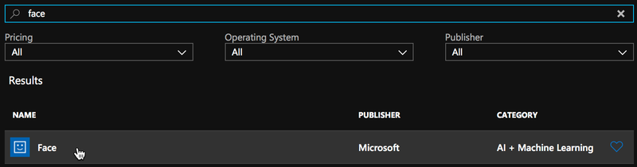
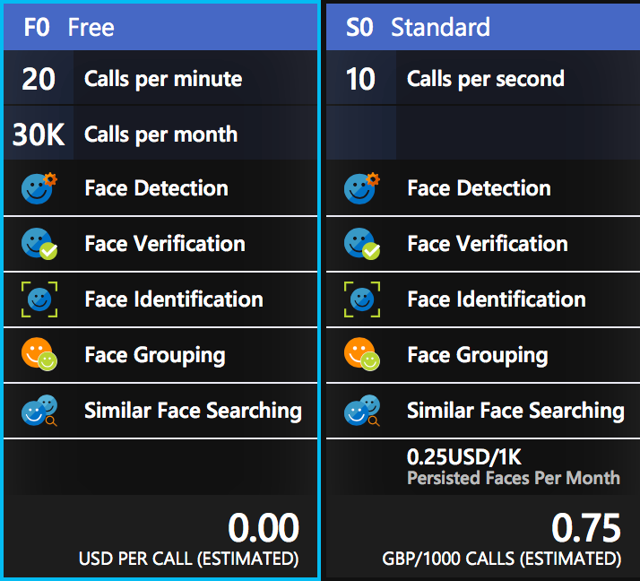

Recently I've been playing with a lot AI and seeing how it can be used in mobile apps to enhance the experience offered to the user. Currently I am playing with facial recognition using the [Azure Cognitive Services Face API](https://aka.ms/Vd514y). This is a stupidly powerful API that can do a LOT of different things:

* Detect faces in images
* Analyze those faces to detect characteristics such as hair color, gender, age
* Detect the different points on a face, such as the pupils or lips
* Compare two faces and verify if they are from the same person
* Group faces by similar facial characteristics
* Identify faces from a repository of up to a million images

This is a very powerful set of APIs with a large number of different use cases. For example if you were building a social network you could use the facial identification to automatically tag peoples friends in images. If you were building a ride share system you could use facial verification to ensure the driver is who you expect it to be. For now I'm going to focus on one particular example - identifying faces from a photo in a mobile app.

## Face Finder

I've built a sample mobile app to show off the facial recognition tools in this API, and you can grab the code from [my GitHub repo](https://github.com/jimbobbennett/FaceFinder). This app takes a photo, then finds all the faces in that photo, giving a breakdown of the details of each face.

<div class="image-div" style="max-width: 300px;">
    

    
</div>

In the rest of this post I'll go through you can get signed up for FaceAPI, and how the app works.

#### Getting started with FaceAPI

From the [Azure Portal](https://portal.azure.com/?WT.mc_id=azureportal-blog-jabenn), select __Create a resource__, search for _"Face"_, and select __Face__ from the __AI + Machine Learning__ category. The click __Create__.

<div class="image-div" style="max-width:480px;"> 
    

    
</div>

Enter a name for this resource, select your subscription and the location nearest to you. For the pricing tier, there is a free tier called __F0__ that gives you 30,000 calls per month at a rate of no more than 20 per minute, and you can have one face resource per subscription with this tier. After this there is a paid tier limited to 10 calls per second and you pay per 1,000 calls - at the time of writing this is US$0.25 per 1,000 calls.

<div class="image-div" style="max-width:300px;"> 
    

    
</div>

Choose a resource group, or create a new one and click __Create__. Once it has been created, head to it and grab an API key from _Resource Management->Keys_, and the endpoint from the _Overview_ blade.

#### Building and running the app

The Face Finder app is pretty complete, all you need to do is update the `ApiKeys.cs` file with your API key and endpoint. For the `FaceApiKey`, copy yours and paste it in. For the `FaceApiEndpoint`, paste the value for the endpoint, removing everything past `microsoft.com`. For example, for me the endpoint shown in the Azure portal is _https://westeurope.api.cognitive.microsoft.com/face/v1.0_, so I would set the endpoint to `https://westeurope.api.cognitive.microsoft.com`.

> If you get a _Not Found_ exception, then check your endpoint - this exception is thrown if you don't remove everything past `microsoft.com`.

Once you have done this, build and run the app. When it loads, tap the __Take photo__ button and take a picture of one or more faces. The app will then show a list of all the faces detected, describing them using the detected age and gender. Tap on a face in the list to see more details, including if that person is smiling, if they are wearing glasses, what hair, facial hair and makeup they have, and their emotion.

#### So how does it work

This app is a simple Xamarin.Forms app, with three pages and some view models. The first page, `FaceFinderPage.xaml` has a button you tap to take a photo, wired up to a command on the `FaceFinderViewModel`. This uses the [Xam.Plugin.Media](https://www.nuget.org/packages/Xam.Plugin.Media/) plugin from [James Montemagno](https://twitter.com/JamesMontemagno) to launch the camera and take a picture. This picture is then run through the face API.

The face API is accessed via an SDK from a NuGet package. Currently there are a load of NuGet packages from Microsoft with names containing __ProjectOxford__ - the code name for the various vision cognitive services. These are being replaced with new packages that are called __Microsoft.Azure.CognitiveServices.*__, and these packages are currently in pre-release. For the face API, I'm using the __Microsoft.Azure.CognitiveServices.Vision.Face__ package, currently available as a pre-release package. 

<div class="image-div" style="max-width: 600px;">
    

    
</div>

The important class to note here is `FaceClient`, this wraps a connection to the Azure Face Api and is configured using your API key and endpoint.

__Initializing the FaceClient__

Before you can use the Face API you have to configure it to use one of your keys and the appropriate endpoint. When constructing an instance of `FaceClient` you need to pass it credentials, in the form of an instance of `ApiKeyServiceClientCredentials` which takes one of the API keys assigned to your account as a string in a constructor argument:

```cs
var creds = new ApiKeyServiceClientCredentials("<your api key>");
```

You can then pass this to the constructor of the `FaceClient`:

```cs
var faceClient = new FaceClient(creds);
```

Finally you set the appropriate endpoint to match the endpoint shown with your keys:

```cs
faceClient.Endpoint = "https://westeurope.api.cognitive.microsoft.com";
```

__Detecting faces__

Once you have your instance of the `FaceClient` you can then use that to detect faces using the `Face` property to access all the different face operations the API supports. The method I'm interested in is the `DetectWithStreamAsync` method. This takes a stream containing the image, and sends it up to Azure to detect faces. The `Async` suffix is because it is an `async` method that you can await (not sure why they've added this suffix - they don't have non-async versions on the API).

```cs
var faces = faceClient.Face.DetectInStreamAsync(imageStream);
```

The `imageStream` comes from the media plugin. When you use this plugin to take a photo it returns a `MediaFile` which has a method to get the image as a stream that can be passed to the detect call. This method has some other parameters on it which we'll look at later.

The results of this call is a list of detected faces - literally a `List<DetectedFace>`, with one entry per face that was detected in the image. Each `DetectedFace` in the list contains a set of properties about that face, including coordinates of a rectangle that shows where the face is in the image. The picture below shows a face with this rectangle drawn on top.

<div class="image-div" style="max-width: 300px;"> 
    

    
</div>

__Detecting face attributes__

So far, so good - we can find where a face is. Now what about more details about the face? This is where the extra parameters on the `DetectWithStreamAsync` method come in.

```cs
DetectWithStreamAsync(Stream image, 
                      bool? returnFaceId = true, 
                      bool? returnFaceLandmarks = false, 
                      IList<FaceAttributeType> returnFaceAttributes = null, 
                      CancellationToken cancellationToken = default(CancellationToken));
```

So what do these parameters do:

* `returnFaceId` - set this to `true` (the default) to return an Id for the face. This Id can then be used for face searching operations - outside the scope of this post!
* `returnFaceLandmarks` - set this to `true` (default is `false`) to return the coordinates of the facial landmarks, for example the positions of the pupils, nose, lips etc.
* `returnFaceAttributes` - this is a list of the different face attributes you want returned. There are a lot of these! In the Face Finder app I get them all, and they are:
  * `Age` - a guess at the age of the face. Seeing as it predicted me at 9 years older than I am in the image above it's either buggy, or (more likely) I need more sleep and to look after myself!
  * `Gender` - a guess at the presented gender. Just limited to male or female.
  * `HeadPose` - what position the head is in, pitch, roll and yaw.
  * `Smile` - the percentage certainty that the face is smiling.
  * `FacialHair` - the percentage certainty that the face has a beard, mustache or sideburns.
  * `Glasses` - the type of glasses (if any) the person is wearing, so normal glasses, sun glasses etc.
  * `Emotion` - the percentages that the face is displaying a set of emotions (e.g. anger, happiness, surprise) 
  * `Hair` - the percentages certainty that the face has different colored hair. If no hair is detected then this list is empty, otherwise it covers all natural hair colors and 'other'. This also specifies if the face is bald or if the hair is invisible (such as under a hat or scarf).
  * `Makeup` - The percentage certainty that the face has eye or lip makeup on.
  * `Occlusion` - how much of the face is occluded (such as by a mask, bandana, hair etc.)
  * `Accessories` - any accessories on the face, such as glasses or a hat
  * `Blur` - how blurry the face is.
  * `Exposure` - how well exposed the picture is.
  * `Noise` - how much noise there is in the image.

These landmarks and attributes come back on the `DetectedFace` instances, and are present for all faces in the image.

#### What sort of apps can I build with this?

This API is great and can provide a LOT of power, but are they just for mucking around, or can we build real-world apps with them? Well a few examples I can think of without trying too hard are:

* Passport photo app. Passports have strict requirements about photos, so you could use this API to ensure the person was looking at the camera (`HeadPose`), no glasses (`Glasses`) or make-up (`Makeup`), and a neutral expression (`Emotion`). The photo needs to be of good quality (`Exposure`, `Blur`, `Noise`).
* Facial blurring. You could detect the face rectangle and blur out faces automatically, for example in apps that make photos public. You could even do it by age to only blur out children if needed.
* Adding decoration to faces. Using the landmarks you could add fake glasses, hats, dog noses or other things to a face to make a comedy picture. I've even seen an example replacing faces with emojis that match the emotion being shown.
* Auto-picture selection. You could take a selection of pictures and have it choose the best one based on quality (`Exposure`, `Blur`, `Noise`) and if the people in it are smiling (`Emotion`).

#### Where can I learn more?

We've got loads of great content on-line showing all the cool things you ca do with this API, from all different languages. Check them out:

* Read the offical docs at [docs.microsoft.com](https://aka.ms/I5y8t7)
* Work through some great tutorials from the [Microsoft AI School](https://aka.ms/Hz3eo7)

