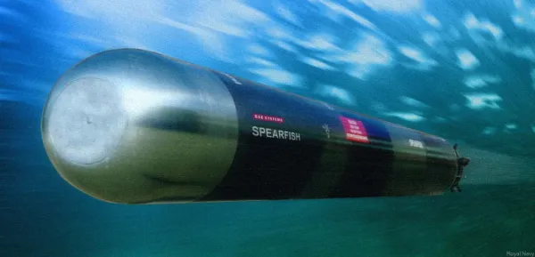

Will technology, automation, or AI take our jobs? This is something we hear a lot at the moment - but it's always been this way. Right back at the start of my career I automated something that was canned the moment I left as folks were afraid of their job.

Some background to why I am writing this post. I was reading a tweet today from [Michelle Bakels](https://twitter.com/MichelleBakels) that was a cautionary tale from her enterprise days.

<blockquote class="twitter-tweet">
Cautionary tale from enterprise days re: AI/automation:  Company touted big Innovation Week where IT interviewed other depts (accounting, marketing, etc.) to find workflow optimizations for the business.  After 3 years, the other depts shut down when IT would come for interviews.…
&mdash; Michelle Bakels (@MichelleBakels) <a href="https://twitter.com/MichelleBakels/status/1721597776893489190?ref_src=twsrc%5Etfw">November 6, 2023</a></blockquote> 

I'm not going to dump the entire text here - go read the tweet as it's fascinating, but the TL;DR is folks are scared of telling IT what they do in case it is automated and they are out of a job.

## Will technology replace \<thing\>?

This is something that is constantly talked about in the tech world, though feels like it has really come to the surface recently with the rise of AI. Will technology replace us? Will AI take our jobs (one of the catalysts of the recent SAG-AFTRA strikes in the TV and movie industry)? Will self-driving cars replace taxies? Will cars replace horses? Will movable type replace handwritten books? The list goes on.

Rather than dive into this discussion, I thought it would be fun to tell a story of my own - of how I automated something during an internship, and how it got killed the minute I left as folks were worried it would replace their jobs.

## Jim gets an internship at Marconi

This was just after I graduated in 1999 - I started working on a summer internship at Marconi ([plays the mamba, listen to the radio](https://youtu.be/K1b8AhIsSYQ?si=i5wCmF8Y2Vbin0cn)) in their underwater weapons division. This was probably the start of my route towards being a pacifist and hating all weapons and the military industrial complex.

My job was to analyze torpedo data. Marconi built these $1M Spearfish torpedoes that didn't work very well, and they would do trials on them in various parts of the world (Faslane in Scotland, deep water testing in the Caribbean). The testing torpedoes would record data about their decisions, as well as telemetry such as depth, speed, location etc. They would also record radar data and what they identified in the way of ships. The goal was to drop a torpedo in the water and send it at a ship, then gather the data afterwards to see if it did the right thing. Not quite testing in production as the torpedoes had no explosives, but the closest you can get.

### The reporting process

Once the trails were over, someone had to analyze the results, and this was the team I was on. The process was horribly manual:

- Remotely log into a mainframe and request a printout of the data from the torpedo trial as a hex dump on green and white continuous feed paper.
- Work through the hex dump using highlighters to 'read' what was happening. Hex codes marked the steps in the output, and each one had so many bytes of information. For example, one hex code was for direction and you knew that meant the next X bytes were the direction information, then the next character was the next set of data. Very laborious and error prone
- Enter all this data into an Excel spreadsheet showing each step
- Extract location and direction data and put this into another page on the spreadsheet
- Generate a chart to show the torpedo's movements
- Create a word doc with all the steps that the torpedo did, along with the charts.
- Actually do the analysis and look for issues for the software teams to investigate

(There are probably more steps which I have forgotten as it was 24 years ago)

Apart from the last step which actually used your brain, the rest was repetitive and dull. It could easily take a week or to to get a report ready to be able to do the final analysis step. And there was a whole team doing this, most of them ex-Ministry of Defense folks who just wanted to get their pension.

### In comes Jim with an idea!

So I had an idea! I was an engineer after all. I could automate all the things, I'd be the hero, save the company money and everyone would love me.

<iframe src="https://giphy.com/embed/PoHTJgxBHCCJ2zCbvf" width="480" height="480" frameBorder="0" class="giphy-embed" allowFullScreen></iframe>
<a href="https://giphy.com/gifs/outlander-season-4-starz-PoHTJgxBHCCJ2zCbvf">via GIPHY</a>

So I set about doing this whilst I was working on a report.

### Automate all the things

Firstly I had to automate getting the data - can't do this from a printer. Luckily the mainframe that I logged into to print could just dump the data to the screen. How could I get this in a way I could do things with it? Excel!

So I wrote some good old VBA in Excel to connect over SSH to the mainframe and download all the data. I had one control sheet that you enter the trial number into, a button to click and away it would go downloading the data and filling out a second sheet.

Next was replacing the highlighter pen! Easy to do in Excel, work through each cell to get the action for each step, highlight the cells as if I was using a highlighter pen and paper, and extract the data for each action.

Once I had the actions, it was easy to convert from the hex codes to the steps information that was wanted. Same with locations - easy to extract and plot the chart.

Finally it was time to create a word doc - and VBA can do this nicely.

### The result

All in all I spent about 4 weeks on this, and was able to generate a report ready for analysis in about 10 minutes, as opposed to 1-2 weeks. I packaged this as an add-in, so anyone could use it - just add the add-in, enter the trial number and away it went and spat out the doc.

I even gave it a cool name: Spearfish Trials Analysis Report Writers Automated Reporting Suite - or STAR WARS for short (this was a few months after Episode 1 came out after all).

I was impressed, I could save everyone time!

### The reception

Everyone hated it. Simple as that. I was told there was no way it could be better than a human, and one of the top report writers challenged me to produce a better report. In 10 minutes I had one, in 4 days she had her version, and she'd made some mistakes - which made her hate it (and me) even more.

After I left, it was deleted and everyone forgot about its existence. It took me a while to figure out why - everyone was afraid. This one spreadsheet could replace almost the entire team of 7 people. You'd just need this spreadsheet and 1 person to do the analysis as the bulk of the job was manually processing reports. I could have put 6 people out of work in just 4 weeks.

Regardless of how you feel about waste in enterprises, this was 6 humans, with families who had houses, mortgages, rent, bills, who needed to eat and to live. The lives of 6 families who could have been destroyed with one spreadsheet.

## Conclusion

Yes, automation is coming. Yes, technology can solve so many things. Yes, in theory if a job is replaced by automation then folks can focus their knowledge and energy onto solving bigger problems. But the reality is business is run by people who want to make as much money as possible, so automation is a way they can cut jobs and boost shareholder value, whatever that is (I'm guessing making rich folks richer).

This is not always the case, and this is a very cynical and dystopian view, but in most cases this is the truth. Even in the high-paying tech world of multi-trillion dollar companies, folks are dropped in an instant to boost share prices.

So it's not surprising folks are worried about computers taking their jobs. If we are in the throes of an AI revolution, then maybe we need to really push the conversations around [universal basic income](https://en.wikipedia.org/wiki/Universal_basic_income), and taxing large corporations and billionaires to pay for it.
