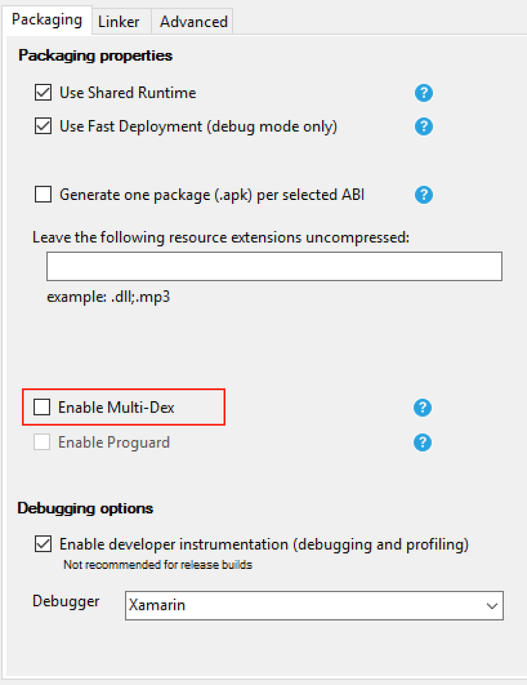

When building large apps on Android you may end up getting a weird 'Java has exited with code 2'.  This is caused by a limitation when building Android apps of 65,536 fields.  Sounds odd I know, but your app can't contain are than 65k fields - a field being a method, property or similar.  You may think that this is a lot, but this also includes any other libraries you use, and just by including google maps you're already half way there.  You can get more information on this [on the Android developer page](https://developer.android.com/studio/build/multidex.html).

Luckily there is a way round this - multidex.  When Android compiles your app it puts the code into a dex file and these dex files have the 64k limit.  To exceed this limit the compiler can create multiple dex files, each with 64k fields in it.  This seems like an overcomplicated solution, but from our perspective it's simple - just tick a box on the project settings and the Xamarin SDK/Android SDK does the magic.

<div class="image-div" style="width: 300px;"> 
    

    
</div>

Your Android app needs an application class to run, and if you don't have a custom application class in your app it gets the default Android one - Application.  When you set your app to use multidex the default application class that is used is MultiDexApplication.  Now if you have your own custom application class that derives from Application, then setting multidex will tweak your code so that it derives from MultiDexApplication.
In addition to this when your app is launched it needs to run the application.  In the case of an app with multiple dex files it needs to look in all the dexes to find the application class.  On Lollipop and above this is not a problem, the OS is built to understand this and teach for the application.  However on previous versions such as KitKat multidex wasn't built in, so the OS will only ever look in the first dex file as this is all it knows about.  If the application class is not found, the app crashes on startup.
Again normally this is nothing to worry about. When your app is built it knows which classes to put in the first dex file - it creates a list of classes to put in the main dex and uses this during the build.  This means when your app is launched on a pre-lollipop device the right code is in the main dex so your app is launched, and because it uses MultiDexApplication this will cause the other dexes to load.

So for a developer - just tick the box and job done.

Except when it goes wrong.  I've spent the last few weeks with an issue where my large app crashes instantly on KitKat because it can't find the application class.
Luckily I've had access to Xamarin support to help look into this.

It seems the issue is caused by a bug in the Android SDK on Windows. See https://code.google.com/p/android/issues/detail?id=187721 for more details, but basically when it generates the list of classes to put in the first dex, the list ends up empty.

This only affects the Android SDK on Windows, and so far it's in the latest build tools versions - 23 and up.  There is a simple fix, a big thanks to Jon Douglas at Xamarin for providing this.

What you need to do is edit the `mainDexClasses.bat` file inside `android-sdk\build-tools\23.0.3` (or whatever is your latest version).  It also helps to delete all earlier versions to ensure the wrong one doesn't get used.  In this file, near the bottom, change:

```
if DEFINED output goto redirect
call "%java_exe%" -Djava.ext.dirs="%frameworkdir%" com.android.multidex.MainDexListBuilder "%disableKeepAnnotated%" "%tmpJar%" "%params%"
goto afterClassReferenceListBuilder
:redirect
call "%java_exe%" -Djava.ext.dirs="%frameworkdir%" com.android.multidex.MainDexListBuilder "%disableKeepAnnotated%" "%tmpJar%" "%params%" 1>"%output%"
:afterClassReferenceListBuilder
```

to:

```
SET params=%params:'=%
if DEFINED output goto redirect
call "%java_exe%" -Djava.ext.dirs="%frameworkdir%" com.android.multidex.MainDexListBuilder %disableKeepAnnotated% "%tmpJar%" %params%
goto afterClassReferenceListBuilder
:redirect
call "%java_exe%" -Djava.ext.dirs="%frameworkdir%" com.android.multidex.MainDexListBuilder %disableKeepAnnotated% "%tmpJar%" %params% 1>"%output%"
:afterClassReferenceListBuilder
```

And that's it!  Rebuild your app and it should now run on pre-lollipop devices.

This only affects Android builds on Windows, not on Mac.  Also be aware though that there is a different bug in Xamarin on the alpha and beta channel that causes issues with Multidex, so if you're running into a problem on these versions you'll need to update to stable until a fix is released.

<hr>

And here's a better blog post on it from the engineer at Xamarin who helped me solve the issue.

http://www.jon-douglas.com/2016/09/05/xamarin-android-multidex/

