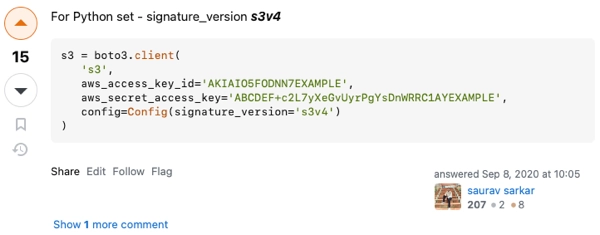

> TL;DR: If your `put_object` boto3 pre-signed URLs are failing with access denied errors, add `config=Config(signature_version="s3v4")` when creating the boto3 client to get a working URL.

I was recently working on some Python code to interact with S3 buckets, where I needed to be able to generate some pre-signed URLs for S3 objects. These are URLs that contain a built-in time-limited credential to allow access, meaning that you can give this URL to anyone and they can read an object, or write it without access to your AWS account or S3 bucket - they only have access to that one object.

In Python there is a helpful library called [boto3 from Amazon](https://boto3.amazonaws.com/v1/documentation/api/latest/index.html#) that can be used to interact with AWS services. This includes S3, and it has a method to generate pre-signed URLs for objects.

## Get started with boto3

### Set your credentials

You can only access S3 if you have the correct credentials. These are your AWS access key and secret key, and need to be set in your AWS credentials file using the AWS CLI:

```bash
aws configure
```

Or you can edit the `~/.aws/credentials` file directly:

```ini
[default]
aws_access_key_id = YOUR_ACCESS_KEY
aws_secret_access_key = YOUR_SECRET
```

### Install boto3

To use boto3, you need to install it in your current Python environment. This can be done with pip:

```bash
pip install boto3
```

Obviously using a virtual environment or a development container is a good idea, but I'll leave that up to you 😁.

Once done, you just need to import boto3 into your Python code:

```python
import boto3
```

Then you need to create a client for the service you want to use. In this case, S3:

```python
region = 'us-east-1'
s3 = boto3.client('s3',
                  region_name=region)
```

Clients are regional, so you need to specify the region you want to use. In this case, I'm using `us-east-1`.

## Create pre-signed URLs

Once the client is created, you can use it to generate pre-signed URLs for objects in your S3 bucket using the `generate_presigned_url` method.

### Create a get object pre-signed URL

The first case I needed was for someone to be able to download an object from my S3 bucket. In AWS, this is the `get_object` client method.

Here is the code to generate a pre-signed URL for getting an object in an S3 bucket:

```python
url = s3.generate_presigned_url(
    ClientMethod='get_object',
    Params={
        'Bucket': 'my-bucket',
        'Key': 'my-object'
    },
    ExpiresIn=3600
)
```

This takes the client method - `get_object`, the parameters - the bucket and the object key, and the time the URL is valid for in seconds.

This gives you a working URL that anyone can use for the object `my-object` in the bucket `my-bucket` that is valid for 3600 seconds, or 1 hour. You share that URL with someone, and they can download that one object only.

### Create a put object pre-signed URL

The second case I needed was for someone to be able to upload an object to my S3 bucket. In AWS, this is the `put_object` client method.

Now, in theory this is the same as the `get_object` call just with a different client method:

```python
url = s3.generate_presigned_url(
    ClientMethod='put_object',
    Params={
        'Bucket': 'my-bucket',
        'Key': 'new-object'
    },
    ExpiresIn=3600
)
```

As we all know, theory and practice are the same in theory, but not in practice. This code will generate a URL, but when you try to use it, you will get an XML document with an access denied error.

```output
The request signature we calculated does not match the signature
```

This took hours to get to the bottom of, but after plenty of S3 reconfiguration and some googling, I found the solution in [an answer buried in this stack overflow question](https://stackoverflow.com/a/63791634/1034742)



It seems this configuration option is not well documented. It is mentioned in the [boto config docs](https://botocore.amazonaws.com/v1/documentation/api/latest/reference/config.html) but without any details on why you need a different signature version for `put_object` URLs, or what the default is.

So, to generate a working pre-signed URL for `put_object` in S3, you need to add the `signature_version` to the `Config` object when creating the client:

```python
from botocore.config import Config

s3 = boto3.client('s3',
                  region_name=region,
                  config=Config(signature_version="s3v4"))
```

Once you have done this, the code above to generate a pre-signed URL for `put_object` will create a URL that works as expected. You can now share this with anyone and they will be able to upload a new object to your S3 bucket, with the key given in the params.

In the example above, they would be able to upload an object to the bucket `my-bucket` with the key `new-object`. Again, the URL has an expiry, so is valid for 3600 seconds, or 1 hour.

## Conclusion

[Saurav Sakar](https://stackoverflow.com/users/6514028/saurav-sarkar), you are my hero! If you are creating re-signed URLs, make sure to set the `signature_version` to `s3v4` in the `Config` object when creating the client.
