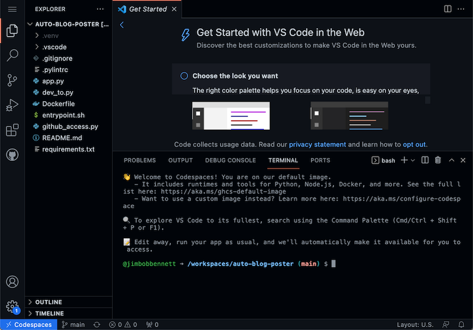
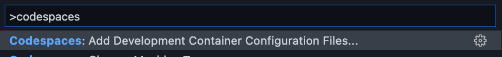
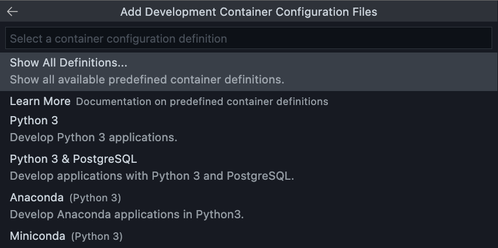
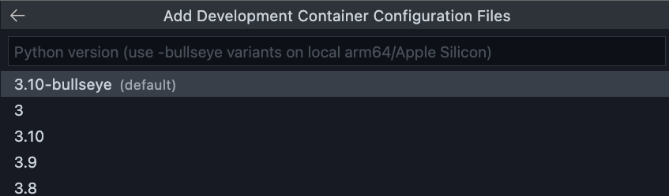
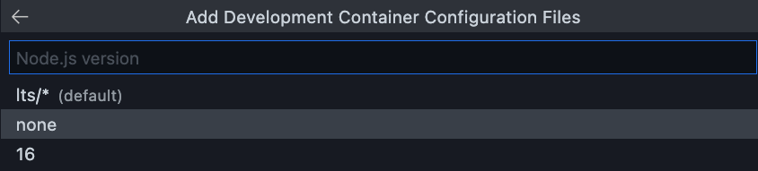
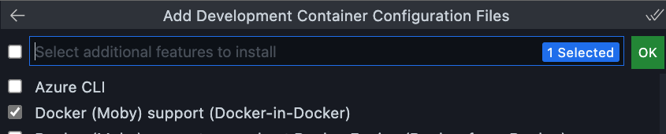
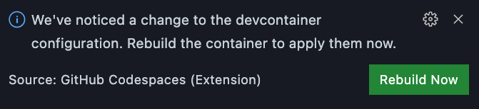

The bane of every new developers life is getting your environment set up to be productive. And when I say new developer - I don't just mean a dev who is new to a team, but every developer who needs to work on a project they haven't worked on before.

Each project has it's own dependencies, required tools, required libraries, a whole swathe of things that need to be installed, and can in some cases cause problems when projects have conflicting requirements. I certainly remember having to uninstall/reinstall different tooling versions when switching projects, sometimes multiple times a day 😱.

What if there was a way to fix this? If we could instantly have a pre-configured developer machine with the right tools that we need available at the click of a button? Even better one powered by the cloud so we don't even need to worry about the power of our local machine, or even be able to access from a tablet or phone? This is where [Codespaces](https://github.com/features/codespaces) comes in.

[GitHub Codespaces](https://github.com/features/codespaces) are virtual developer machines in the cloud that you access through VS Code, running either on your desktop or in a browser. You can launch any GitHub repo inside a Codespace, with everything you do running in that Codespace - your code lives there, your debug sessions run there, your terminal runs commands there, it's as if someone teleported a dev machine into your office!

## Setting up a Codespace

I've been recently working on a project for my team that consists of a Python app that I want to run as a Docker container, so I thought it would be fun to configure the repo for this to run inside a Codespace so when anyone else on the team wants to work on it, they won't have any local configuration to do.

### Sign up for Codespaces

Codespaces needs to be set up for a team or organization - mainly so someone can pay! Despite the claims that the best things in life are free, you do need to pay for Codespace.

### Open your repo in a Codespace

The first step is to open the repo in Codespaces. From the repo in GitHub, select **Codespaces** from the **Code** button, then select **New codespace**.


This will set up your code in a new Codespace - essentiall a blank VM using a default image from GitHub. This image is based off Ubuntu, and comes pre-configured with Python. Node, Docker and other stuff. You can read up on this default image at [aka.ms/ghcs-default-image](https://aka.ms/ghcs-default-image).

This image contains almost everything I need - the tools are all installed, and VS Code is running with my code in it.



My code is in Python, and this image comes with Python 3.8 installed. It means I can create a Codespace, and run my code in only a few seconds!

## Configure your Codespace

The good news is Codespaces are configurable - you can define the details for the container in which your Codespace runs in a `devcontainer.json` file. I can use this to change the image used, configure what tools are installed, that sort of thing. The big upside of this is to ensure I have the right versions - the default container currently has Python 3.8 installed, but I can create a devcontainer file to set another version.

I'll start by creating a devcontainer file. The Codespaces extension is installed for you in VS Code, so you can use the command palette to access options to configure the devcontainer file.

I started by selecting **Codespaces: Add Development Container Configuration Files....**



From there I selected **From a predefined container configuration definition...** to use a pre-defined image. I could also use any container I have in my container registry.


From the images I chose a Python 3 image, and selected Python 3.10.





I then had an option to add a Node version, so selected None as I don't want Node.



Next I could select features to pre-install. I selected Docker as I need support for that.



2 things now happen. 2 new files are created in my explorer, `devcontainer.json` and `Dockerfile` in a folder called `.devcontainer`, and a toast will popup suggesting I rebuild the container. When I do this, Codespaces will restart with a new image based off my selections. It takes a while the first time as the container needs to be built.



The devcontainer.json file directs the Codespace to use the Dockerfile that was created to define the image. It then includes things like a list of extensions that VS Code will need - in my case PyLance.

```json
"extensions": [
	"ms-python.python",
	"ms-python.vscode-pylance"
],
```

I could and any more extensions here if I wanted, such as the Docker extension.

I could also edit these files to create a virtual environment, install Python packages, that sort of thing - though I'm not sure I'd need a virtual environment as my container will only be used to develop from this repo, so I could install packages globally and not worry.

### Check in your files

Once you are happy with your dev container setup, you can then check the .devcontainer folder and all it's contents into your repo. This will then be used by anyone who creates a Codespace for your repo!

## Learn more

If you want to learn more, check out the Codespaces docs - [docs.github.com/codespaces](https://docs.github.com/codespaces). There was also some great videos on it from GitHub Universe, this particular one by [Allison Weins](https://twitter.com/2PercentSilk) and Bailey Brooks works through the configuration of Codespaces.


