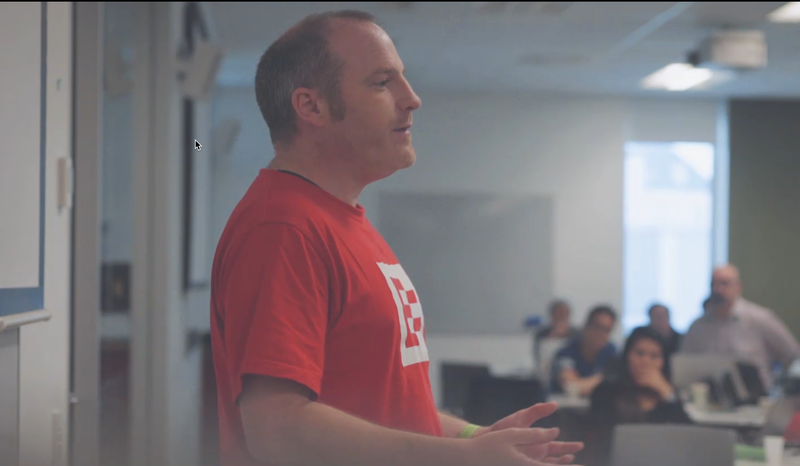

Inspired by [Satya Nadella's Hit Refresh](http://amzn.to/2lcaLDa), a book well worth reading, I thought I'd write about my Hit Refresh moment.

Hit Refresh is inspired by refreshing your browser - it doesn't reload everything, instead it just reloads part of the page. This is reflected in how we can change our lives, not by a complete change, but by refreshing a part. In my case it was three and a half years ago. I was working in finance for some of the worlds largest institutions writing desktop apps, and I was bored. By doing boring work using old technology for people who only cared about how much money they could make I'd lost my passion. No longer did I code at weekends or keep up to date with the latest cool things. In the end, enough was enough. I needed a change.

I decided mobile was the way to go, as I felt a strong interest in these new paradigms - the ability to take our content creation and consumption with us wherever we went. Looking around the technology landscape I discovered Xamarin. I could write mobile apps using C#, a language I was very familiar with, in Visual Studio, a tool I was also very familiar with. In a short space of time I took the plunge - I quit a job I hated and parked in a co-working space in Thailand with my MacBook, a Surface and a Xamarin license (and a very understanding wife and toddler). I spent 4 months learning this new, exciting technology.

At that point I couldn't find a job as a Xamarin developer, instead I went back to finance to pay the bills, but got heavily involved in the community. My passion was back so I wanted to spread this love around the world. I published code again, I blogged again, and for the first time I spoke at events, starting with meetups, then moving to international conferences. I'd truly found my passion. Later I got a job as a Xamarin developer, moving to New Zealand. Here I got involved running the local meetups, spending time with the local Microsoft team helping at all day events. I even ended up writing a [book on Xamarin](http://xam.jbb.io)!

I went from bored, to full of passion for a technology that made mobile so easy. I'd learned how much I loved presenting, so do it at every opportunity. I'd reinvented myself, not by a conscious effort to become someone else, but by discovering who I truly am. I am more content with my life, I love what I do. And career-wise, it has played out incredibly well, with another Hit Refresh moment coming, that I will blog about soon!

There is a moral to this story - find what you love and use it to hit refresh on your life, who knows where it will lead!

This post is part of the collection of #HitRefresh moments. Read more at www.hitrefreshbook.com

