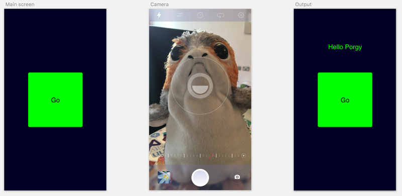

In the [first part of this post](/blogs/identifying-my-daughters-toys-using-ai/) I used the [Azure Custom Vision service](http://customvision.ai/?wt.mc_id=toyidentifier-blog-jabenn) to create an image classifier to allow me to easily identify my daughters cuddly toys. Once created I tested it by uploading an image and seeing what tags the classifier found for the image.

Although this works, it's a long winded way of using the model. Ideally I'd want it in a mobile app (after all, I am a bit of a Xamarin fan) so in this post we'll look at calling the classifier from a Xamarin app.

The first thing to do is to create a new blank Xamarin Forms app, I'm going to call mine __Toy Identifier__. This app will be pretty simple to start with - one screen with a big button to launch the camera, then after a photo is take I'll use text to speech to say the name of the toy.

<div class="image-div" style="max-width: 800px;"> 
    

    
</div>

Like a lot of Xamarin apps, the bulk of this will just be some of James Montemagno's Plugins joined together, so add the following packages to all the projects (core, iOS and Android):

* `Xam.Plugin.Media`
* `Xam.Plugins.TextToSpeech`

The Media plugin has some permissions you need to set, so follow the instructions at https://github.com/jamesmontemagno/MediaPlugin to configure this.

We'll also need the Custom Vision client side SDKs, so add:

* `Microsoft.Cognitive.CustomVision.Prediction`
* `Microsoft.Rest.ClientRuntime`

as well to all your projects.

You can find all the source code for this app on GitHub at https://github.com/jimbobbennett/ToyIdentifier, so grab the code now.

The UI is simple - a button and a label. Tap the button and the camera appears, take a photo and the label shows the name of the toy. I am using MVVM, but not bothering with a framework at this point as the app is too simple, so I've got a view model that is created inside my XAML which has all the fun logic.

If you open `ToyIdentifierViewModel.cs` you'll see how simple it is to take photos and upload them to the custom vision service. Taking a photo is easy thanks to James Montemagno's Media plugin:

```
var options = new StoreCameraMediaOptions { PhotoSize = PhotoSize.Medium };
var file = await CrossMedia.Current.TakePhotoAsync(options);
```

I'm using a medium sized photo - this returns an image which is 50% of the size of the one that comes out of the camera. This is fine as we don't need a high res image for recognition, and the serviced apartment I'm staying in at the moment has crappy internet so the smaller the better.

The `TakePhotoAsync` call returns a `MediaFile` object, with a method on it to return the file as a stream, and we can pass this stream to a call to the custom vision SDK.

To use the custom vision SDK we need to start by creating a `PredictionEndpoint`. Uploading an image to get the percentage chance of it matching the tags is called prediction.

```
private PredictionEndpoint _endpoint = new PredictionEndpoint { ApiKey = ApiKeys.PredictionKey };
```

The `PredictionKey` I'm passing in comes from a constants file - you'll need to update this file with your own API key. You can find this by going to the settings on your project in the custom vision portal and getting the value of the __Prediction Key__. There is also a `ProjectId` in that same file you need to set, again this comes from the settings page.

Using the prediction endpoint is easy - there is a `PredictImage` method on this class, and this takes the project id as a Guid, and a stream containing the image to use for the prediction. 

```
_endpoint.PredictImage(ApiKeys.ProjectId, stream)
```

This call uploads the image to the custom vision service and returns a model containing information about the custom vision project, and a list of predictions - essentially a list of all the tags the a numerical probability that the image matches the tag in the range of 0 to 1, the higher the number, the more likely the match.

Once we have these predictions we can sort them by probability then get the highest. We then need to add a threshold - after all if we match all tags with a probability < 0.01 then it's unlikely the image is one of our tags. In my code I've got a threshold of 0.5 to start with, but I might increase this after playing some more.

```
_endpoint.PredictImage(ApiKeys.ProjectId, stream)
         .Predictions
         .OrderByDescending(p => p.Probability)
         .FirstOrDefault(p => p.Probability > 0.5);
```

Once I have the best match I update the label to say hello to the particular toy, then use the text to speech plugin from James Montemagno to actually say hello to the toy. If there are no matches the label is changed to say "I don't know who that is".

If you want to see more on the SDK, it is on GitHub at https://github.com/Microsoft/Cognitive-CustomVision-Windows. At the time of writing the code in there is a bit out of date and doesn't match the NuGet package, so check out [this pull request](https://github.com/Microsoft/Cognitive-CustomVision-Windows/pull/11) to find the latest code.

Check out this short demo:

<div class="image-div" style="max-width: 300px;"> 
    

    
</div>

Want to read more on how to get started with the Custom Vision APIs? Check out the docs [here](https://docs.microsoft.com/en-us/azure/cognitive-services/custom-vision-service/home?wt.mc_id=toyidentifier-blog-jabenn).

In the [next post](/blogs/identifying-my-daughters-toys-using-ai-part-3-offline-ios/) we'll look at exporting these models to run on an iOS device.

