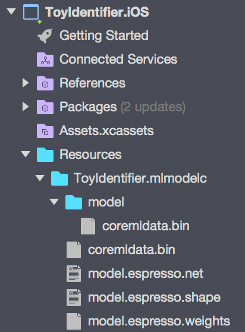

In the [first part of this series](/blogs/identifying-my-daughters-toys-using-ai/) I used the [Azure Custom Vision service](http://customvision.ai/?wt.mc_id=toyidentifier-blog-jabenn) to create an image classifier to allow me to easily identify my daughters cuddly toys. Once created I tested it by uploading an image and seeing what tags the classifier found for the image.

In the [second part](/blogs/identifying-my-daughters-toys-using-ai-part-2-using-the-model/) I accessed this model from a Xamarin app, so that I could use the camera to take a photo to run through the classifier using a NuGet package that talks to the Custom Vision service. 

The limitation with this NuGet package is that it requires internet access. Not such a huge problem for classifying single images with fast, cheap data contracts, but not so good in countries where data is expensive, or when classifying a live video feed.

Identifying toys is fun, and is a great project I can share with my daughter, but there are a lot or serious uses for this kind of technology, especially in medical imaging. 

Imagine an app where you can run your phone over moles on your skin and have it tell you in real-time if you are at risk of skin cancer. You'd want this to run on device for a couple of reasons. Firstly for speed, uploading a lot of images is slow. Secondly, and more importantly, this kind of technology is incredibly useful for third-world countries who have little in the way of education around health issues, or access to medical screening services. These countries also have little or no, or incredibly expensive internet access, especially away from big cities where people are more likely to be lacking medical screening. If you could take a phone on the road with these models running locally you could easily screen whole villages in a short space of time.

This kind of app is not a sci-fi dream, but is a real thing. You can see an example iOS app and download actual trained models for identifying skin cancer at https://github.com/Azure/ai-toolkit-iot-edge/tree/master/Skin%20cancer%20detection.

These models run on device using CoreML on iOS and TensorFlow on Android. In this post we'll look at CoreML, in the next post we'll look at TensorFlow.

<div class="image-div" style="max-width: 128px;"> 
    

    
</div>

#### Running models on CoreML

[CoreML](https://developer.apple.com/documentation/coreml) was introduced in iOS 11 and macOS High Sierra, and is a set of APIs for running models on device instead of up in the cloud. The models used are compressed and optimized to run on device GPUs, and they run pretty quickly. CoreML can run all sorts of models, and has a specialized API designed for running image classification models that we can take advantage of.

<div class="image-div" style="max-width: 400px;"> 
    

    
</div>

To download the CoreML model, head to the __Performance__ tab in the Custom Vision portal, selected the latest iteration from the list on the left (we'll cover iterations in a future post), and click the __Export__ link at the top. Select __iOS 11 (CoreML)__ then click __Download__. This will download a `.mlmodel` file. Before you can use this model, you will need to compile it - either in advance or at run time. 

To compile in advance on a Mac using the following:

```bash
xcrun coremlcompiler compile <model_name>.mlmodel <compiled_model_name>.mlmodelc
```

The `model_name` will be a GUID, so set the `compiled_model_name` to be something more user friendly. Once this is compiled you will have a folder called `compiled_model_name.mlmodelc` containing some model files. You will need to add this entire folder to your `Resources` folder in your iOS app, so drag this into Visual Studio.

<div class="image-div" style="max-width: 200px;"> 
    

    
</div>
<br>

You can also compile it at runtime. This is useful especially if you want to download new models without updating your app. If you want to compile at runtime, just add the `<model_name>.mlmodel` file to your resources folder, renaming the model to something easier to read than the default Guid.

To run CoreML models you need three components:

* The model
* A request for the model with a callback
* A request handler to issue the request

__The model__

Once we have the model as a resource, we need to load it into a CoreML model, then convert it to a vision model:

```cs
using CoreML;
using Vision;
...
var assetPath = GetModel();
var mlModel = MLModel.Create(assetPath, out NSError err);
var model = VNCoreMLModel.FromMLModel(mlModel, out err);
```

The `GetModel` method varies depending on if the model is compiled or not. For compiled models use:

```cs
private NSUrl GetModel()
{
  return NSBundle.MainBundle.GetUrlForResource("<compiled_model_name>", "mlmodelc")
}
```

To compile your model on device use:

```cs
private NSUrl GetModel()
{
  var url = NSBundle.MainBundle.GetUrlForResource("<model_name>", "mlmodel")
  return MLModel.CompileModel(url, our NSError err);
}
```

> In a real app you should check the NSError out variables for any errors

This code creates a `MLModel` from a URL to a resource, then converts this to a `VNCoreMLModel` - a 'Vision' CoreML model for image classification constructed using the custom vision model. The `Vision` namespace also contains some built in models for bar code recognition and facial recognition, amongst others.

If you want more information on this class, the docs for VNCoreMLModel are [here](https://developer.xamarin.com/api/type/Vision.VNCoreMLModel/?wt.mc_id=toyidentifier-blog-jabenn).

__The request__

The CoreML request wraps our model and provides a callback. Running these models is asynchronous - once you start it, it will run on the GPU in a background thread and invoke the callback once done.

The code to create the request is:

```cs
var request = new VNCoreMLRequest(_model, (response, e) => {});
```

The second parameter is the callback, with the `response` parameter containing the results from the model, and the `e` parameter being an NSError instance in case of an error.

If you want more information on this class, the docs for VNCoreMLRequest are [here](https://developer.xamarin.com/api/type/Vision.VNCoreMLRequest/?wt.mc_id=toyidentifier-blog-jabenn).

__The request handler__

Although this model is for image classification, it actually doesn't understand what an image is - it works on raw binary data only. The custom vision models expects this binary data to be in a specific format, namely a 227x227 CoreVision pixel buffer using 32-bit ARGB, whatever that is! Luckily it's easy to create one of these using code I found on [one of the Xamarin iOS CoreML samples](https://github.com/xamarin/ios-samples/blob/master/ios11/CoreMLImageRecognition/CoreMLImageRecognition/ClassExtensions/UIImageExtensions.cs). Follow that link for an extension method that converts from a `UIImage` to a pixel buffer.

Once we have the pixel buffer, we create a request handler for our buffer:

```cs
var buffer = source.ToCVPixelBuffer(_targetImageSize);
var requestHandler = new VNImageRequestHandler(buffer, new NSDictionary());
```

We can then invoke the request handler with our request:

```cs
requestHandler.Perform(new[] { request }, out NSError error);
```

This handler can be used to run multiple requests at once on the same pixel buffer, just pass all the requests you want to run as items in the array in the first parameter. This is useful if you wanted to screen for multiple conditions in a medical imaging app, with multiple models for each condition run against the same image.

If you want more information on this class, the docs for VNImageRequestHandler are [here](https://developer.xamarin.com/api/type/Vision.VNImageRequestHandler/?wt.mc_id=toyidentifier-blog-jabenn).

__Handling the response__

Once the model has been run, it will call the callback you passed to the request, passing in the response (or an error if it failed). This response has a method on it, `GetResults<T>()` that returns an array of results of whatever type the model spits out. For vision models, the results are of type `VNClassificationObservation`, so inside our callback we would do:

```cs
var results = response.GetResults<VNClassificationObservation>();
```

`VNClassificationObservation` has two fields that we are interested in:

* `Identifier` - this is the tag we set in our model
* `Confidence` - this is the probability that our image matches our tag, from 0 to 1 with 1 being 100% confidence.

These values match up to the `Tag` and `Probability` fields from the `ImageTagPredictionModel` class in the Custom Vision NuGet package. You can read more on the VNClassificationObservation class [here](https://developer.xamarin.com/api/type/Vision.VNClassificationObservation/?WT.mc_id=toyidentifier-blog-jabenn).

For an example of this code in action, check out my [Xamarin.PlugIn.OnDeviceCustomVision](https://github.com/jimbobbennett/Xam.Plugins.OnDeviceCustomVision) NuGet package. This wraps the code above, along with an Android implementation using TensorFlow (which we'll look at in the next post) in an easy to use Xamarin Plugin.

> CoreML is only supported on iOS 11 and above - so don't forget to set your deployment target to iOS 11 in your `info.plist`

You can read more on exporting and using models [here](https://docs.microsoft.com/en-us/azure/cognitive-services/custom-vision-service/export-your-model?wt.mc_id=toyidentifier-blog-jabenn). In the [next post](/blogs/identifying-my-daughters-toys-using-ai-part-4-offline-android/) in this series we'll see how to run models on device on Android using TensorFlow.

