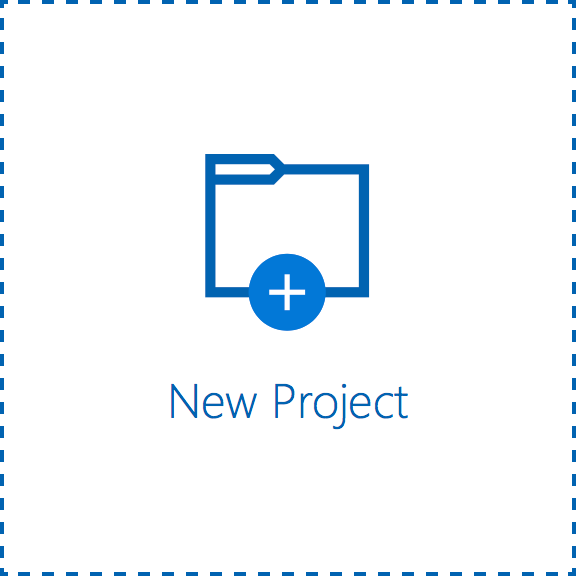
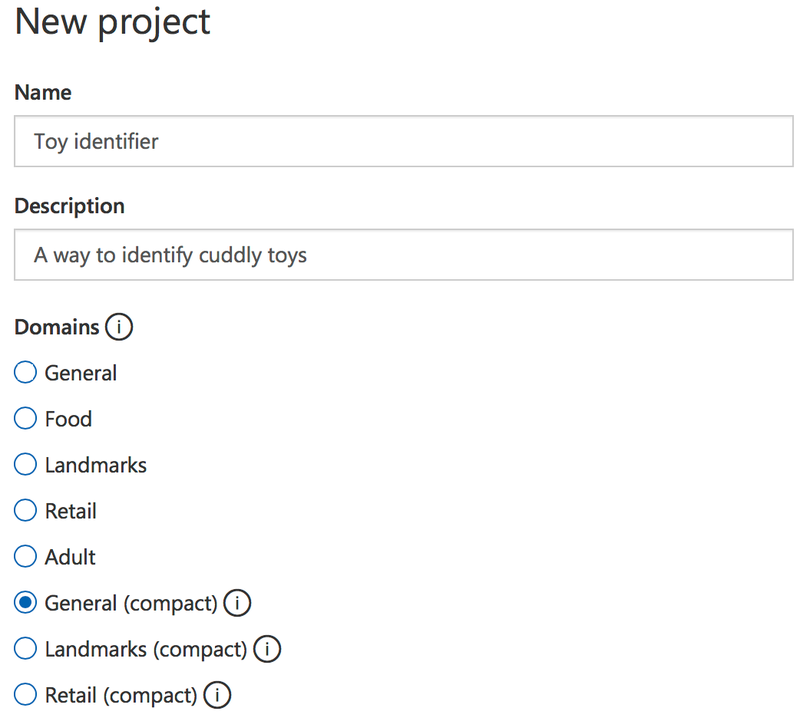
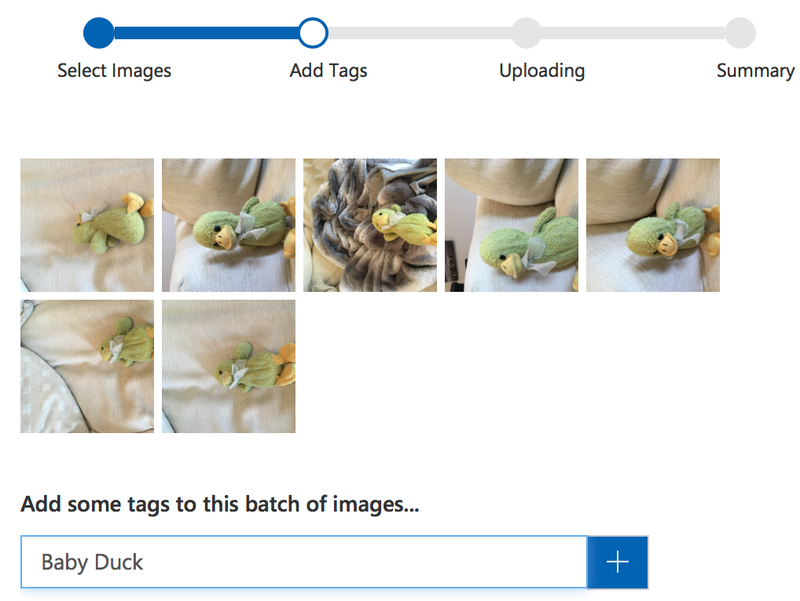

*Prefer to watch instead of read? - https://youtu.be/3sjInlJcpBs*

It's currently just after Christmas, and my 4 year old daughter has received a fair few cuddly toys from Santa. These bring her total collection up to way too many, and like most parents I have a hard time remembering all their names, especially the least favorite ones that rarely come out.

I've thought what would be really useful would be a mobile app that allows me to easily identify each toy. Luckily such an app is really, really easy to build using the power of AI.

One of the cool things you can do with neural networks is image classification. You set up the network with a training set of images and assign tags to each one. Once trained you can pump any image into the network and it will return a set of percentages that show how much it thinks the image matches all the tags it's learned about. For my app idea I can upload images of each toy, and tag those image with the name of the toy.

Normally training these networks takes a LOT of images - think hundreds or thousands. This could be problematic as I really cannot be bothered to take thousands of pictures of my daughters toys, not when there's Christmas leftovers to be eaten.

As it turns out, we actually don't need thousands of images. Microsoft have created a custom vision service as part of their Azure Cognitive Services that can do it with 5. Yup, only 5. Their neural network has already been partially trained for image recognition using some very clever technology that I have absolutely no chance of understanding, so you just upload a small set of pictures, assign a tag and away you go. 5 is a minimum, they do recommend at least 30 for better accuracy, but you can start with 5.

You can access this at [https://customvision.ai](https://customvision.ai/?wt.mc_id=toyidentifier-blog-jabenn). Head there, sign up or log in with a Microsoft account. This service is currently in preview, so is available for free for now.

Once you have logged in, click 'New Project' to create a new image classifier project.

    

    

A side bar will pop out where you can enter a name for this project, a description and select a domain. These domains are part of why this classifier can run with only a few images per tag in its training set - it's configured to be an image classifier, and they have a number of pre-configured networks to specialize in certain things. For example they have a version which is better when it comes to food, another that is better for landscapes, another that is better for filtering out adult content.

 
    

    

You can read more on the different domains in the [developer docs](https://docs.microsoft.com/en-us/azure/cognitive-services/custom-vision-service/getting-started-build-a-classifier?wt.mc_id=toyidentifier-blog-jabenn").

After entering a name and description, select a domain. You'll notice there are two versions of some domains - normal and compact. The compact ones are smaller models that can be downloaded as either a CoreML file or a TensorFlow file. These are model files you can import into a mobile app to run on the device. Create a __General (compact)__ model for now so we can download it later on (I'll cover this in more detail in a later post).

Once your project is created you need to train it, so select the __Training Images__ tab and upload a set of images that match one of the tags you're interested in. In may case, I'm starting by uploading 7 images of a cuddly duck who goes by the name of 'Baby Duck'.

 
    

    

I then repeat the process with her remaining toys. Once I've uploaded the photos of a few toys my model is ready to train.

Training is easy - click the green __Train__ button at the top of the page.

 
    

    

This kicks of the model training, and it will take a few seconds. More if you have a lot of images. Once done you have a working model, so it's time to try it out. Click the __Quick Test__ button and upload an image. After a few seconds your image will be classified - against each tag you will see a percentage chance that the image matches the tag. I tested mine using Miss 4's Porg and it recognized it with a 99.9% probability.

 
    

    

Every time your model is run against an image, the image is stored along with it's scores so that you can use it to validate and re-train your model. These images appear in the __Predictions__ tab. You can select each image and add the correct tag to help improve the model - either by clicking on them one by one or by ticking them all and selecting __Tag Images__. Once you've added tags you will need to retrain the model using the __Train__ button.

We now have a trained model. In the [next post](/blogs/identifying-my-daughters-toys-using-ai-part-2-using-the-model/), we'll look at using it from a Xamarin app.

Want to read more on how to get started with the Custom Vision APIs? Check out the docs [here](https://docs.microsoft.com/en-us/azure/cognitive-services/custom-vision-service/home?wt.mc_id=toyidentifier-blog-jabenn ).

