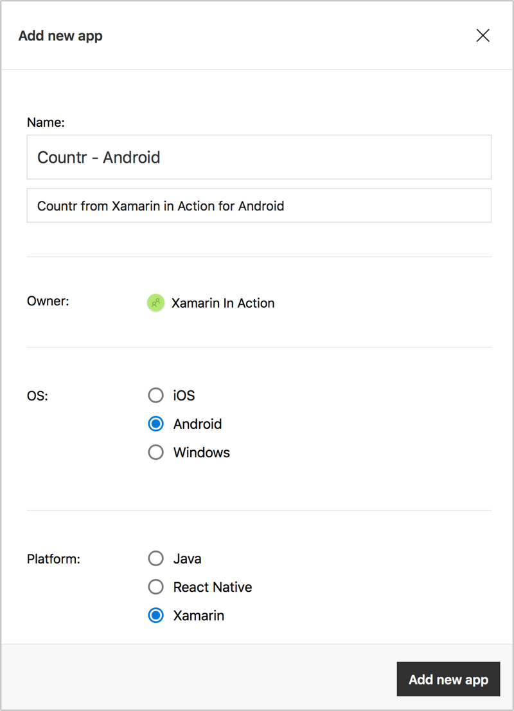
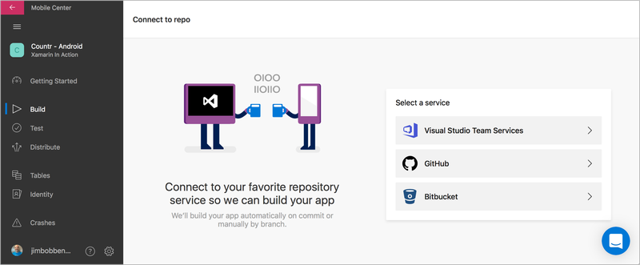

In this article, excerpted from chapter 15 of [Xamarin in Action](http://xam.jbb.io), we’ll be looking at using Visual Studio Mobile Center’ mobile-optimized lifecycle to build, test, deploy, and monitor applications. 

**Save 37% off Xamarin in Action with code `fccbennett` at [manning.com](http://xam.jbb.io).**

#### Introducing Visual Studio Mobile Center
Visual Studio Mobile Center is billed as 'Mission Control for apps' and provides a one-stop shop to managing the mobile-optimized developer lifecycle in your mobile apps, covering testing, building, deployment and monitoring.

* **Build** - Mobile Center has tools to take your code and build it either on demand, or when you push to source code control.
* **Test** - Mobile Center integrates with Test Cloud, which allows you to take the UI tests and run them on real devices in the cloud (in this case the 'cloud' is a warehouse in Denmark with racks and racks of phones and tablets). 
* **Monitor** - Using Mobile Center, you can get analytics around the users who’re using your apps, and crash reports that upload automatically if your app crashes for your users.
* **Distribute** - From Mobile Center you can distribute your builds to beta testers, including adding notifications inside your app when an update is available. You can also distribute to the Google Play and Apple App Stores.

This is slightly out of order in terms of the lifecycle, but makes sense to developers—we should set up the build before we can test it and we should add analytics before we distribute to see the results as soon as possible.

You can access Mobile Center at https://mobile.azure.com. At the time of writing, it’s available as a public preview and is free for light usage. You can log in using either a Microsoft account (you probably set one of these up when installing Xamarin), or by connecting it to your GitHub, Facebook, or Google account.

 
    

    

<small>_Figure 1. Visual Studio Mobile Center: Mission Control for apps_</small>

Once you’ve connected to Mobile Center, it’s worth setting up a Mobile Center password associated with the email address used by the service you connected with. This allows you to log in from the command line later, which is needed to run UI tests. To do this, click on the cog icon next to your name to see the user settings, go to the password tab and click the 'Send set password email' button. You’ll receive an email with a link to follow to set a password; click this link and set a password.

> **NOTE:** Mobile Center is a continuously evolving service
At the time of writing, Mobile Center is in preview, and it’s being actively worked on. Hopefully, the implementation shouldn’t change too much, the concepts certainly should not.

Mobile Center is based around the concept of 'Apps', and apps can belong to users or organizations.

###### Apps
Mobile Center is built around the concept of 'Apps', with each app being a single, releasable app for a single platform. Imagine that we are developing an app called Countr (if you would like to follow along, you can fork the source code from https://github.com/jimbobbennett/Countr). Although we may think of Countr as a single app available on iOS and Android, from the perspective of Mobile Center it’s two apps, one Android, one iOS.

> **TIP:** Mobile Center covers more than Microsoft products
As part of the new 'Any developer, any platform,' Microsoft has made sure that Mobile Center works for all mobile developers, not only Xamarin developers. They support native iOS and Android apps built using Objective-C, Swift and Java, Xamarin, Windows UWP and React Native—and they supported native iOS and Android before Xamarin. This means that if you work with a mixture of app technologies you can still use Mobile Center to manage everything.

For each app Mobile Center provides a number of services:

* **Build** - Mobile Center can connect to a source code repository (currently GitHub, VSTS and BitBucket are supported), and for each branch in your repo you can create a build to compile your solution or an individual project using any available build configuration, either on demand or whenever the code is updated in the repo, when you sign your build using an Android keystore or iOS provisioning profile, or even launch it on a real device using Test Cloud as a sanity check that your app runs and doesn’t crash on startup.
* **Test** - Xamarin has a huge datacenter in Denmark with thousands of real devices that you can run your app on using automated UI testing. Mobile Center can be used to configure, start and see the results of these test runs.
* **Distribute** - Mobile Center can distribute your app as soon as it’s built, to beta testers or to the Google Play or Apple App stores. Beta test users get an email with a link to download your app to test it, and can even get notifications inside their apps that an update is available.
* **Crashes** - Most apps crash at some point and Mobile Center has an SDK you can add to your apps that can track crashes. If your app crashes, the Mobile Center SDK tracks this, and the next time your app is run and is online it uploads the crash details, including the stack trace, to Mobile Center.
* **Analytics** - It’s always good to know how your users are using your app to track pain points, see what features are popular or aren’t being used to know which areas to work on. It also helps to see user demographics—if your app is in English, but it’s popular in Italy, you might want to offer it in Italian. The Mobile Center SDK can help to track this kind of information.

###### Users and Organizations
When you log into Mobile Center, you’re logged in as a user and you can have apps assigned to you as an individual. Users can also be part of an organization—a named group of users with different permissions. You can be an 'admin' user and have full control over the organization, or a 'collaborator' who creates and manages apps inside the organization. You can read more on organizations at https://docs.microsoft.com/en-us/mobile-center/dashboard/creating-andmanaging-organizations.

###### API
Mobile Center was written to be API first—the development team at Microsoft created public APIs for managing your apps, and the web portal was written to use these APIs. This means that anything you can do in the Mobile Center web portal, you can also do using a public REST API. You can easily integrate Mobile Center into any existing build or CI tools that you already use. For example, if you already have an automated build and release process using a tool, like Jenkins, you can replace the steps for building your app with calls to Mobile Center and use that to run your builds. API documentation is available at https://docs.microsoft.com/en-us/mobile-center/api-docs/.

###### CLI
Mobile Center also has a command line interface that you can use to do everything Mobile Center can do from a command line. The Mobile Center docs at https://docs.microsoft.com/en-us/mobilecenter/cli/index have more information on the CLI, covering the huge range of features it offers. We’ll look at getting this set up and using it later in this article to run automated tests.

###### Getting Help
Mobile Center has excellent documentation available by clicking the question mark icon in the bottom of the menu, or at https://docs.microsoft.com/en-us/mobile-center/. You can also interact directly with the Mobile Center team at Microsoft if you get stuck, find bugs or have feature suggestions by clicking the blue and white speech bubble button. From here you can start conversations with the team, see their responses and see messages about new features.

#### Setting up Builds

Mobile Center apps are based around code for a mobile app from a source control repository, and before we can set up a build we need to put the source code for our app into a repository that Mobile Center can access. At the time of writing Mobile Center supports three providers: Git repos in [GitHub](https://github.com) and [BitBucket](https://bitbucket.org); and Git or TFS repos in [Visual Studio Team Services](https://www.visualstudio.com/team-services/). Source code control is outside the scope of this article, and if Git’s new to you I’d recommend [Learn Git in a Month of Lunches by Rick Umali](https://www.manning.com/books/learn-git-in-a-month-of-lunches). For the rest of this article you’ll need to have a basic understanding including being aware of branches, commits, and pushes.

Let’s have a look at setting up Countr, our fictitious app that we mentioned earlier. You’ll need to add your Countr code to one of the three source code providers to get started. Each one has comprehensive documentation to get you started. I personally use GitHub as you can use a GitHub account to log into Mobile Center, and this automatically gives Mobile Center access to your repos, but use what you feel most comfortable with.

###### Creating your first Mobile Center app
Once your code is in source control, start by creating an app in Mobile Center. We’ll begin by creating an Android app, and then the iOS version. From the Mobile Center landing page, click the 'Add new app' button on the top right.
 

 
    

    

<small>_Figure 2. Setting up our app in Mobile Center_</small>

A panel slides out on the right where you can enter details for your app. Set the name as **Countr - Android**, add a description, set the OS to Android and the Platform to Xamarin, then click Add new app. This creates the app and shows a 'Getting started' page with details on how to set up the Mobile Center SDK for crash reporting and analytics.
 

 
    

    

<small>_Figure 3. To create a build you first need to connect Mobile Center to your source code provider_</small>

The next step is to configure a build, and to do this we need to connect Mobile Center to our source code provider. Click the 'Build' tab on the menu on the right, select your source code provider of choice and follow the instructions to connect it to Mobile Center. Once connected, choose the repo that you put the source code for Countr into.

###### Configuring the Android build
Once you’ve set up your repo, the build tab shows all available branches in that repo, and if you set up a new Git repo you’ll probably only see one branch called master. Click on the master branch, and then click 'Set up branch'. A panel will slide out with options to configure your branch.
 

 
    

    

<small>_Figure 4. Mobile Center can build your branch, as well as sign it, test it and set it up for distribution_</small>

This configuration is divided into four sections:

* **Build app** - In this section you can configure how your app should be built.
 * **Project** - The first option is the project to build - your solution could contain multiple Android apps, and here you can select the one to build. Our solution only has one Android app; Counter.Droid should be selected.
 * **Configuration** - From here you can set the build configuration to compile with—either Debug or Release (or any others if you’ve more set up). We’ll need a release build for running UI tests later; set this to Release.
 * **Build frequency** - The build frequency can be set to every push to this branch or on demand. Leave this as Build this branch on every push; every time you push one or more commits to GitHub, BitBucket or VSTS the app is rebuilt.
* **Sign builds** - Mobile Center can sign your builds using your Android keystore. Turn on 'Sign builds,' upload your keystore from the safe place where you keep it, enter the alias you used when creating it into the KEY&#95;ALIAS, then enter your keystore password into both the KEYSTORE&#95;PASSWORD and KEY&#95;PASSWORD fields (when you set up a keystore using Xamarin it uses the same password for both the keystore and the signing key inside it).
* **Tests on a real device** - By turning this option on your app is launched on a real device inside Mobile Center’s Test Cloud service, and the test verifies that your app launched successfully. This is a great sanity check that your build has worked and your app starts up. You have no control over which device it runs on—it’s compatible with at least your app’s minimum SDK installed, but other than that you have no control. It also makes your build take longer as you’ll have to wait for an available device. It runs using UITest, and you’ll need to use a release build to prevent the shared Mono runtime from being used.
You need a valid Test Cloud subscription for this to work, but as part of your Mobile Center free trial you’ll get a valid subscription; turn this option on.
* **Distribute builds** - These options allow you to distribute your final builds to either beta testers or the store. 

Once your build’s configured, click 'Save.' This will queue up a first build under the master branch.
 

 
    

    

<small>_Figure 5. All builds for a branch can be seen by clicking on the branch_</small>

Under each branch is a list of all the builds for that branch, with only one entry—the build that was kicked off by setting up the branch. If you click on the build you can see more information about it, including a full build log.
 

 
    

    

<small>_Figure 6. Your Android app should build successfully_</small>

Once your app is built you’ll see the build marked as a success, as well as how long the build took and logs detailing everything that happened. The build has taken the code from your source control provider, restored the NuGet packages you use, compiled your Android app, signed the APK using your keystore, installed it on a device, and launched it to verify that everything worked. You’ll also have an option to download the Android APK and build logs if you want. If your app didn’t build, check the build output and fix whatever’s causing the issue.

This is our Android app setup and built, now let’s setup the iOS app.

###### Configuring the iOS build

Although we’re building a cross-platform Xamarin app, we’re building two apps, one iOS and one Android. This means we must set up our iOS app as a separate app in Mobile Center. Repeat the same steps as for the Android app, but call the app **Countr - iOS** and set the OS to iOS.
 

 
    

    

<small>_Figure 7. iOS builds have a few more options than Android builds_</small>

As before select the master branch to setup the build. The 'Build app' section has a few different options to the Android version.

* **Build app**
 * **Project** - Unlike Android, from here you can only select the solution to build, not the project. This means to avoid confusion you should only have one iOS app in your solution—if you have more than one, it might be worth breaking them out into separate solutions. This should default to Countr.sln.
 * **Configuration** - This is the same as the Android configuration section. To be able to run a launch test on our builds using UITest we need to use the Debug configuration; set this to Debug instead of Release.
 * **Xcode version** - You can configure which version of Xcode to use when building. Only recent versions are available (at the time of writing, 8.3.2 is the latest and you can only select versions starting at 8.0), but this is useful if you have a reason for needing an earlier version. We can leave this as the default which is the latest released version.
 * **Build type** - Unlike Android, iOS builds come in two types: simulator and device builds. Set this to Device
build to run a launch test on a real device (launch tests aren’t available on simulators).
 * **Build frequency** - Leave this as Build this branch on every push.
* **Sign builds** - Mobile Center can sign our iOS builds using our certificate and provisioning profile.
 * **Provisioning profile** - The easiest way to set the provisioning profile is to head to the [Apple developer site](https://developer.apple.com), log in, head to the provisioning profiles section of 'Certificates,
identifiers and profiles,' and download your developer profile. Once downloaded, upload it
to Mobile Center.
 * **Certificate** - Mobile Center needs your signing certificate as a .p12 file. You can’t download this from the
Apple developer website, instead you need to export it from your keychain. Open 'Keychain Access' on your Mac and search for a certificate with a name that starts with 'iPhone Developer.' Select this certificate and click 'File→Export Items…', enter a name, select a sensible location, and click Save. When prompted, enter a password to use to encrypt this certificate.

 
    

    

<small>_Figure 8. Use Keychain Access to export your certificate_</small>

From Mobile Center upload this `.p12` file and enter the password you used.

* **Tests on a real device** - Turn this option on again to sanity check out app on a real iOS device.
* **Distribute builds** - Leave this off for now.
Once your build is set up, click Save and watch the logs to see it build and run the launch test. Again, if the build fails check the build output and fix any issues.

That’s the basics using Mobile Center. If you want to learn more about making cross-platform mobile apps using Xamarin, download the free first chapter of [Xamarin in Action](http://xam.jbb.io) and see [this Slideshare presentation](https://www.slideshare.net/ManningBooks/xamarin-in-action).

