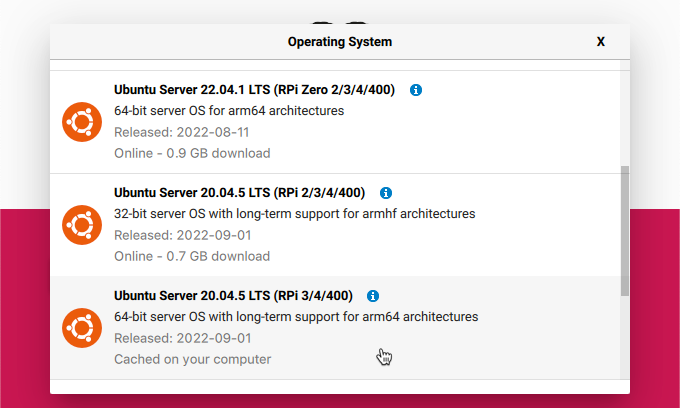
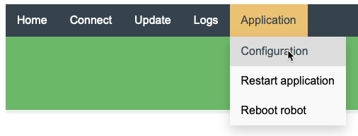
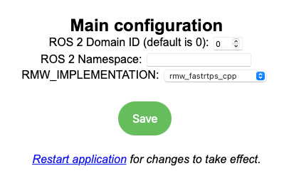
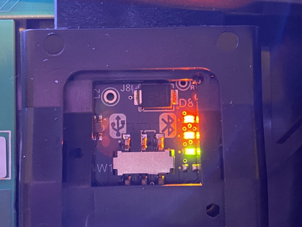

iRobot, the makers of robotic vacuum cleaners also make educational robots designed for learning how to do robotics programming. I recently managed to get my hands on one of their [new Create3 robots](https://edu.irobot.com/what-we-offer/create3) as part of the Microsoft Global Hackathon, one of the cool perks of working for Microsoft.

These robots are the same as the vacuum cleaners, except without the vacuum part. They have all the same sensors, with extra connectivity for you to program yourself. The beginner option is to program them in Python using their browser-based tooling that connects using bluetooth, but I wanted to do something more advanced and learn a bit about ROS!

## ROS

[ROS, short for Robot Operating System](https://www.ros.org) is, as the name suggests, an 'operating system" for robots. Despite the name, it's not so much an operating system, more a set of software libraries and tools for building and controlling robots that runs on top of Windows or Linux. It's fully open source and free to use.

> The downside to ROS is that the documentation needs some love. It covers in great detail how to do things, but not the why, so anything I write in this post is based off my understanding from my couple of days working with ROS, and could be completely wrong! If so, please correct me in the comments.

ROS has a concept of a graph of nodes that connect to each other, nodes can be actuators, sensors, or parts of the control code. Nodes communicate by sending messages on named topics to any other node that is listening.

The iRobot Create3 runs ROS2, the current version of ROS. ROS has version names for the minor versions, and my Create3 runs [Galactic Geochelone](https://docs.ros.org/en/galactic/index.html) 🤷. The Create3 can connect to a compute board running ROS that can be programmed to receive messages from the sensors on the Create3, or send messages to the actuators. The compute board can be a Raspberry Pi, a NVIDIA Jetson Nano, or an NXP NavQ+. This compute board can then connect to additional sensors or actuators (for example LIDAR or a camera), add control logic for the robot, and connect to the internet such as to IoT or AI services.

In my case, I want to connect a Raspberry Pi 4. The goal is to start by sending status data to an IoT Central dashboard, then expand to add a camera and code to detect and find objects using image-based AI. Maybe get it to play chase with my daughters cats.

## Connect a Raspberry Pi 4

To connect a Raspberry Pi, first you need to install Ubuntu, then connect it over USB-C, then configure the robot. All the instructions are in the [Create3 compute board documentation](https://iroboteducation.github.io/create3_docs/hw/rpi_hookup/), but I've included a basic run through here with some additional observations of things that caught me out!

### Install and configure Ubuntu

ROS runs on Ubuntu, not on the default Raspberry Pi OS, so you need to start with a clean install of Ubuntu server on an SD card. From the Raspberry Pi imager you can create an image of Ubuntu Server 20.04. As I am using a Raspberry Pi 4, I used the 64-bit version. You can find this under *Other general purpose OS -> Ubuntu*



Once the image is created, you need to update some configuration on the image before you insert it into your Pi. The [documentation](https://iroboteducation.github.io/create3_docs/setup/pi4/) tells you the changes to make, but the important gotcha is that the `network-config` file that you update to set your WiFi details will get copied on first boot into a `yaml` file, so you **must** get the indentation correct:

```yaml
network:
    ethernets:
        eth0:
            dhcp4: true
            optional: true
        usb0:
            addresses:
            - 192.168.186.3/24
            dhcp4: false
            optional: true
    version: 2
    wifis:
        wlan0:
            access-points:
                "SSID":
                    password: "password"
            dhcp4: true
            optional: true
```

I found the first time the Pi boots it won't connect, it needs to boot a second time. Not sure why or if you will get the same.

It's worth having a monitor and keyboard at the ready in case the Pi doesn't automatically connect to your network. If it doesn't, you will need to update the network configuration. To do this from the Pi, edit the `/etc/netplan/50-cloud-init.yaml` file, **not** the `network-config` in the root of the SD card - this file is only read the first time. Once you have updated the `/etc/netplan/50-cloud-init.yaml` file, reload the network plan using this command:

```bash
sudo netplan apply
```

If you configured everything correctly you should be able to connect to the internet. You can test this out by pinging a website.

```bash
ubuntu@ubuntu:~$ ping google.com
PING google.com (142.251.211.238) 56(84) bytes of data.
64 bytes from sea30s13-in-f14.1e100.net (142.251.211.238): icmp_seq=1 ttl=117 time=9.30 ms
64 bytes from sea30s13-in-f14.1e100.net (142.251.211.238): icmp_seq=2 ttl=117 time=7.76 ms
64 bytes from sea30s13-in-f14.1e100.net (142.251.211.238): icmp_seq=3 ttl=117 time=8.48 ms
```

Once you have network connectivity, continue installing all the required software listed in the [documentation](https://iroboteducation.github.io/create3_docs/setup/pi4/).

### Configure the ROS middleware (RMW)

One of the last steps is to configure the ROS middleware, known as the RMW. This middleware is responsible for networking, and transmitting messages around. There are 2 options that the Create supports - CycloneDDS and FastDDS. I'd recommend FastDDS as it works with multiple networks out of the box. Your Pi will be configured with 2 network connections - a WiFi connection so you can program it, and a USB connection so it can talk to the Create3 robot. Out the box FastDDS can work with both of these, CycloneDDS does not unless you configure it.

Run this command to configure the Pi to use FastDDS.

```bash
echo "export RMW_IMPLEMENTATION=rmw_fastrtps_cpp" >> ~/.bashrc
```

Once the Pi is configured, you will need to configure the RMW on the Create3. To do this:

1. Set the robot into WiFi access point mode by pressing and holding buttons 1 and 2 at the same time till the LED flashed blue and the robot plays its happy noise.

    

1. Connect your computer to the WiFi from the Create3. It will be called `Create-xxxx` where `xxxx` is a mix of numbers and letters. The robot will play its happy noise when you connect.

1. Navigate to `192.168.10.1`

1. Select **Connect** and set the WiFi so the Robot can connect to the internet. If you don't do this, you will need to install an NTP server on your Pi to ensure the robot has the correct time. Messages are time based, so the robot and the Pi needs to have the same time. The [network time documentation](https://iroboteducation.github.io/create3_docs/setup/compute-ntp/) has the instructions for setting this up if needed. Note that running `sudo chronyc clients` to see the connected clients will return nothing if the Pi is not plugged in to the robot, and may take a while to show a connection the first time.

1. Select *Application -> Configuration*

    

1. Set the value of `RMW_IMPLEMENTATION` to `rwm_fastrtps_cpp`

    

1. Select **Save** then **Restart Application**. The robot will reboot.

### Connect and test the Pi

Once the robot reboots, you can connect the Pi using a USB-C cable.

1. Open the top of the robot and ensure the USB/Bluetooth switch is set to USB. Then close the top.

    

1. Open the cargo bay to access the USB-C socket, and insert a USB-C cable.

1. Connect the other end of the cable to the USB-C socket on the Pi. This socket provides both power and connectivity.

1. If you want the Pi to be screwed in place, you can [3D print a caddy](https://iroboteducation.github.io/create3_docs/hw/print_compute/#large-mount) that the Pi connects to.

1. Close the cargo bay and wait for the Pi to boot up.

The default hostname for the Pi is `ubuntu`, but I've not been able to connect from macOS by sshing into `ubuntu.local`, so you will need the IP address. Either using your routers software to find it, or connect the Pi to a monitor/keyboard, boot it up and run `ip a` to get the IP address of the `wlan0` network.

Connect to the Pi over SSH using the username `ubuntu` and password `ubuntu`. You will need to change the password the first time you log in.

Once you are in, you can verify the Pi is talking to the robot successfully buy running the following command:

```bash
ros2 topic list
```

This command lists all the topics that the Pi is able to see from the robot. These topics are how you can receive sensor data by subscribing to messages, and send commands to actuators.

The output should be:

```bash
/battery_state
/cmd_audio
/cmd_lightring
/cmd_vel
/dock
/hazard_detection
/imu
/interface_buttons
/ir_intensity
/ir_opcode
/kidnap_status
/mobility_monitor/transition_event
/mouse
/odom
/parameter_events
/robot_state/transition_event
/rosout
/slip_status
/static_transform/transition_event
/stop_status
/tf
/tf_static
/wheel_status
/wheel_ticks
/wheel_vels
```

The Pi can only see the topics if it was connected and booted when the robot boots up. If most of the topics are missing and you only see this list of topics:

```bash
/parameter_events
/rosout
```

Then you need to reboot your robot. The easiest way is to press buttons 1 and 2 to start the WiFi access point, then connect to it and select *Application -> Reboot robot*.

Your Pi is now connected and ready to program your first ROS application!
