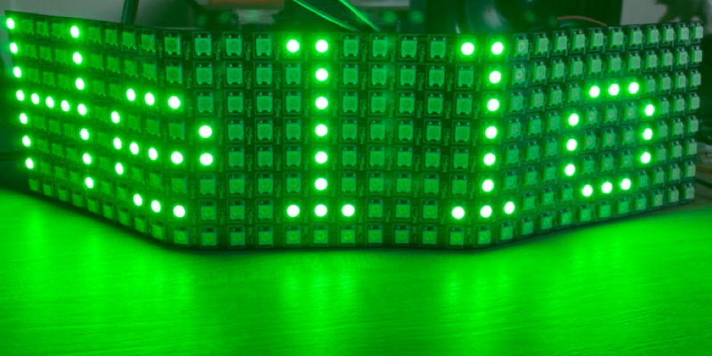

Anyone who knows me knows I'm a big fan of IoT and LEDs. I love using IoT devices to control lights, from the LEDs behind my desk to [smart pumpkins](https://www.youtube.com/watch?v=h5ETn4PTdQA)!

I've been giving the .NET IoT libraries a spin for an upcoming project using a Raspberry Pi Zero W 2. I'm usually a Python person when using a Pi, but the project I'm working on needs a service that doesn't have Python libraries that run on a Pi. Instead it has a .NET library, so it was time to break out my C# skills for the first time in years.

I wanted to build an LED panel that can display text, either static text or scrolling text. So I picked up this [WS2812B panel from Amazon (allifliate link)](https://amzn.to/3sVjF7M), and started to dig into the .NET IoT libraries. WS2818b LEDs are also known as NeoPixels, and are addressable multicolor LEDs, so you can light up individual ones in any color you like. They are addressed based on the order they are connected to your device, so the first pixel in a string of LEDs is 0, the next is 1 and so on. You can add as many as you like, and the addresses just keep going up.

The .NET IoT libraries are on GitHub at [github.com/dotnet/iot](https://github.com/dotnet/iot) and available as a NuGet. They support a wide range of boards including the Raspberry Pi.

## Lighting LEDs in C\#

I started as I usually do with a clean install of Raspberry Pi OS Lite. I use the Lite version as I access my Pi remotely using VS Code for all my development. You can read more on how I do this on [my blog post on the Raspberry Pi blog](https://www.raspberrypi.com/news/coding-on-raspberry-pi-remotely-with-visual-studio-code/). When I connected to my Pi I installed .NET 6, and the C# extension in VS Code.

> One thing to note for the C# extension is it doesn't support remote debugging on the Pi Zero W 2.

The .NET IoT libraries have a small amount of documentation and samples, so it wasn't too much effort to get the LEDs lighting up.

The .NET libraries control these pixels over SPI, so they need to be connected to an SPI pin and ground on the Pi, as well as to a 5V power supply. You can't use the 5V pins on the Pi as the panel can draw too much power and burn your Pi out, it's best to use an external 5V power supply, either from a USB connection or a power converter plugged into the mains.

You also need to do a bit of SPI configuration, and this is documented in the [GitHub source code for the WS2812B device code](https://github.com/dotnet/iot/tree/main/src/devices/Ws28xx).

> This is different to using the Adafruit NeoPixel libraries from Python, where you use different pins and don't need any SPI configuration.

To use the .NET libraries, you start by creating an SPI configuration, then use that to create the pixels:

```csharp
// Create connection settings to connect to the panel using SPI
SpiConnectionSettings settings = new(0, 0)
{
    ClockFrequency = 2_400_000,
    Mode = SpiMode.Mode0,
    DataBitLength = 8
};

// Create an SPI device
var spi = SpiDevice.Create(settings);

// Use the SPI device to connect to the LEDs
// and pass the number of LEDs
var neoPixels = new Ws2812b(spi, 256);
```

When you create the pixels, you pass in the length of the strip. I've been using a 8x32 panel, which is actually a 256 pixel long strip arranged in and up/down pattern.

Once created, you light pixels by getting a `BitmapImage` from them, and setting colors on that. This image is a lengthx1 image, so 1 pixel tall, and as wide as the length of the LEDs. For example, my 8x32 panel is 256 pixels long, so is a bitmap of 256x1.

```csharp
var img = neoPixels.Image;
```

You can then set pixels in this image to the color you want. The color is set using the `System.Drawing.Color` struct, which wraps ARGB values. The A (alpha channel) is ignored, so you set pixel brightness by reducing the value of the R, G, and B.

```csharp
img.SetPixel(0, 0, Color.Red);
img.SetPixel(1, 0, Color.Green);
img.SetPixel(2, 0, Color.Blue);
```

Once the pixels are set in the image, it is commited and the LEDs updated.

```csharp
neoPixels.Update();
```

One quirk of the bitmaps, is you have to set all the pixels up to the last one you want set. So if you want to set pixel 10 to be red, you have to also set pixels 0-9 to something, even if it is `Color.Black` (off). The first pixel you set is mapped to the first LED in the strip, so if you just set pixels 10-20, then the strip is set as if the first LED was pixel 10.

For example, if you just want to set pixel 2 to blue, you can't do this:

```csharp
var img = neoPixels.Image;

img.SetPixel(2, 0, Color.Blue);

neoPixels.Update();
```

What will happen here is pixel 2 is the first one with a value, so that will be considered the first pixel in the strip, so the first LED will light up blue.
What you need to do is:

```csharp
var img = neoPixels.Image;

img.SetPixel(0, 0, Color.Black);
img.SetPixel(1, 0, Color.Black);
img.SetPixel(2, 0, Color.Blue);

neoPixels.Update();
```

This will set the pixels 0 and 1 to off, and pixel 2 to blue.

## Writing text

I wanted to make my panel show text, either short static text, or scrolling text. The first thing I needed was a font - something that defines how to create letters from pixels. I found a simplar project based on Aruino in a [GitHub project from Josh Levine](https://github.com/bigjosh/SimpleTickerTape/tree/main/fonts) so leveraged this code for a font and re-wrote it in C#.

Next I needed the mapping code. These fonts are defined as columns of binary data, so the bits to set. Each character is 8 bits tall (the size of my panel), and 6 bits wide. This mapping code was a bit of fun as I not only needed to divide up my pixels into columns, and map from a pixel in the 1 dimensional strip to a character pixel, but the strips go up and down!

The way this panel is made is by weaving an LED strip up and down, so the pixels start at 0 on the top left, go down to 7 on the left-most column, then across one pixel to the right to 8, then up to 15.

This gives for the first few columns:

```sh
0   15   16   31
1   14   17   30
2   13   18   29
3   12   19   28
4   11   20   27
5   10   21   26
6    9   22   25
7    8   23   24
```

This means that the mapping code needs to alternate - for 0dd numbered columns the pixles go down, for even numbered the pixels go up so the mapping has to be reversed!

I'm not going to dive into all this mapping here, but you can find the code with full documentation in my [NeoPixelTickerTape GitHub repo](https://github.com/jimbobbennett/NeoPixelTickerTape).

I then added scrolling code that writes text starting at the right-most column, then re-writes it shifting left a column at a time.


## Check out the code

You can find the code with full documentation in my [NeoPixelTickerTape GitHub repo](https://github.com/jimbobbennett/NeoPixelTickerTape).

You can also download a NuGet pckage to use in your apps:


