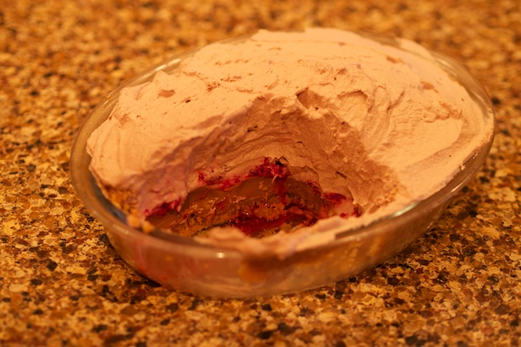

So once again I'm [waiting](/blogs/waiting-12-05-2014/), this time whilst I download the XCode 6 preview.  I'm working on a simple node application for photo management - uploading, storing, showing thumbnail previews and showing the pictures.  Nothing complicated but more of my self learning of node and javascript.  Seeing as Apple have just announced [Swift](https://developer.apple.com/swift/) I thought I might try to develop a simple iOS app in Swift that talks to my node app.
Once XCode is dowloaded over my pathetic broadband (5 hours 28 minutes remaining) I'll give it a go and blog about it.

In the meantime, I decided to eat some dessert.  I make a mean version of banoffie pie, using raspberries which add a tartness that cuts through the sweetness of the pie.

The recipe is simple.  What, a recipe on a technology blog?  Well why not - developers have to eat after a hard day pumping mouse and keyboard.

Base - melt a couple of ounces of butter in a pan, and add a small pack of finely crushed digestive biscuits (bung them in a ziplock bag and roll over them with a rolling pin).  Press into a greased pie dish to make a bottom and sides and slap in the fridge.

Toffee - put an unopened can of sweetened condensed milk into a large pan of boiling water and boil for 3 hours.  Make sure the can is always completely covered with water.  After 3 hours, open the can and spread the contents into the pie dish.  Be warned, the contents of the can is stupidly hot, will spurt out when you pierce the can with a can opener and sticks like shit to a blanket.  Best to open it wearing oven gloves.  Bung the pie dish back in the fridge.

Once the toffee is cooled, cover in raspberries.  Then whip some cream with some hot chocolate powder (not cocoa, it's too bitter, needs to be a decent hot chocolate powder) and spread on top.

Then eat.  Nom, nom, nom.

