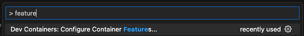

> In this post we look at how to add NPM packages to a devcontainer to use in VS Code locally or in a GitHub codespace

I recently started at [liblab](https://liblab.com) as a Principal Developer Advocate. liblab is a tool that converts APIs into language SDKs, something I'm a big fan of as I love typesafety and the inherent documentation that comes with a good SDK. Obviously my first job was to dive into building out an API and creating an SDK from it.

## Devcontainers

I love [devcontainers](https://containers.dev/) - they allow me to create a repo that anyone can open and instantly have a fully configured environment that just works! My standard process when creating any sample code is to start with a devcontainer. In this case, I'm creating a [FastAPI](https://fastapi.tiangolo.com/) application, and building an SDK from that.

I start with a Python container - this is a pre-configured container that I can just spin up inside VS Code.


Once in this container I can create my API, then build the SDK using liblab.

## Add liblab to the container

liblab is available as a [CLI that you install via NPM](https://developers.liblab.com/docs/getting-started). There are a number of ways you can install NPM packages in the container:

* Install it manually in the `postCreateCommand`
* Use a `DOCKERFILE` and install it there
* Use the NPM package feature

I went for option 3 - use the NPM package feature. This avoids having to create a `DOCKERFILE` and configure my `devcontainer.json` to use it, and means I don't have to add more to my `postCreateCommand` which already installs pip packages.

You can add this feature manually into the `devcontainer.json` file, or use the command palette:




To add manually, add the `ghcr.io/devcontainers-contrib/features/npm-package:1` feature:

```json
{
    ...
    "features": {
        "ghcr.io/devcontainers-contrib/features/npm-package:1": {}
    }
}
```

Once added, the feature is configured using the `package` and `version` parameters. THe `package` should be set to `liblab`, the name of the NPM package for liblab. The `version` parameter defaults to `latest` and I always want the latest liblab CLI installed, so this can be left out.

```json
{
    ...
    "features": {
        "ghcr.io/devcontainers-contrib/features/npm-package:1": {
          "package": "liblab"
        }
    }
}
```

## Rebuild the container

Once this is set up you can rebuild the container and the liblab SDK will be available in your terminal!

```bash
vscode ➜ /workspaces/python $ liblab
The offical liblab CLI

VERSION
  liblab/0.9.20 linux-arm64 node-v18.17.0

USAGE
  $ liblab [COMMAND]

TOPICS
  hooks  Bootstrap an SDKs hooks.

COMMANDS
  build           Build SDK(s) and Docs for your API.
  help            Display help for liblab.
  init            Create a liblab folder for housing files relevant to SDK and Doc generation.
  login           Login to your account.
  logout          Logout of your account.
  post-build      Run extra tasks after code generation.
  pr              Create a PR for all the generated SDKs.
  register        Register for a new liblab account.
  reset-password  Reset your password.
  token           Create a new login token for CI/CD.
```

## Learn more

Want to learn more about liblab for automating the generation of SDKs from your APIs? Get in touch.

* [Contact me via social](https://linktr.ee/JimBobBennett)
* [Join our Discord](https://discord.gg/F8aECHbRkV)
