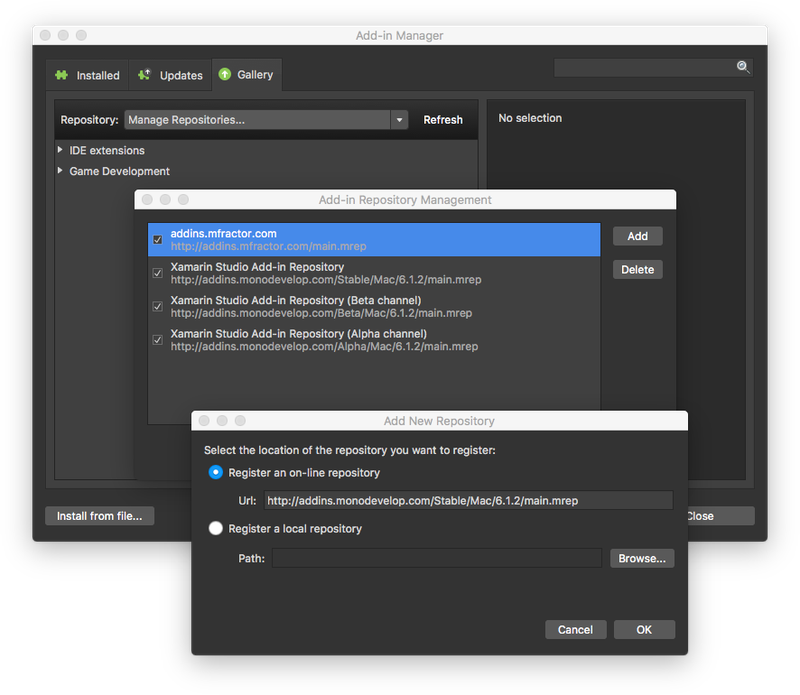

In the latest Stable Xamarin Studio (6.1.2) there is a problem with add-ins - the add-in gallery is empty - the add-in endpoint for 6.1.2 is not returning any add-ins.

This means if you are planning on using my [Xamarin Studio MvvmCross add-in](/blogs/mvvmcross-add-ins-for-visual-studio-and-xamarin-studio/) then you won't be able to find it.

Luckily there are a number of workarounds:

* Use the Alpha channel - on 6.2 all the add-ins reappear.

* Add the add-in repository from the previous version by opening the 'Add-in manager', going to the 'Gallery' tab, selecting 'Manage Repositories' from the 'Repository' drop-down, tapping 'Add' and entering this url - http://addins.monodevelop.com/Stable/Mac/6.1.2/main.mrep

* Install the add-in manually by downloading from [here](http://addins.monodevelop.com/Stable/Mac/6.0/MVVMCross.XSAddIn.MVVMCross.XSAddIn-1.1.8.mpack) and installing it using the 'Install from file...' option in the 'Add-in manager'.

This issue has been raised with Xamarin, so hopefully should be fixed soon.

