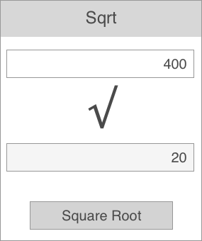
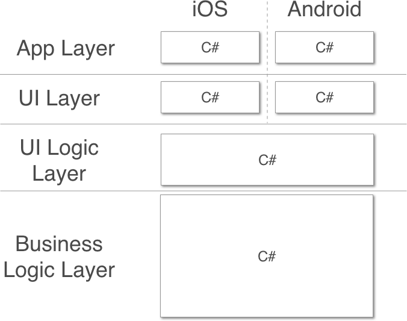
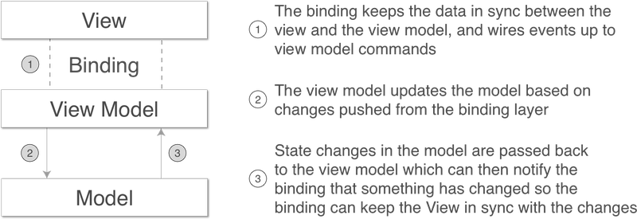

This article is an excerpt from [Xamarin in Action](http://xam.jbb.io)
<hr>

MVVM is the most popular design pattern for cross-platform apps built using Xamarin, and has a history of being a very successful design pattern for building Windows desktop apps using WPF, WinRT apps, and Windows 10 UWP apps – even web frameworks like knockout.js are using it. When Xamarin designed Xamarin.Forms (where the goal was to have as much code sharing as possible), the principles of MVVM were baked into the underlying framework right off the bat.

For the purposes of this article, let’s consider a simple square root calculator app called “Sqrt” that has a text box you can put a number into, and a button. When you tap the button it calculates the square root of the number in the text box and shows this on a label. An example of this app is shown below.

<div class="image-div" style="max-width: 300px;">
    

    
</div>
<small style="color:black">A simple square root calculator app that calculates the square root of a given number</small>

The simplest way to write this app is to wire up the button to an event that takes the value directly from the text box, calculates the square root, and writes the value to a label. All this can be done in the code behind file for the UI. Simple, and all in one class. Below is some pseudo-code for the kind of thing you might write.

```
MyAddButton.Click += CalcSquareRoot;                ❶

...

private void CalcSquareRoot(object sender, EventArgs args)
{
   var number = double.Parse(NumberTextBox.Text);   ❷
   var sqrt = Math.Sqrt(number);

   MyResultLabel.Text = sqrt.ToString();            ❸
}
```
❶  We are listening for the Click event of the button

❷  The number comes from reading the value from the Text property of the text box

❸  Once we have the square root the Text property of the label is set directly

Whilst this seems simple, it has a number of flaws.

First, this is not easily testable. Yes, you can launch the app, type in a number, and tap the button, but this takes a long time. We can only test this app by updating the value in the text box and tapping the button – it would be nice if the calculation code was self-contained so we could test it in isolation. It would be better if we could write unit tests so we can programmatically test our code, covering multiple cases – including edge cases such as missing inputs, or large or negative numbers. This way we can run a set of automated tests quickly, which can be repeated every time we change our code. 

Second, this is not cross-platform. One of the reasons for building our app using Xamarin is so that we can have parts of our app written in shared code that works on both iOS and Android. If our calculation is wired directly to the view, we can’t do this.

<div class="image-div" style="max-width: 500px;">
    

    
</div>
<small style="color:black">Xamarin apps are written in C#, so you can share any common business logic whilst having a platform-specific UI</small>

As you can see, a Xamarin app has three layers:

* The application layer is the small part of the code that makes your code runnable on each platform; it is separate and has different platform-specific implementations for iOS and Android. 
* The UI layer is also separate, and has different platform-specific implementations for iOS and Android.
* The business logic layer is shared between the two platforms.

In the UI layer there are really two layers – the actual UI widgets and some logic around these widgets. For example, we could put some logic around our answer label to make it only be visible once we have calculated a square root. This expands our three layers to four. Let’s explore ways to maximize code re-use between layers.

<div class="image-div" style="max-width: 500px;">
    

    
</div>
<small style="color:black">To maximize code re-use, it would be good to have UI logic in shared code</small>

To increase the amount of code sharing, it would be great to be able to move the UI logic into shared code as well. The image above shows how the layers would look if we could do this. If we did this, the label in our example would be in the UI layer, and the logic to decide whether it should be visible or hidden would be in the cross-platform UI logic layer. This is a great way to do things – we’re maximizing our code re-use by abstracting our UI logic into cross-platform code.

<div class="image-div" style="max-width: 600px;">
    

    
</div>
<small style="black">MVVM has a model, a view model, a view, and a binding layer that keeps the view and view model in sync and connects events on the view to the view model</small>

MVVM helps split the UI from its logic. This pattern’s name is based off the three layers that you use in your app. Let’s look at these layers in the context of our calculator example:

* Model - your data and business logic
The model contains the number, the logic to calculate the square root, and the result.
* View - the actual UI, buttons, text controls and all other widgets
This holds the UI widgets – the text box, button and label. It is a passive view so it doesn’t have any code to get or set the values, or handle the events such as the button click.
* ViewModel - the UI data and logic

For our calculator app this would have properties that represent the numbers on the model – the input values and the result. It would also have a Command property that wraps the square root calculation logic on the model into an object. The view model would know about the model but have no knowledge of the view.

In addition to these three layers it has a binder, a binding layer that you can think of as glue that connects the view model to the view. This removes the need to write boilerplate code to synchronize the UI – the binder can watch for changes in the view model and update the view to match, or update the view model to match changes made by the user in the UI. This binder is loosely-coupled rather than tightly-coupled, and the connection is often done based on wiring up properties in the view and view model based on their names (so in the case of a binding between a property called "Text" and a property called "Name", at run time, the binder will use reflection to map these string values to the underlying properties).

<table style='border:0px;background:#F0F0F0'>
<tr>
<td style="width:48px">
  
</td>
<td>
<h5>Reflecting on reflection</h5>
<p style="text-align:justify;color:#686868;">If you’ve never heard of reflection before, it is a part of the C# API that allows you to query details about a class – you can discover properties, fields, methods, the whole shooting match. Once you’ve found out details you can also execute code – for example, you can find a property based on its name then get the value of that property from a particular instance of that class.
Reflection is also found in other languages, such as Java – C# reflection is basically the same as Java reflection.
This is great for binding – if you bind a property called "Name" the binding code can use reflection to find a property on your view model class with that same name, then it can get the value on your view model instance.</p>
</td>
</tr>
</table>

For our calculator app, the binding layer would wire up the text box, button, and label on our UI to the equivalent properties and a command on the view model.

There is a bit of magic to make this binder work, and it is usually implemented in an MVVM framework – a third party library that gives a set of base classes that provide the implementation of this pattern for you. 

<table style='border:0px;background:#F0F0F0'>
<tr>
<td style="width:48px">
  
</td>
<td>
<h5>MVVM frameworks</h5>
<p style="text-align:justify;color:#686868;">There are multiple MVVM frameworks around that work with Xamarin native apps such as <a href="http://mvvmcross.com">MvvmCross</a>, <a href="http://mvvmlight.net">MvvmLight</a>, or <a href="http://caliburnmicro.com">Caliburn.Micro</a>. Although each one has differences, they all follow the same basic principles and do roughly the same things.</p>
</td>
</tr>
</table>

<div class="image-div" style="max-width: 600px;">
    

    
</div>
<small style="color:black">Binding keeps the value in the view in sync with the value in the view model</small>

For example, as shown above, we could have a text box on our calculator app UI that is bound to a Number property. This means at run time it will try to find a public property called “Number” on the view model that it is bound to using reflection, and will show the string contained in that property in the text box. If the user changes the value inside the text box, it will update the value of the Number property to match what the user has typed in. Conversely, if the value of the Number property on the view model changes, the binding will update the text box to match.

The binder doesn’t care about the underlying class type of the view model that you are using, just that it has a public property called “Number” that it can extract the value from. In some of the MVVM frameworks it doesn’t even care if the property is there or not – if it can’t find one, it just treats it as an empty value. This loose coupling is what makes MVVM especially powerful – it allows view models to be completely agnostic to the view, meaning we can write unit tests against the view model that simulate the UI, without worrying about UI code getting in the way. It also supports code re-use, so a view could be glued to any view model that has properties with the names it is expecting.

<div class="image-div" style="max-width: 500px;">
    

    
</div>
<small style="color:black">The different layers of MVVM, and how they fit in with the different layers of a Xamarin app</small>

The image above expands on the previous figures by showing how these layers map to the three layers of MVVM.

* The App layer is one that doesn’t really come under the pure MVVM design pattern, but the different MVVM frameworks do provide some application layer features. For this reason, we can have some cross-platform code in our app layer that can control app logic, such as which view is shown first and how the different classes in the app are wired together – for example, code defining which view model is used for each view.
* The UI layer is our view layer. This is platform-specific code.
* The binding between the UI layer and the UI logic layer is the binder, the glue that connects the UI layer to its logic layer. This is usually a mix of cross-platform and platform-specific code provided by a third party framework.
* The UI logic layer is our view model layer, and this provides logic for the UI and other device interactions in a cross-platform fashion. Part of this logic is value conversion – converting from data in your domain objects to data on the UI. For example, you could model a user in your domain with a first name and last name, but want to show the full name on the UI. The view model will provide this value conversion by concatenating the names and giving a single string value that will be shown by the UI.
* The business logic layer is the model layer. This contains data, domain objects, logic, and connectivity to external resources such as databases or web services. Again, this is cross-platform.

<table style='border:0px;background:#F0F0F0'>
<tr>
<td style="width:48px">
  
</td>
<td>
<h5>A quick history lesson</h5>
<p style="text-align:justify;color:#686868;">MVVM has been around since 2005 and was developed by two architects from Microsoft, Ken Cooper and Ted Peters. It was primarily created for use with the new UI technology stack coming out of Microsoft, called WPF. It leverages the data binding that was a key feature of WPF. In WPF, you write your UI using XAML, a UI based markup language; in this XAML, you can bind properties of a UI widget to properties defined in the data context of the view – essentially the view model. This allowed UI/UX experts to design the UI using more designer-based tools, and to simply wire up the widgets (based off of names) to code written independently by developers.</p>
</td>
</tr>
</table>

<hr>

If you want to learn more about making cross-platform mobile apps using Xamarin, download the free first chapter of [Xamarin in Action](http://xam.jbb.io) and see [this Slideshare presentation](http://www.slideshare.net/ManningBooks/xamarin-in-action) for a discount code.

