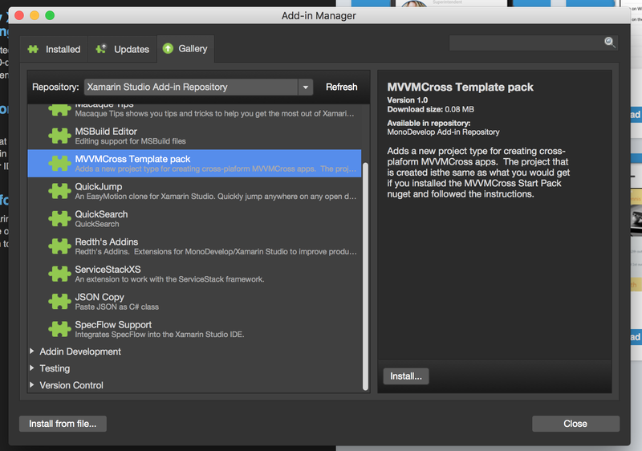
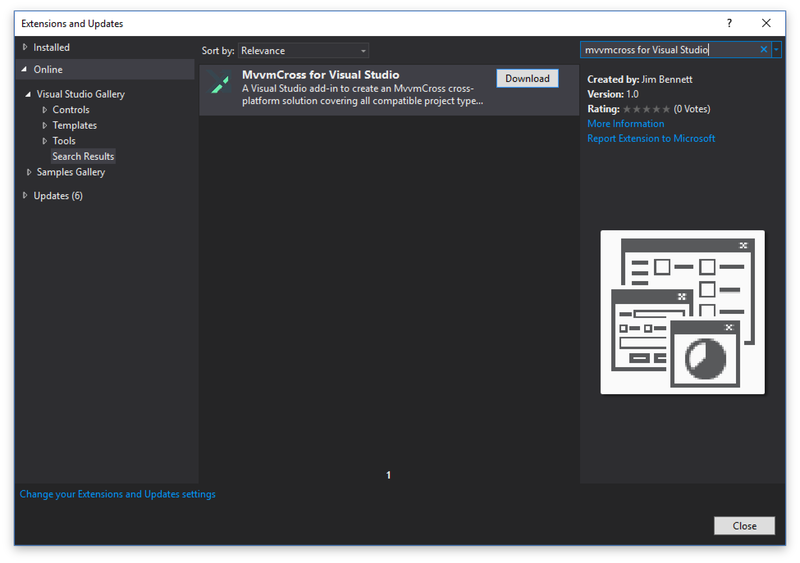

I've been using MvvmCross a lot at work and it's pretty cool.  I've got a big upcoming personal project that I've started working on (more info soon I promise - it's something pretty awesome), and I've decided to use MvvmCross for it.  Unfortunately despite all it's awesomeness, creating a boilerplate cross platform solution using MvvmCross is still a bit of work.  There is the [starter pack nuget](https://www.nuget.org/packages/MvvmCross.StarterPack/), but using this still means a bit of work copying code, setting up projects and remembering to remove the starter pack once you are finished just from your `packages.config` (not from your installed packages or you lose a load of files).

Ideally I'd like an add-in for Visual Studio and Xamarin Studio where you can create a new solution and it creates all the projects you need for a cross platform app - so core/iOS/Droid/UWP/Wpf/Win8 on Visual Studio and core/iOS/Droid/Mac on Xamarin Studio.  There is [Ninja Coder](https://visualstudiogallery.msdn.microsoft.com/618b51f0-6de8-4f85-95ce-a50c658c7767) but this is Visual Studio only and is overkill for my needs as it does pretty much everything you could want, all I want is a consistent way of creating projects using Visual Studio and Xamarin Studio that match the starter pack.

I had a chat with [Tomasz Cielecki](https://twitter.com/Cheesebaron) (or [CheeseBaron](https://twitter.com/Cheesebaron) as you may know him), and we talked about creating an add-in that does just this.  So over the past few evenings I've been teaching myself how to create add-ins for Visual Studio and Xamarin Studio and I've finally managed to get it working.

The Visual Studio one is available [here](https://github.com/jimbobbennett/MvvmCross-VisualStudioAddIn).  Grab the source if you want a nose at how it works, or grab the release to try it out.  Once I've had some feedback I'll put it up on the Visual Studio gallery.

The Xamarin Studio version is available [here](https://github.com/jimbobbennett/MvvmCross.XSAddIn).  Again, source is available and a release build is there you can try out.  I've also submitted it to the alpha channel for Xamarin Studio add-ins for v6 and above, so once it's accepted you should see it in the add-in gallery in the latest beta of Xamarin Studio.  This one was hard to do as there is minimal documentation, so a big shout out to [Mikayla Hutchinson](https://twitter.com/mjhutchinson) for generally being awesome and answering my dumb questions.

I'll blog in more detail about how I created these add-ins at a later date.  For now though please grab them and try them out.  I'd appreciate as much feedback as possible!

    

    

#### Update!

These add-ins are now live in the [Xamarin Studio stable add-in repository](http://addins.monodevelop.com/Project/Index/227) and on the [Visual Studio Gallery](https://visualstudiogallery.msdn.microsoft.com/96b3d919-0277-4f63-92a3-a7bf3e7cd384?SRC=Home).  This means you can install them from inside Xamarin Studio's add-in manager and Visual Studio's extensions and updates.  The Xamarin Studio add-in needs XS 6 so you'll need the latest Stable or Beta, the Visual Studio extension needs VS2015.

 
    

    

 
    

    

