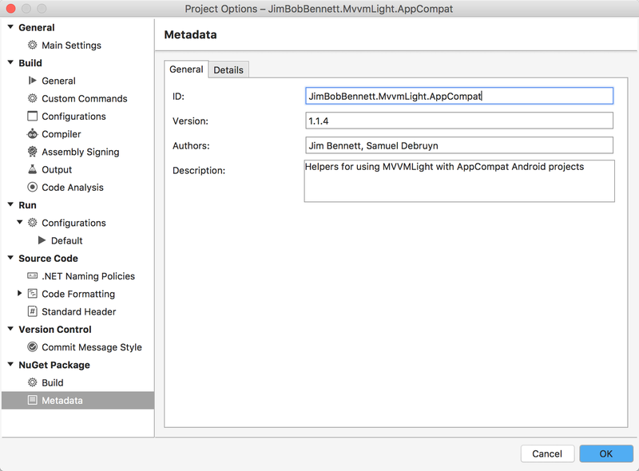

One cool new feature in Visual Studio for Mac is the ability to create NuGet packages from your projects automatically whenever you compile. This new feature is thanks to a cool project started by Xamarin called the **Nugetizer 3000** (I do love [Miguel](https://twitter.com/migueldeicaza)'s naming conventions).

It's really easy to turn this on. From your project open the project properties and head to the 'NuGet Package -> Build' tab. From there tick the 'Create a NuGet package' box.

    

    

Once this is ticked you need to set up the metadata for your package, and this can be done from the metadata tab. You have to fill in everything in the 'General' tab, and you can optionally fill in the 'Details' tab.

    

    

Once you click 'OK', Visual Studio will add a new NuGet package to your project - `NuGet.Build.Packaging`. This package doesn't contain any assemblies, it just contains build targets to create the NuGet package.

Once this package is installed you can compile your project and it will spit out a `nupkg` file in the projects output directory. This package has everything all set up for it, including dependencies on all the packages and framework libraries used by your project.

This makes package creation easy as there is no faffing around with `nuspec` files and command lines. You can even control values such as the version by configuring project properties when calling MSBuild from the command line, very useful if you want to tweak the version number at build time.

