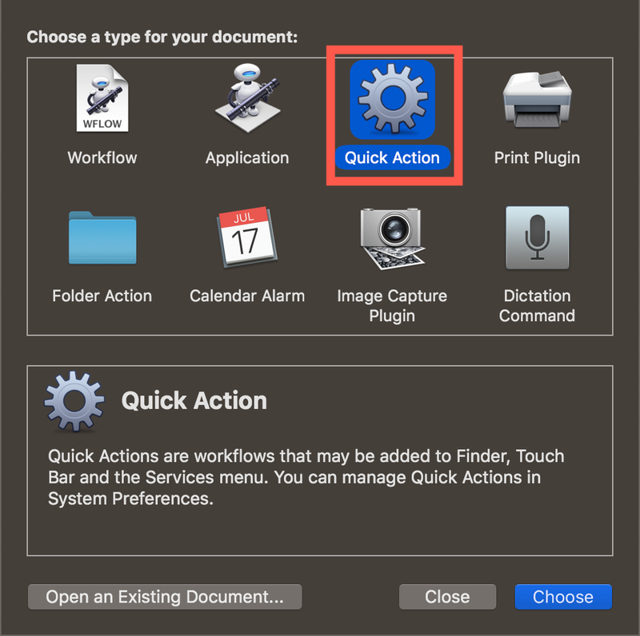

I've been getting fed up with the long winded process to open things in VS Code - you know, typing in the terminal, opening VS Code and dragging folders in, that sort of long, manual process... _#FirstWorldProblems_ 😜

I thought it would be fun to automate the whole thing, using Automator!

If you haven't used Automator, it's a great little tool. You can build simple workflows using capabilities from system apps and other apps, configure the data that comes in, then trigger these when things happen, such as calendar events, items changing in a folder or on demand.

These workflows can be wired up to "Quick Actions", these are actions that can be applied to text or images and are called from the context menus in Finder or in a text box. They can also be launched from a keyboard combination or the touch bar.

#### Creating a Quick Action to open VS Code

The first step is to create a quick action to open VS Code.

* Launch Automator
* Create a new __Quick Action__

<div class="image-div" style="max-width:480px;">
    

    
</div>

* Configure the workflow:
  * Set it to receive current _"files and folders"_ from _Finder_. 
  * Set and image if you want one - I used the icons from [this GitHub repo](https://github.com/cnstntn-kndrtv/open-in-buttons-for-finder-toolbar).
* Add a new __Run Shell Script__ action to the workflow.
  * Set the _Pass Input_ to be _"as arguments"_
  * Set the shell script to be:
```sh
open -n -b "com.microsoft.VSCode" --args "$*" 
```

<div class="image-div" style="max-width:600px;">
    

    
</div>

* Save the action using a name like `Open In VS Code`.

This will register the quick action with Finder, and you will now be able to right-click on a file or folder in Finder and select _Quick Actions->Open In VS Code_

<div class="image-div" style="max-width:480px;">
    

    
</div>

#### Adding a keyboard shortcut

Keyboard shortcuts can be added to Quick Actions from _System Preferences_. 

* Launch System Preferences
* Open the Keyboard settings and select the _Shortcuts_ tab
* Select _Services_ from the list on the left
* Scroll down on the right to _Files and Folders->Open In VS Code_
* Click the __none__ keyboard shortcut and press the keys you want to use

<div class="image-div" style="max-width:600px;">
    

    
</div>

#### Adding to the touch bar

If you are a fan of the touch bar (and I am, and I know it'a a controversial opinion), you can add quick actions there. Unfortunately not on an action-by-action basis, but you can add a button that shows the quick actions.

* From the Keyboard settings in System Preferences, select the _Keyboard_ tab.
* Click __Customize touch bar...__
* Drag the Quick Actions button down to the touch bar and position it where you want. For mine I replaced the default Siri button with the quick actions button as I've never used Siri on my Mac.
* Click __Done__

You will now have a quick actions button on the touch bar, and when you tap it it will show you the Open in VS Code action. If you change the color of the quick action in Automator it will change the color of this button!

#### More shortcuts...

Once I started with this, I added one to open a folder in terminal, and will probably add a load more for things like git commands.

<div class="image-div" style="max-width:600px;">
    

    
</div>

