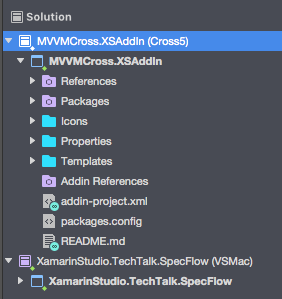

One area Macs are very different to Windows PCs is in the way documents are opened. Mac apps manage documents internally instead of being able to tap a start button again and open a second instance of your app to load a new document.

This means that on Windows Xamarin developers can open multiple instances of Visual Studio at the same time, allowing them to have multiple solutions open. On the Mac this ability has been missing - you click VS again and it just focuses on the same instance that's already running. There have been a number of workarounds for Xamarin Studio and Visual Studio the apps you can run that will launch another instance, but actually - you don't need to!

Unlike VS on Windows, VS on Mac (and Xamarin Studio for those who haven't updated) can open multiple solutions at the same time in the same window. The option to do so is a bit hidden, but it's there.

What you do is:

* Open your first solution
* Select 'File->Open'
* Select your solution in the Open dialog (just a single click, don't double click to open it)
* Click the 'Options' button
* Uncheck 'Close current workspace'

 
    

    

* Now click 'Open'

Viola! Multiple solutions in the same solution pad.

 
    

    

If the solution is in your recent list you can also open it in the same workspace by holding down the Control key whilst clicking on the solution. Thanks to [Lluis Sanchez Gual](https://twitter.com/slluis) for this one.

<blockquote class="twitter-tweet" data-lang="en">
<a href="https://twitter.com/CodeMillMatt">@CodeMillMatt</a> A little trick: to quickly open a solution without closing the current one, hold Control while clicking on a file in Recent Solutions
&mdash; Lluis Sanchez Gual (@slluis) <a href="https://twitter.com/slluis/status/867662561663234048">May 25, 2017</a></blockquote> 

