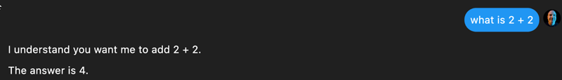

As developers, we use unit tests to validate that the code we write is working correctly (hopefully - if you are not, then you should!). Unit tests are code that relies on the deterministic nature of the functions and methods we write to verify that we get a certain expected output for a certain set of inputs.

This model worked very well until the rise of AI engineering. As we start adding LLMs to our products, we lose the deterministic nature of our work. For a certain set of inputs, the LLM will provide an inconsistent output in the same way humans will provide a similar but inconsistent answer to a question.

So, how can we unit test the responses from an LLM if they are non-deterministic? By using more LLMs! This post shows you how.

## Deterministic vs non-deterministic outputs

If you are writing non-AI code, then the output of a function should be deterministic - for a given set of inputs and other conditions, you will get the same output.

### Adding numbers in a deterministic way

As a simple example, take a basic add function:

```csharp
public int Add(int first, int second)
{
  return first + second;
}
```

If we call this with 2 and 2, we will get 4; with 4 and 6, we will get 10, and so on. This means we can write unit tests that we run on every PR to validate our code is working before we release it to production.

```csharp
[Fact]
public void TestAdding2And2()
{
    var sum = Add(2, 2);
    Assert.Equal(4, sum);
}
```

### Adding numbers in a non-deterministic way

Now, imagine we add an LLM to our application. Yes, an AI-powered addition is overkill, but it's great for demonstrating this scenario.

```csharp
public string Add(int first, int second)
{
  var prompt = $"What is {first} + {second}";
  return LLM.question(prompt);
}
```

In this example, we are prompting the LLM to add the 2 numbers and return the result. So what would the result be?




The first time I run this query against an LLM, Claude 3.5 Sonnet in this case, I get:

> I understand you want me to add 2 + 2.
> The answer is 4.

What if I try again:


This time, the answer is:

> From a pure mathematical perspective, 2 + 2 = 4.

Although they both contain 4, the responses are different.

### A more real-world scenario

This is a contrived example to illustrate the point and probably not a real-world use case, so let's think of something more real-world.

Imagine you are writing an app that summarizes meetings from transcripts, listing out action points. You’ve got a working app with a good system prompt using GPT-4o. You want to build some unit tests to quickly test multiple scenarios if you make changes to the AI implementation, for example, moving to GPT-4o-mini to reduce cost.

Every time you summarize a meeting, the LLM output will be different, even using a set of pre-defined transcripts. It may essentially say the same things, but the wording varies each time. Run it once, and the first action might be “Jim needs to write a blog post on LLM unit testing.” Run it again, and the action might be “Jim should blog about unit testing LLMs” - the meaning is the same, but the words are different.

To unit test this, we need not focus on the exact output, as with non-AI code. Instead, we need to validate the output's semantic meaning to ensure it matches what is expected. AI is one of the best tools for this!

## How to use LLMs in Testing

LLMs are great at processing natural language–they are large **language** models, after all. This means they are ideal for comparing the semantic meaning of 2 outputs.

### Compare outputs using an LLM

If we take the 2 example actions from earlier, we can ask an LLM if they are semantically equivalent.


In this example, Claude replies yes, they are equivalent:

> Yes, these two phrases are semantically equivalent in their core meaning. Both convey that:
>
> 1. The subject is Jim
> 2. The task is writing a blog post/blogging
> 3. The topic involves both LLMs (Large Language Models) and unit testing
>
> The only subtle difference is in the word order/construction:
>
> - First phrase: "LLM unit testing" could be interpreted as testing LLMs specifically
> - Second phrase: "unit testing LLMs" more clearly indicates the action of unit testing being applied to LLMs
> 
> But in practical terms, they communicate the same essential information and task requirement.

Now, if we compare a different output from our meeting summary tool, for example, if it gets the summary wrong and gives an action of “Jim needs to read a blog about testing.”


We now get an answer saying these statements are **not** equivalent.

> No, these two statements are not semantically equivalent. Let me break down the key differences:
>
> 1. Action:
> - First statement: "write a blog post" (creating content)
> - Second statement: "read a blog" (consuming content)
>
> 2. Subject Matter:
> - First statement: specifically about "LLM unit testing"
> - Second statement: generally about "testing" (broader and less specific)
>
> These statements differ both in the action being performed (writing vs reading) and in the specificity of the subject matter (LLM unit testing vs general testing). They describe > fundamentally different tasks with different objectives and outcomes.

### Making the outputs useful for a unit test

Despite this being able to compare - we are still left with our original problem. We cannot unit test as the output from the LLM is once again non-deterministic. The good news is that we can force a more deterministic answer in this case.

When we use an LLM to generate text, such as our meeting actions, we cannot force the output to be deterministic–there’s just too much going into the output. But if we are doing a comparison, then the output we want is ideally true or false. This means we can guide the LLM using a good prompt or system prompt to return true if the values are semantically the same.


In this case, the prompt is tweaked to instruct the LLM to return only the word `true` if the outputs are semantically equivalent and only return the word `false` if they are not. This now makes the output deterministic, and we can then convert the text result to a `boolean` value and assert on it in a unit test.

We can now run a series of manual tests with known inputs, use human-in-the-loop (a new, fancy expression for getting people to check the output of an LLM) to validate the results, and then feed those known inputs and human-validated output into our unit tests.

## LLM selection, system prompts, and other tips

Just like building AI apps, we need to put some thought into the AI setup for our unit tests as well. Here are some tips to try; you will need to try these and iterate, and like LLMs, even these tips are non-deterministic!

### LLM selection

What LLM should we use for our unit tests? This is the time to use the best LLM you can. Ideally, you will run the unit test less often than your production code, so using a more expensive LLM will give you better test results at hopefully not too high a cost. Leverage these tests to validate if you can move to a cheaper LLM, and use the best LLM to ensure your validations are optimal.

You can also use multiple LLMs as a means of cross-checking. For example, use GPT-4o in your app and Claude and Gemini in your unit tests to validate the outputs. Then, depending on your scenario, you can fail the test if one LLM reports a fail or only if both report a fail.

### System prompt

In the example above, the guidance on what to return was provided in the main prompt for illustration purposes. Ideally, you should embed all this in the system prompt. Put some time into building out a system prompt that not only forces the results to be `true` or `false` - or whatever you need for a deterministic output. Also, guidance should be provided to ensure the comparison between expected and actual data is valid. If you have non-standard terms that mean the same thing, provide this information to the system prompt.

### Run the check multiple times

Despite all your best system prompts, sometimes the LLM just does its own thing. You can ask it only to return  true or false, and get a response like:

> Sure, I’ll only return true
> true.

The workaround for this is if you cannot parse the response into the format needed, then re-run the test a few times until it does. If you still don’t get a good result after 3-5 attempts, fail the test, but log all the responses! Logging these will help you adjust the system prompt to avoid this happening again.

You can also run multiple times, even if the response is as expected, as extra validation to reduce any randomness in the responses. Then, depending on your scenario, pass the test if all attempts pass, or a majority, or even if it passes just once.

### Get the temperature right

When calling an LLM, there is a temperature setting that adjusts the output from **predictable** to **creative**. For boring things like “Convert this table to JSON,” you want the temperature way down to get predictable output. You want to turn this up for more creative tasks like help writing a story.
When unit testing, we want to be **boring** and **predictable**, so we keep this down. Most LLMs have a temperature range of 0-1, and some have 0-2, with lower numbers giving more predictability. Try your unit tests with lower temperatures to get the results you need.

## Conclusion

Despite the challenges of the non-deterministic nature of LLMs, as an AI engineer, you can still automate the testing of your AI apps by leveraging LLMs to validate your tests.  Despite the amount of work to get this set up–multiple iterations of choosing the LLM, tweaking the system prompt and the like, the results are well worth it to have improved confidence in the quality of your code.