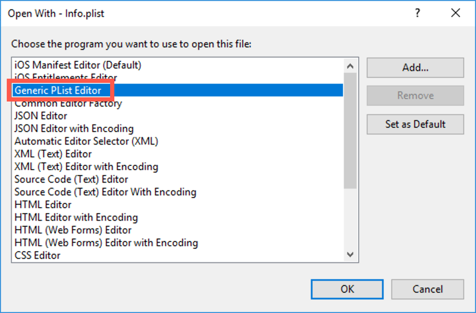
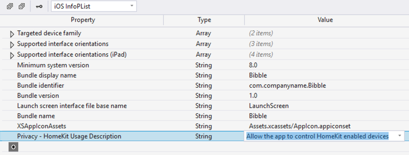

I spend most of my developer day using Visual Studio for Mac, but occasionally I flip back to Visual Studio 2017 on Windows. Last time I flipped back I tried to build an app that uses the camera and I got stuck on one simple thing - setting the camera usage description.

If you double click on the `info.plist` file in an iOS app project, it will open in the iOS manifest editor. This editor allows you to set or change a number of settings for your app, such as the bundle identifier, app name or scheme URLs that your app uses. But one thing this editor doesn't support is setting the usage descriptions.

After a quick chat to some other developers, I found out how to do it (thanks [Pierce](https://twitter.com/pierceboggan)).

From Visual Studio, right-click on the `info.plist` file, then select __Open With...__.

From the __Open With...__ dialog, select the __Generic PList Editor__.

    

    

Once the file has been opened, click the __+__ on the bottom row to create a new property. Click the property name to get a drop down showing all the supported properties, then click the one you want.

    

    

Finally add the description to the __Value__ column.

    

    

Read more about this in the [docs](https://docs.microsoft.com/en-us/xamarin/ios/app-fundamentals/security-privacy?tabs=vswin#setting-privacy-keys&WT.mc_id=ios-blog-jabenn).

> At the time of writing, the docs are out of date, showing that there is no `info.plist` editor support in VS on Windows. But worry not, I've already submitted a PR against the docs to fix this, so hopefully by the time you read this the docs will be up to date.

