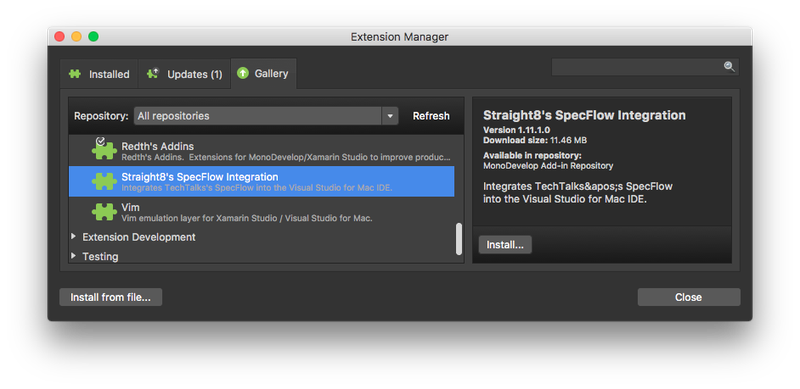

Love Specflow and Visual Studio for Mac? Well you are in luck as there is now a working extension for Visual Studio for Mac to enable full specflow support including generating feature files with syntax highlighting.

It's all open source and built upon the amazing work by [Mike Jones](https://twitter.com/MikeyJones78). You can find it on GitHub at https://github.com/straighteight/SpecFlow-VS-Mac-Integration or in the VS extension gallery:

 
    

    

As always a big thank you to [Mikayla Hutchinson](https://twitter.com/mjhutchinson) for her continued help in getting this all working.

