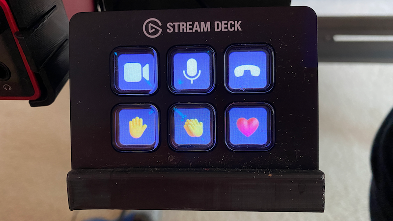
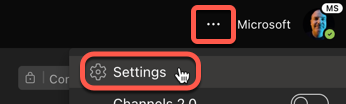
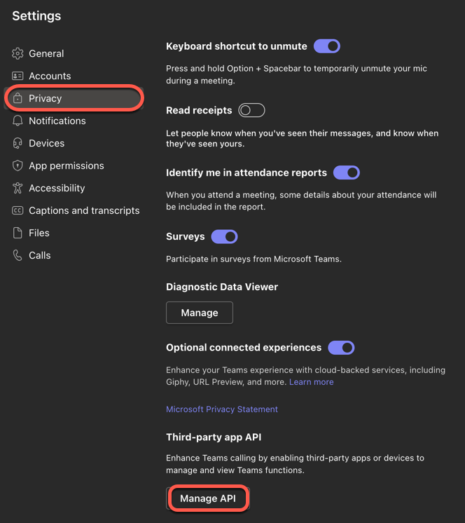
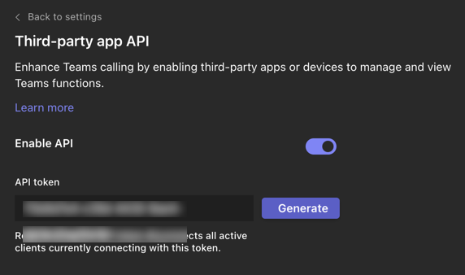

> Already have a Stream Deck and just want to get it working with Teams? [Jump to the instructions to set this up](#set-up-your-stream-deck-for-teams)

Like a lot of folks, I spend time in Microsoft Teams. It's where I chat to my team and others at Microsoft, and it's where I take most of my meetings.

Although Teams has a lot of good features, the UI can sometimes be a pain to use in meetings - especially as a Microsoft employee where we get to try the dogfood versions and things move all the time. There have been loads of occasions where I have tried to give a reaction and put up my hand by mistake, or tried to mute and left the call. WHat I really need is a tool to allow me to control teams without using the UI.

Makers have worked on hacks for this. For example, the key combination `ctrl+shift+m` toggles muting on teams. Add a big red button that simulates this key press and you have a quick way to mute or unmute. Here's one example of this from [Jen Fox on Hackster](https://www.hackster.io/jenfoxbot/microsoft-teams-mute-button-7e9186).

For those with a less maker mindset, there's now a new way to do this - using a Stream deck!

If you've not come across a Stream Deck before, its a neat little gadget that comes in different sizes and has an array of LCD buttons. You can set these buttons up to do things like control apps, or make REST requests, and as each button is an LCD screen you can fully customize what is displayed. For example, you can use one of these to control apps like OBS to switch scenes, or start streaming to Twitch.

There's a whole Stream Deck store with plugins to extend the capabilities by controlling other apps or hardware (such as Phillips Hue lights). A Teams plugin has just been released!

## Set up your Stream Deck for Teams

To set up the Stream Deck, you need an API key for Teams to allow external apps to control it - makes sense really as Teams gives access to confidential work stuff, so you don't want any app to be able to get access. Then you install the plug in, and set it up.

### Get an API key

To get an API key:

1. Select the ellipses from the top-right corner of Teams, then select **Settings**

    

1. Select the *Privacy* tab, then scroll down to the *Third-party app API section* and select **Manage API**

    

1. From the API settings, copy the API token. Use the **Generate** button to generate a new API key if needed. And yes, the UI is terrible and the key wraps out of the text box... 🤷

    

Now you have your key, you can set up your Stream Deck!

### Set up the Stream Deck

Teams is managed from a plugin from the Stream Deck store.

1. Open the Stream Deck store from the menu/taskbar icon

    

1. Search for Teams in the store, and install the Microsoft Teams plugin with the **install** button

    

    You might also see this on the Store discover page - at the time of writing it's the first item there.

1. Once installed, configure your Stream Deck using the Teams options. I did mine by creating a new profile that is activated when Teams is active.

    

1. Once your profile is ready, select it then add buttons by dragging them from the Microsoft Teams group in the menu. After adding each button, you will need to set the *API token* field to the API key you copied from Teams.

    

Done! You can now control Teams using your Stream Deck.
