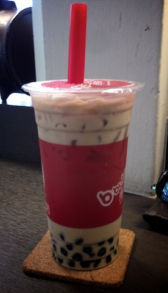
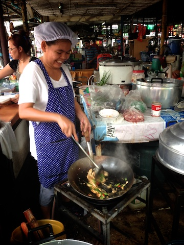

Todays bubble tea is banana milk tea with bubbles.  Quite nice, but a bit too sweet and the banana taste is a bit artificial.

I also snapped a quick photo of my lunch yesterday being cooked fresh for me.  One of the great things about thai street food is a lot of it is cooked in front of you so you know whats in it and that it's really, really fresh.

