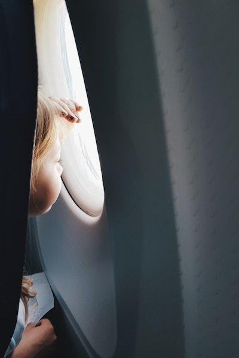

A discussion came up at work the other day on flying long-haul with very young children (toddler age), so I though it would be good to share the tips that I shared with the discussion. My daughter is 6 and has been on over 40 flights, including a lot of long haul as a toddler so I've managed to build up a selection of tips that have worked well for me.

* Night flight. Long journeys are so much easier if they sleep lots. Try to plan how they will sleep seeing as they will be sitting up, so think about bringing cushions or pillows to make them comfortable. Remember - by default they don't get their own seat so you will need to fit them on your lap.

* **Lots** of spare clothes in hand luggage for both you and the child. Toilet accidents can happen, especially during turbulence if you can’t get them to a toilet. Also food spills happen, so you don’t want your little one in wet clothes for the entire flight if a juice box goes everywhere, nor do you want to sit there just in an airplane blanket because your trousers have 💩 on them. Pressure can affect bottles and juice boxes, so anything with liquid should be opened with care!

* Something to suck on the way up and down – if they are still young enough to breastfeed then that’s perfect for up and down as it provides comfort even if they aren’t getting any milk, and helps with the pressure on the ears.

* Bring lots of their favorite snacks and even some packed lunch style meals as airplane meals might not be to their liking, even a kids meal.

* Eating with a child on your lap is hard - when the food comes round ask if one of you can eat first, then once they have finished the rest of the plane, bring food for the other one so one east whilst the other holds the child.

* Get them used to headphones before you travel if they aren’t already. Bring those headphones with you, along with travel adapters for the dual plugs that some planes have.

* Lots of bags with toys or sensory play so there’s something new every now and again. Child gets bored – open another.

* Parents of young kids can board early, so take advantage of this. Also when leaving the plane wait for everyone else to get off. It’s just easier, especially to ensure you have rounded up everything. You don’t want to lose the favorite toy that your child can’t sleep without just because you were rushing off the plane with everyone else jostling for space. You have plenty of time to get off so it’s better to wait and double/triple check the important stuff is there. You've been on a plane for hours, so an extra 10 minutes doesn't matter, especially as a lot of airpots will fast-track parents through immigration!

* Take gifts such as pre-packaged chocolate for the crew because it’s a nice thing to do and can be a game for the child delivering presents to the cabin crew or ground staff. Happy cabin crew will be extra helpful when needed on the flight.

* Have your hand luggage well organized so you know exactly where to go to get food/wipes/entertainment. Space is limited so you don’t want to have to fight through multiple bags to get something.

* Spare batteries and power packs for any gadgets they have on the plane – if their iPad runs out 1 hour in it’ll be a long flight! Also make sure what you think you have downloaded is actually there on the device and works in airplane mode.

* In the run up to the flight make it exciting. My daughter has an [Usbourne flap book on airports and airplanes](https://www.amazon.co.uk/Inside-Airport-Usborne-Board-Books/dp/1409551768/ref=sr_1_1?ie=UTF8&qid=1548156194&sr=8-1&keywords=usborne+airport) and loves it. She used to take it on all her flights and find the right page for the thing we were doing (check in, boarding, take off etc.).

* Be selfless with your partner. It will be trying for you both so if it does turn stressful laugh about it instead of fighting. Take turns to walk away and hang out in the galley if you need a break. Miserable parents make for a miserable flight so focus on happiness - maybe even pack a few hidden notes to each other saying things like "Sorry I'm grumpy as I have poo on me, I still love you" to hand to your partner at the appropriate time, or a hidden stash of their favorite chocolate to cheer them up.

* Ignore anyone around you who complains without reason. Young children are allowed on a plane, so if the grumpy old man behind you complains about noise or demands up front that your child is silent and doesn’t cry all flight (has happened to us), then ignore them and don’t get stressed. Be nice, be apologetic if needed, but be fair to yourselves. You all have a right to travel.

Hope this is helpful to travelers! Enjoy your flight and let me know of any other top tips so I can update this list.

