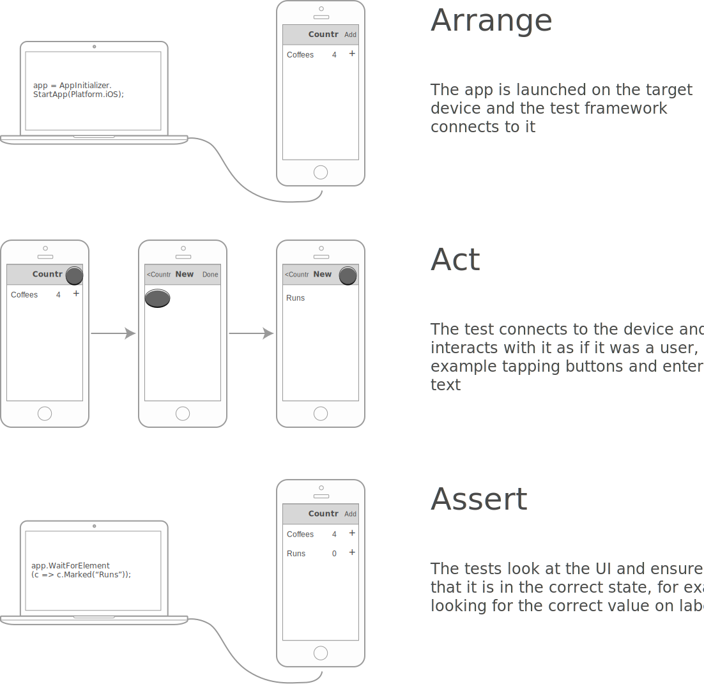
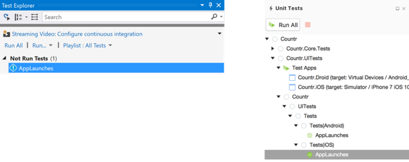
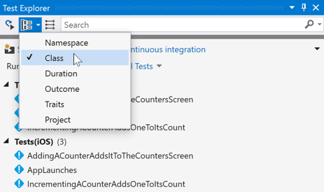

This article is an excerpt from [Xamarin in Action](http://xam.jbb.io). Save 37% off the cover price using code **fccbennett** at http://xam.jbb.io.

<a href="http://xam.jbb.io">
<div class="image-div" style="max-width: 500px;">  
    

    
</div>
</a>

<hr/>

One of the great things about the MVVM design pattern is that it allows us to maximize the code in our cross-platform model and view-model layers. This means we’ve written the bulk of our code and we’ve also written unit tests for it, giving us a degree of confidence that our code works. This article introduces UI testing in Xamarin.

Unit tests are great, but they don’t cover two important areas - have we used the correct controls on our view and bound them correctly, and does our app run on the device. It’s great to have a property on a view model that we bind to a text field to allow the user to enter the name of a counter, but what if we accidentally use the wrong control, such as a label instead of a text box, or even use the right control but forget to add the binding code? What if we’ve used a feature that was only added to the Android SDK in API 21 but our app manifest shows our app runs on API 19 and higher? This is where UI testing comes in - it allows us to run our app on emulators, simulators, and devices, and to write automated tests in code against it.

The concept behind UI testing is simple - run your app and have something interact with it using the user interface components (such as tapping buttons or entering text in text boxes), and validate that everything is working by ensuring the app doesn’t crash and that the results of the users’ actions are shown on the UI as expected. This kind of testing started out life for desktop apps, where the aim was to make testing more reliable and cheaper - after all, humans are expensive and after testing the same screen many, many times they can get bored and make mistakes or miss problems. Automated UI testing also allowed for better time usage with tests being run overnight and developers discovering if they’ve broken anything the next morning.

For desktop apps, UI testing was reasonably simple - launch the app and test it, maybe testing on a few different screen sizes, but always on one OS with maybe one or two different versions as desktop OSes don’t change often. With mobile, things are more complicated. We want to support two major OSes with our cross-platform app, with multiple versions. We also have different hardware with different screen sizes. On iOS this isn’t too bad - we only need to support a small number of OS versions (maybe the current one and the previous) and a small number of different devices, but on Android, as we’ve already seen it’s a mess with multiple OS versions in regular use, a huge range of screen sizes available, and worst of all customizations to the OS from both the hardware manufacturer and carrier.

This is why UI testing is hugely important for mobile apps. A human can’t test on a wide range of devices without needing a lot of time or lots of humans involved in the process (expensive) and without them all going mad as they install the app on another device and run the same test for the millionth time.

##### Writing UI tests using Xamarin UITest
You write UI tests in the same way that you write a unit test – you decide what you want to test, then write some code to create a test. This code uses some kind of framework that is able to launch your app and interact with it as if it was a real user. Many different frameworks are around for testing, and the table below shows some of these.

<table>
<tr>
<th>Framework</th>
<th>Platforms</th>
<th>Language</th>
<th>Description</th>
</tr>

<tr>
<td>Espresso</td>
<td>Android</td>
<td>Java</td>
<td>Google’s testing framework for Android apps has deep integration with Android.
<br>
https://google.github.io/androidtesting-support-library/docs/espresso/</td>
</tr>

<tr>
<td>XCTest</td>
<td>iOS</td>
<td>Objective-C/Swift</td>
<td>
Apple’s UI testing framework has deep integration with iOS.
<br>
https://developer.apple.com/reference/xctest</td>
</tr>

<tr>
<td>Appium</td>
<td>iOS/Android</td>
<td>Any (Java/C#/PHP/Ruby etc.)</td>
<td>Open source cross-platform testing
framework based off of Selenium (a web UI testing framework).
<br>
http://appium.io
</tr>

<tr>
<td>UITest</td>
<td>iOS/Android</td>
<td>C#/F#</td>
<td>Xamarin’s testing framework heavily integrated into Visual Studio for Windows (Android) and Mac (iOS and Android).
<br>
https://developer.xamarin.com/guides/testcloud/uitest/
</tr>
</table>

For this article, I’ll focus on Xamarin UITest, which is well integrated into Visual Studio. For testing Android apps, you can use either Windows or Mac, but for testing iOS apps you’ll need to use a Mac - it’s not supported on Windows at the moment.

Xamarin UITest is based off a testing framework called Calabash which was written in Ruby and is fully open source and maintained by Xamarin. UITest is a layer on top of this that allows you to write your tests in C# and run them using NUnit. These tests are written in the same way as unit tests using the arrange, act, assert pattern, with the arrange part launching the app and getting it to the relevant state ready to test, the act interacts with the UI as if it was a user, and the assert queries the UI to ensure it’s in the correct state.



<small><strong>UI tests, like unit tests, follow the arrange, act, assert pattern</strong></small>

##### Setting up your app for UI testing
For this section, we’ll focus on the Countr app, as there’s more to test here. You can download the source code from this book [here](https://manning-content.s3.amazonaws.com/download/8/b102481-f2a9-4cf5-884b-fc5f273ed0c9/source-code.zip), so download this and open the completed Countr solution from chapter 13. When we built the model layer in our app, we added a new unit test project that we used for unit tests for both the model and view model layers. For our UI tests, we also need a new project that contains and runs our UI tests.

###### Creating the UI test project
Add a new UITest project to the Countr solution using Visual Studio for Windows by right-clicking on the solution, selecting 'Add→New Project…' and from the 'Add new project' dialog select 'Visual C#→Cross-Platform' on the left and select 'UI Test App' from the middle. For Mac, right-click on the solution and select 'Add→Add New Project…', select 'Multiplatform→Tests' on the left and 'UI Test App' from the middle and tap 'Next'. Name your project 'Countr.UITests' and click 'OK' (Windows) or 'Create' (Mac).

<div class="image-div" style="max-width: 500px;">  
    

    
</div>
<small><strong>Adding a new UITest project using Visual Studio for Mac</strong></small>

<div class="image-div" style="max-width: 500px;">  
    

    
</div>
<small><strong>Adding a new UITest project using Visual Studio 2017</strong></small>

Once the test project has been added it’ll install two NuGet packages that UITest needs - _NUnit_ and _Xamarin.UITest_. It’s worth updating the _Xamarin.UITest_ NuGet package to the latest version, as they often push out bug fixes to ensure it works on the latest mobile OS versions. *Don’t* update _NUnit_. UITest only works with NUnit 2, not NUnit 3 and if you update this package your tests won’t work and you’ll need to remove the package and re-install NUnit 2.

The UI test project has two files auto-generated for you - `AppInitializer.cs` and `Tests.cs`.

* `AppInitializer.cs`: This is a static helper class with a single static method which is used to start your app. UITest has an `IApp` interface used to represent your running app, and this has methods on it for interacting with the UI elements in your app or to a limited extent the device hardware (for example rotating the device). The `StartApp` method returns an instance of `IApp` that your tests can use. This method uses a helper class called `ConfigureApp` to start the app, and this helper class has a fluent API that allows you to configure and run your app. The auto-generated code doesn’t do much to configure the app, it specifies its type (Android or iOS) based on the platform passed in to the method.
* `Tests.cs`: This file contains an UI test to run. This test fixture has a parameterized constructor that takes the platform to run the tests on as one of the values from the `Platform` enum, either `Platform.iOS` or `Platform.Android`, and has two `TestFixture` attributes, one for each platform. This means that we have two test fixtures - one Android and one iOS. This fixture has a setup method that uses the `AppInitializer` to start the app before each test, and a single test that calls the Screenshot method on the `IApp` returned from the app initializer to take a screenshot.

###### Setting up your Android apps for UI testing

By default, Xamarin Android apps are configured in debug builds to use the shared mono runtime. When you deploy your app to a device or emulator, time is taken copying the code over, and anything that can make your app smaller is a good thing as this reduces the time to install. Xamarin Android apps use a mono runtime (mono being the cross-platform version of .Net that Xamarin is based on) to provide the .Net framework, and this is a large piece of code bundled in your app. Rather than bundling it in, for debug builds you can use a shared version which is installed separately, making your app smaller. Unfortunately, when doing UI tests you can’t use the shared runtime, and you’ve two options:

* Don’t use the shared runtime: You can turn off the shared mono runtime from the project properties. In Visual Studio for Windows you’ll find it in the 'Android Options' tab at the top of the 'Packaging' page, on Mac it’s on the 'Android Build' tab at the top of the 'General' page. Untick the 'Use Shared Mono Runtime' box to turn this off, but be aware that this increases your build times.
* Release builds: Release builds don’t have the shared mono runtime turned on. After all, when you build a release version it’s usually for deployment such as to the store, and your users won’t have the shared mono runtime installed. The downside to using a release build is that you need to grant your app permission to access the internet. This isn’t a problem if your app already accesses the internet, but if it doesn’t you many not want to ask your users for this extra permission as they might not want to grant it. If you want to use a release build, then you can grant this permission in Visual Studio by opening the project properties, heading to the 'Android Manifest' tab and finding the **INTERNET** permission in the 'Required Permissions' list and ticking it. On Mac, double-click on the `AndroidManifest.xml` file in the Properties folder and tick the permission.

<div class="image-div" style="max-width: 500px;"> 
    

    
</div>
<small><strong>Adding the internet permission to the AndroidManifest.xml</strong></small>

###### Setting up your iOS apps for UI testing

Apart from the shared mono runtime, out of the box UITest works with Android – UITest is able to connect to your running Android app on a device or an emulator and interact with it. iOS, on the other hand, isn’t quite as simple. Due to the stricter security on iOS you can’t connect to a simulator or device and interact with the app. Instead we need to install an extra component into your iOS apps that you initialize before your UI tests can run. To do this, add the _Xamarin.TestCloud.Agent_ NuGet package to the Countr iOS app (Test Cloud is the Xamarin cloud-based testing service – you’ll see the name used in a few places with UITest).

<div class="image-div" style="max-width: 500px;">  
    

    
</div>
<small><strong>Adding the Xamarin Test Cloud Agent NuGet package</strong></small>

Once this NuGet is installed you’ll need to add a single line of code to initialize it. Open `AppDelegate.cs` and add the following code: 

```
public override bool FinishedLaunching(UIApplication app,
                                       NSDictionary options)
{
   #if DEBUG
   Xamarin.Calabash.Start();
   #endif
   ...
}

```

This code starts the Calabash server for debug builds only. The Calabash server is an HTTP server that runs inside your app, and the UITest framework connects to this to allow it to interact with your app. Apple is strict about security in their apps, and they’d never allow an app with an open HTTP port like this on the app store. To avoid this the Calabash server is only enabled for debug builds - for release builds this code won’t get run, the linker strips it out and your app won’t get rejected from the app store (at least not due to the Calabash server).

##### Running the auto-generated tests

UI tests are run in the same way as any other unit test - you can run them from the test pad/explorer. UI tests rely on having a compiled and packaged app to run, and the first step is to build and either deploy to device, emulator or simulator or run the app you want to test. Note that doing a build isn’t enough for Android – a build compiles the code, it doesn’t package it up. The easiest way to ensure you have a compiled and packaged app is to run it once. On Android build in release, for iOS you need to use a debug build to enable the Calabash server. You also need to set what device, emulator or simulator you want to run your tests on in the same way that you’d select the target for debugging.

###### Getting ready to run the tests

If you open the test pad or explorer you may not see the UI tests if the project hasn’t been built. If you don’t see the tests then build the UITest project and you should see the tests appear. If you expand the test tree in Visual Studio for Mac you’ll see two fixtures - Tests(Android) and Tests(iOS). 

<div class="image-div" style="max-width: 700px;">  
    

    
</div>
<small><strong>The Test Explorer (Windows) and Test pad (Mac)</strong></small>

Two fixtures are declared with the two `TestFixture` attributes on the Tests class. When you run the tests from Tests(Android) it constructs the test fixture by passing `Platform.Android` to the constructor, which in turn uses the `AppInitializer` to start the Android app. Tests(iOS) is the same, but for the iOS app. Under each fixture you’ll see the same test called `AppLaunches`.

<div class="image-div" style="max-width: 500px;">  
    

    
</div>
<small><strong>Grouping tests in the Visual Studio test explorer</strong></small>

In Visual Studio, you don’t see the same hierarchy out of the box; drop down the 'Group By' box and select 'Class' to see the tests grouped by test fixture. You can only test Android apps using Visual Studio. Feel free to comment out the `[TestFixture(Platform.iOS)]` attribute from the Tests class to remove these tests from the explorer.

Before we can run the test, we need to make a small tweak. Despite the test calling `app.Screenshot`, this test won’t spit out a screenshot. For some reason, out of the box UITest is configured to only create screenshots if the tests are run on Xamarin’s Test Cloud, and we need to change the configuration to always generate screenshots. To do this, add the code in the following listing to `AppInitializer.cs`.

```
public static IApp StartApp(Platform platform)
{
   if (platform == Platform.Android)
   {
      return ConfigureApp
         .Android
         .EnableLocalScreenshots()
         .StartApp();
   }

   return ConfigureApp
      .iOS
      .EnableLocalScreenshots()
      .StartApp();
}
```

By default, the `StartApp` method doesn’t do anything to configure the app which is being tested, and this means that it expects the app to be tested to be a part of the current solution. You also need to configure UI test to know which apps in the solution to use as there could be multiple.

###### Setting the app to test in Visual Studio for Mac

Open the test pad and expand the `Countr.UITests` node. Under this you’ll see the test fixtures, as well as a node called Test Apps shown next to a stack of green arrows. Right-click on this and select 'Add App Project'. From the dialog that appears tick 'Countr.Droid' and 'Countr.iOS' and click 'OK'. You’ll see these two apps appear under the 'Test Apps' node. If you right-click on one of them you’ll see a number of options, including a list of possible target devices to run against, with 'Current device' ticked. This list is used to set which device the UI tests are run against when you run them from the pad. If you leave 'Current Device' selected it’ll use whatever target is set from the main toolbar, but if you always want the tests to run against a particular emulator, simulator or device you can select it from here.

###### Setting the app to test in Visual Studio 2017

UITest uses NUnit to run tests, and we need to ensure Visual is configured to run NUnit tests. As I mentioned, to use UITest we need to install the NUnit 2 adapter. From 'Tools→Extensions and Updates', select the 'Online' tab on the left and search for 'NUnit 2'. Click on 'NUnit 2 Test Adapter' in the list in the middle and click the 'Download' button. You’ll need to close Visual Studio for this to be installed; relaunch it after the install and re-load the Countr solution.

<div class="image-div" style="max-width: 500px;"> 
    

    
</div>
<small><strong>Installing the NUnit 2 test adapter</strong></small>

Visual Studio only supports testing Android; delete the `[TestFixture(Platform.iOS)]` attribute from the `Tests` class. This stops iOS tests showing up in the test explorer.

Unlike Visual Studio for Mac, there is no way on Windows to set the test apps. Instead we need to configure this in code by giving it the path to the Android 'APK', which is in the output folder and is named based on the Android package name with the file extension .apk, with release builds having the suffix of ‐Signed to indicate that they’ve been signed with our keystore. We set the package name in the Android manifest in the last chapter based off a reverse domain name (mine was set to `io.jimbobbennett.Countr`), and you can find this file in `Countr.Droid\bin\Release` (assuming you’ve built using the release configuration) or `Countr.Droid\bin\Debug` for the debug configuration. We’ll be using release Android builds for the purposes of this book; add the code in the following listing to point UITest to the right APK, substituting in your package name.

```
if (platform == Platform.Android)
{
   return ConfigureApp
      .Android
      .EnableLocalScreenshots()
      .ApkFile ("../../../Countr.Droid/bin/Release/<your package name>‐Signed.apk")
      .StartApp();
}
```

When tests are run they’re run on the device or emulator that you selected for the build configuration, the same as for debugging your apps. This makes it easy to change which device tests are run on by changing the dropdown in the toolbar, the same way you’d change the target for debugging.

###### Running the test

Once the test apps are configured you can run the tests by double-clicking on them in the test pad in Visual Studio for Mac, or by right-clicking on them in the Visual Studio for Windows Test Explorer and selecting 'Run Selected Tests.' If you’re testing Android set the build configuration to release, for iOS set it to debug.

<div class="image-div" style="max-width: 500px;">  
    

    
</div>
<small><strong>The device to test on is set in the same way as the device for debugging</strong></small>

That’s all for UI testing. If you want to learn more about making cross-platform mobile apps using Xamarin, download the free first chapter of [Xamarin in Action](http://xam.jbb.io) and see this [Slideshare presentation](http://www.slideshare.net/ManningBooks/xamarin-in-action).


