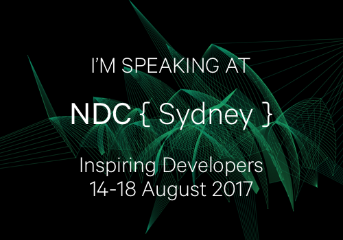

I'm excited to announce that I'll be talking at a couple of major conferences this year:

<a href="https://www.monkeyfest.io">

    

    

</a>

[MonkeyFest 2017](https://www.monkeyfest.io)

<a href="http://ndcsydney.com/speaker/jim-bennett/">

    

    

</a>

[NDC Sydney](http://ndcsydney.com/speaker/jim-bennett/)

At both of these conferences I'll be talking about adding platform specifics to Xamarin Forms apps. Hope to see you there!

