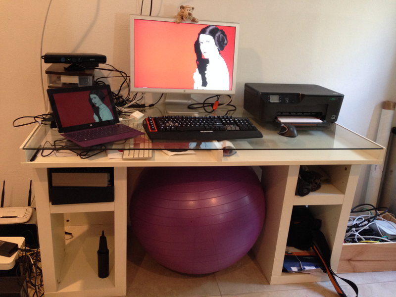

It's a glorious day here, a perfect day to take my wife and daughter to the beach.
Unfortunately we currently live in Bermuda, an island paradise with stunning beaches and clean water.  Why is this unfortunate?  Because the country is so badly run.  Today is Bermuda day, and they are celebrating by closing one of the main roads for a half marathon.  This road is the one that my house is on.  So for the rest of the day, I can't get the car out and drive to the beach.  I can't walk either as I'll have to walk on roads with no pavement that are open that are narrow and the drivers here are idiots, so it's not safe with a child.
They didn't tell us the road would be closed, no sign on the exit from our estate - my wife popped out with our daughter and got shouted at by people on the side of the road and the police and made to leave her car in the local supermarket and walk back.  Not her fault - there was nothing to indicate that the road would be closed.  But thats the way here - hence why we are leaving soon.

So I thought today would be a good day to tidy up a few things in the running.

## Tidying Up

Firstly I finally tidied up my desk so I could work using a proper keyboard and monitor.  Most of my recent dabbling was using my Surface on a coffee table in front of the sofa whilst my wife was glued to *'Americas Next Greys New Girl Anatomy'* or whatever it is she watches.  My setup isn't the latest and greatest, but it does what I need.
My Windows development box is a [Surface Pro 2](http://www.microsoft.com/surface/en-us/products/surface-pro-2), the 256GB model with 8GB RAM.  It's a great Windows 8 tablet (shame Windows 8 isn't a great tablet OS - not having a 'Modern UI' browers unless IE is your default being the worst part), and a pretty powerful dev box.  I've got the type keyboard which is fine to type with but the trackpad is rubbish, not a patch on the Apple track pads.
For input on my desk I prefer a mechanical keyboard and decent mouse.  Logitech do some pretty decent kit so I've got myself a [G710+](http://gaming.logitech.com/en-us/product/g710plus-mechanical-gaming-keyboard) keyboard and [Performance MX](http://www.logitech.com/en-us/product/performance-mouse-mx) mouse - a darkfield one as my desk has a glass top.  The surface has a nice screen which works beautifully as a small second, with an old 24" Apple Cinema display as my main monitor.  Add a 13" MacBook Pro for OSX/iOS development and I'm all set.
My desk as mentioned before is a glass topped one.  Nothing great, just a cheap Ikea number.  I don't have a great chair (though I'd love an Aeron) but instead I use a large excercise ball.  Work those abs whilst working the fingers.
Add a Kinect and a load of other junk and away I go.



## Blogging

Secondly - this blog.  I wanted a better theme so I've installed [Ghostion](http://ghostion.ghostdemo.axiantheme.com/), a really nice looking theme based on [Foundation 5](http://foundation.zurb.com/).  I had to make a few tweaks to make it look better on my iPhone which was a good excuse to get my hands dirty with Foundation.  I'm still very new to HTML, Javascript and all the eleventy billion frameworks out there so it took a while, but I'm pleased with the result.

I really like the way with Foundation that you can hide elements based on the screen size with a simple css class.

```HTML
<div class="row hide-for-small-only">
  <!-- Large screen content -->
</div>
```

```HTML
<div class="row show-for-small-only">
  <!-- Small screen content -->
</div>
```

Ghostion has some really cool features that work out of the box with minimal configuration.  [Disqus](http://disqus.com/) for commenting or Google Analytics are all available by just adding the relevant id's to one file.

## Coding

Finally, time to do some coding.  The rest of today will be spent on a couple of apps.  Years ago I did a game in the iOS app store, which I'm planning on resurrecting and re-releasing and putting the code on GitHub.  I also want to finish playing with Cordova apps using Visual Studio, so I'll try to get something from there on the app store.  Blog posts on these coming soon!

