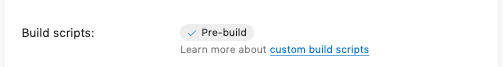
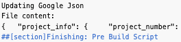

I've been working on an app that needs push notifications, but also needs to be open source. This led me to a problem - the `google-services.json` file. This file is needed to sign up for Firebase messaging to implement push on Android, but it also contains my API keys, values I do **NOT** want to be public.

So - what to do?

Well I'm building and distributing my app using [AppCenter](https://appcenter.ms/?WT.mc_id=appcenter-blog-jabenn) and the build configuration contains a couple of useful settings that I can take advantage of - [build scripts](https://docs.microsoft.com/en-gb/appcenter/build/custom/scripts/?WT.mc_id=appcenter-blog-jabenn) and [environment variables](https://docs.microsoft.com/en-gb/appcenter/build/custom/variables/?WT.mc_id=appcenter-blog-jabenn).

I can define the contents of my `google-services.json` file inside an environment variable, add a dummy version to my GitHub repo, then overwrite the dummy one with the environment variable at build time. This means my secrets are safe, and the real value is protected using my AppCenter account. I can then also use the right version locally by excluding updates to this file from git as [I've described before](/blogs/hiding-api-keys-from-git/).

This works not only for an open source project, but if I wanted to have different settings for different builds (such as different push end points for QA or beta builds).

#### Check a dummy `google-services.json` file into source control

Add the `google-services.json` file to your project as normal. Blank out the file and add it to git. Revert the blanked out file and hide updates from git using:

```sh
git update-index --assume-unchanged ./google-services.json 
```

Run this from the root of your Android app.

#### Define the environment variable

From the **Build configuration** tab of your build in AppCenter, turn on **Environment variables**. Add a new variable called `GOOGLE_JSON` and paste in the contents of your `google-services.json` file.

<div class="image-div" style="max-width:500px;">
    

    
</div>

#### Create a build script to update the file

AppCenter can run build scripts before or after the build. These scripts have to have a [specific name](https://docs.microsoft.com/en-gb/appcenter/build/custom/scripts/?WT.mc_id=appcenter-blog-jabenn) to be picked up by the build configuration. To create a pre-build script, create a script file in the root of your repo called `appcenter-pre-build.sh`. Add the following code to this script:

```sh
GOOGLE_JSON_FILE=$APPCENTER_SOURCE_DIRECTORY/<path>/google-services.json

if [ -e "$GOOGLE_JSON_FILE" ]
then
    echo "Updating Google Json"
    echo "$GOOGLE_JSON" > $GOOGLE_JSON_FILE
    sed -i -e 's/\\"/'\"'/g' $GOOGLE_JSON_FILE

    echo "File content:"
    cat $GOOGLE_JSON_FILE
fi
```

Update <path> to be the path to the `google-services.json` file from the root of your repo. The `$APPCENTER_SOURCE_DIRECTORY` environment variable points to where on the build VM App Center has put your code.

This code will check for the file, and if it finds it copy the value of the environment variable into this file, followed by using a `sed` command to strip out escape characters as environment variables get double quotes escaped to `\"`.

Once you add this file to your repo, it will appear under the **Build Scripts** in the **Build Configuration**.

<div class="image-div" style="max-width:500px;">
    

    
</div>

If you **Save and build** the project, you will see the `google-services.json` file written to and dumped to the build log.


<div class="image-div" style="max-width:250px;">
    

    
</div>

<hr/>

You can read more about the capabilities of [AppCenter](https://appcenter.ms/?WT.mc_id=appcenter-blog-jabenn) on [docs.com](https://docs.microsoft.com/en-gb/appcenter/?WT.mc_id=appcenter-blog-jabenn).


