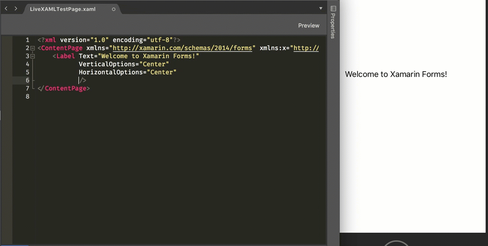

One of the downsides to UI development is how long it takes to get a good looking UI. You spend an inordinate amount of time setting up the UI, running your app to see how it looks, tweaking the UI, running again, tweaking again, running again. Then of course you have to repeat on multiple devices with different OSes or screen sizes.

For Xamarin Forms there are a number of tools to help you when building UIs using XAML. The one that comes out of the box is the previewer - a preview of what your XAML will look like on iOS or Android, phones or tablets. This preview updates as you update your XAML but is limited. If your UI relies on bound data you can't see the full experience, and anything that relies on resources doesn't always work so well.

Another good tool is the Xamarin Live Player, which I'll look at in a later blog post.

Currently though the tool that is interesting me the most is LiveXAML for Xamarin Forms from Mihhail Maslakov - http://www.livexaml.com. 

 
    

    

 

This tool is an extension for Visual Studio (both Windows and Mac which is cool) that injects some code inside your app to listen for XAML updates. You update a XAML file inside Visual Studio and the extension tells your app to update the UI. This means you can tweak your code and instantly see the updates in your actual app running under real world conditions. Essentially magic!

Lets now see it in action. Start by installing the LiveXAMl extension from the extensions gallery, then create a new blank Xamarin Forms app, adding the LiveXAML NuGet package to your core Forms project.

The out of the box forms template creates a single page app with a label. saying "Welcome to Xamarin Forms!". If you run your app you will see this label. Try changing the text color in your XAML page and saving it - you will see the text color update on your app.

Magic! This is a very simplistic example, but the power here is obvious. I've wasted countless hours making minor tweaks, especially to margins, font sizes and colors, time that could be saved by using LiveXAML.

Lets look at a more complicated example, using the sample app I built for a talk at NDC Sydney and MonkeyFest on Xamarin Forms effects and custom renderers. If I change a property on an effect, the UI updates.

This works for pages and styles - so if you update a style in your `app.xaml` file, the UI will update, something very important if you use styles a lot (which I do). It also works for controls, so if you have a control defined using XAML on your page, updating the control updates the page.

You can also use Visual Studio for Mac's run configurations to run two apps at the same time, such as an iOS and an Android app, then update a XAML page and see the UI update on both platforms. Another huge time saver.

You don't just have to use emulators, you can use physical devices. This happens via WiFi over port 53030 and 53031, so if you are on a corporate WiFi network you'll need to have these ports open. I couldn't get this working at the office, but it worked at home.

Support seems to be pretty good as well. When I first tried it out I had issues with resources and controls not working, but the latest NuGet package seems to have fixed everything, having regular releases adding new features is always a good sign.

As great as this tool is, there is a downside. As the name suggests it is XAML focused, so updates to C# code will not be rendered on screen. 

Overall opinion - this is great. It's a paid for tool, but has a free version to allow you to try it out. I would say it's probably worth the money, especially if your company pays for it as the time you save would more than pay for the license cost.

