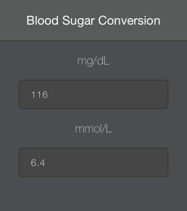

Building on [the previous post in this series](http://jimbobbennett.ghost.io/using-visual-studio-to-develop-cordova-apps/), I thought it would be fun to try to learn [Angular.js](https://angularjs.org/) and include this in my Cordova app.  I could also do with so nice looking widgets, so I decided to have a play with [TopCoat](http://topcoat.io/).

First thing I need is an app to build.  One of my current 'First World Problems' is having to convert from US units (mg/dL) to international blood sugar units (mmol/L).  I'm a diabetic and I've been living most of my life in the UK and in Hong Kong - two countries that use international units for blood sugar measurement.  I'm now living in Bermuda, and they only sell US spec blood sugar meters, and provide testing strips that only work with these small set of meters.  The meters are factory locked to US units for some reason (unlike international meters that can be changed).  So for now, I'm stuck with testing in US units.

The conversion is 18 to 1 - so a US measurement of 90 is the same as an international measurement of 5.  Simple enough, but I've got better things to do than learn my 18 times table, like create an app to do the conversion for me.

So, lets create an app.

## Building the app

I'm starting with the simple HelloWorld example from the previous post, and changing it to suit my needs.
The UI is really simple - a top bar and two input boxes.



The top bar is the TopCoat navigation bar

```HTML
<div class="topcoat-navigation-bar">
  <div class="topcoat-navigation-bar__item center full">
    <h1 class="topcoat-navigation-bar__title">Blood Sugar Converter</h1>
  </div>
</div>
```

This gives a nice header bar.  I'm using the TopCoat mobile dark skin, I really like the way it looks.

For the input boxes I wanted to select all when you press them - that way you can overtype instead of having to delete the existing contents.  A quick search of Stack Overflow gives a few suggestions to select everything, but these lead to a problem.  When the text is selected the iPhone pops up a menu with standard options for selected text, Cut, Copy etc.  This is far from ideal as it looks really bad.
In the end, I just set the value to undefined on the click event handler.  This clears the box so there is nothing to select allowing you to type the number without having to delete everything.
The fun part with the input boxes was the conversion.  Rather than having to click a button to convert, I wanted it to happen on the fly.  This is where Angular comes in.  Angular allows you to bind the values from input boxes to variables - you update the input, the variable automatically updates, you update a variable, the field showing it automatically updates.  It also provides events to detect value changes.

So first off, a controller.

```Javascript
// Create the angular module
var bloodSugarConversionApp = angular.module('BloodSugarConversionApp', []);

// Create the controller
bloodSugarConversionApp.controller('BloodSugarConversionCtrl', function ($scope)
{
	// defines the initial values for our variables
    $scope.usMeasurement = 0;
    $scope.internationalMeasurement = 0;

	// this function is wired up to a change handler for the US input field
    // when this changes, it updates the international measurement
    $scope.changeUSMeasurement = function()
    {
    	// setting the international measurement updates the value in the input
        $scope.internationalMeasurement = Math.round(($scope.usMeasurement / 18) * 10) / 10;
    };

	// this function is wired up to a change handler for the international input field
    // when this changes, it updates the US measurement
    $scope.changeInternationalMeasurement = function()
    {
    	// setting the US measurement updates the value in the input
        $scope.usMeasurement = Math.round(($scope.internationalMeasurement * 18) * 10) / 10;
    };
});
```

So, what's going on here.  First we define a callback that creates the *BloodSugarConversionCtrl* controller.  This function sets up the *$scope* to have a couple of variables for the two units of measurement initialised to 0, and declares a couple of functions on it that will convert when a value changes.
This controller is then wired up in our HTML.

```HTML
<div ng-controller="BloodSugarConversionCtrl">
  <p class="label-text centered">mg/dL</p>
  <input ng-model="usMeasurement" ng-change="changeUSMeasurement()" 
         onclick="this.value = undefined"
         type="number" step="0.1" class="topcoat-text-input centered" />
  <p class="label-text centered">mmol/L</p>
  <input ng-model="internationalMeasurement" 
         ng-change="changeInternationalMeasurement()" 
         onclick="this.value = undefined"
         type="number" step="0.1" class="topcoat-text-input centered" />
</div>
```

At the outer `<div>` we set the controller using the `ng-controller` attribute, and this is accessible to the inner elements.  We then set the model using the `ng-model` attribute against the inputs - this binds the given variable to the value for the input.  Finally we wire up the events - the `onclick` to clear the value when selected (as described above), and the `ng-change` to handle the value change and update the corresponding value.

And that is basically it.  Angular takes care of the hard parts.

When I ran it, it did look a bit bad.  The app could be scrolled - it's essentially a hosted web page so the scrolling is a default behavior.  It also scrolled up when you selected the input boxes so that the keyboard could fit on the screen, and this made the status bar visible through the HTML elements.  Scrolling was easy to turn off - just add a line to the *config.xml*

```XML
<preference name="DisallowOverscroll" value="true" />
```

Removing the status bar was harder.  There are many solutions on the web for earlier versions of Cordova or earlier versions of iOS, but for Cordova 3.3.1 and iOS 7 the only way I could get it to work was using the StatusBar plug-in.  Install it by adding an entry to the vs features in the *config.xml*

```XML
<vs:feature>org.apache.cordova.statusbar</vs:feature>
```

Then hide it in the *onDeviceReady* event

```Javascript
StatusBar.hide();
```

Done.

## Deploying to the App store

Once done, I thought it only fair to share the app with the world for free on the app store.

Doing this was fairly simple.  The Cordova build engine that runs on my Mac spits out an XCode project for the app for every build.  It's a simple job to load this into XCode, set the relevant provisioning profiles and upload it to the store.
The only gotcha is the version number.  The default one in the *config.xml* is 1.0.0.0.  iTunes app submissions only allow a 3 part version, so you'll have to update this to 1.0.0 or similar before it will pass validation.

My app is currently awaiting review - I'll update this post with a link once it's passed and available.


The source for this app is available on [GitHub](https://github.com/jimbobbennett/BloodSugarConverter).  I'm new to HTML and JavaScript so please be kind.  All comments and criticisms greatfully received.

