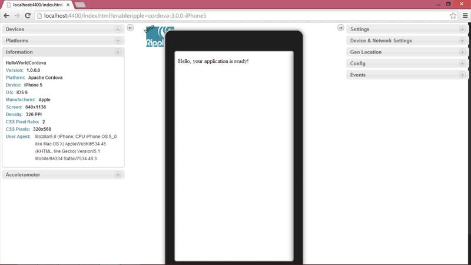
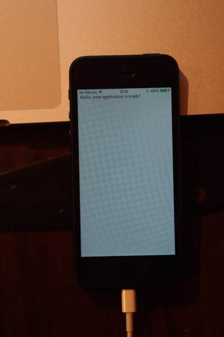

So after [yesterdays](http://jimbobbennett.ghost.io/waiting-12-05-2014/) attempt to create a 'Hello World' app using the new Cordova tools for Visual Studio, I thought tonight I'd try again.

If you haven't heard the news, Microsoft [announced](http://blogs.msdn.com/b/somasegar/archive/2014/05/12/mobile-first-cloud-first-development-visual-studio-apache-cordova-tooling-and-cloud-optimized-net-futures.aspx) a CTP of support for Cordova inside Visual Studio.  Thats right, Microsoft is opening up to a world of other devices.  The aim is to allow you to build HTML5 apps inside Visual Studio and deploy to Windows Phone, Android and iOS, all from one place (with a networked Mac for iOS building).
I guess this might put Adobe's PhoneGap out of business, but hey, thats how it works when you build a business exposing open source software.

I'm writing this as I go along trying to do a 'Hello World' app, and so far not much success.

I'm working through the [documentation](http://go.microsoft.com/fwlink/?LinkID=397716) and here are my experiences:

First I did the basics - I launched Visual Studio and created a new solution using the new Multi Device Hybrid App template.  I set up my MacBook Pro to host the remote build and simulation agent, set the build output to be the iOS simulator and hit build.  First problem - it couldn't find Java.  It seems the installer didn't successfully install the Java 7 JDK.  One more delay whilst I download and install this.

Once the JDK was installed - I tried building and running again.  Next thing I know, up pops Chrome (with the obligatory set your default browser prompt - I use IE as my default simply so I can use a bowser on my surface in Metro mode, oh for Firefox for Metro) running the iOS simulator with my 'Hello World' app running.  WooHoo!

Now to try the first interesting bit - can I run the app on an iOS simulator on my Mac?  Lets set the output on Visual Studio and see what happens!
So far so good - things are happening on the Mac's terminal.
And as if by magic:

I'm in shock.  No third party paid for components like Xamarin, just an installer from Microsoft that installs open source code and I have an iOS simulator on my Mac running code from Visual Studio.  This is groundbreaking stuff (to a techy of course - it didn't cause my wife to even look up from whatever celebrity gossip site she's browsing).

Lets take it all the way - lets see if it can run on my iPhone itself.

Seems you can't have it all - Code signing error.  I guess I need to provision my iPhone.  BRB!

Time to let a picture paint a thousand words:

Excuse the poor quality shot - it's late and I couldn't be bothered to turn the lights up.  Thats the same app - the basic Visual Studio Multi Device Hybrid app template built on my Surface using my MacBookPro as a remote build agent, installed using iTunes on the Surface running on my iPhone.

iPhone development has just got a lot easier.  
Tomorrow I'll try adding some code and developing a simple app.

