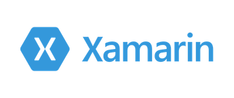

There's only 1 week to go until the first Xamarin Dev Days in Auckland, hosted by the [Auckland Xamarin Meetup](http://www.meetup.com/Auckland-Xamarin-Meetup/) on Saturday 19th November. We’ve got an awesome program lined up for this free day and evening, so we thought now would be a good time to share our plans. We have internationally recognized speakers, drinks in the evening and some seriously good prizes to give away!

###### Location:

Auckland University of Technology, Gov Fitzroy Pl, Auckland, 1010, New Zealand

<iframe src="https://www.google.com/maps/embed?pb=!1m18!1m12!1m3!1d3192.5271113704994!2d174.76381131529138!3d-36.853799979937556!2m3!1f0!2f0!3f0!3m2!1i1024!2i768!4f13.1!3m3!1m2!1s0x0%3A0x0!2zMzbCsDUxJzEzLjciUyAxNzTCsDQ1JzU3LjYiRQ!5e0!3m2!1sen!2sus!4v1478215657098" width="300" height="225" frameborder="0" style="border:0" allowfullscreen></iframe>

A big thank you to AUT for sponsoring the room.

###### Guest speakers

We've privileged to have some amazing local and international speakers at this event. As well as listening to the three of us and a local Microsoft technical evangelist you get to hear from:

<a href="http://www.michaelridland.com"><b>Michael Ridland</b></a>

<table style="border:0px;">
<tr style="background-color:rgba(0, 0, 0, 0);">
<td>
<a href="http://www.michaelridland.com">

</a>
</td>
<td style="vertical-align:top">

Michael Ridland, Xamarin MVP, Community Blogger and the founder of XAM Consulting. A Xamarin fan since the monotouch days and a even bigger Xamarin.Forms fan since it's release. Michael has been leading Xamarin projects years and delivered enterprise apps of the highest quality in the market. Michael (and his team) are the creators of a few Xamarin.Forms components including the FreshMvvm Framework, SlideOverKit and FreshEssentials. You can find him over at michaelridland.com and twitter.com/rid00z. 

</td>
</tr>
<tr style="background-color:rgba(0, 0, 0, 0);">
<td>

</td>
<td style="vertical-align:top">
</td>
</tr>
</table>

<a href="https://twitter.com/matthewrdev"><b>Matthew Robbins</b></a>

<table style="border:0px;">
<tr style="background-color:rgba(0, 0, 0, 0);">
<td>

</td>
<td style="vertical-align:top">

Matthew is the creator of <a href="http://www.mfractor.com">MFractor</a> - the essential productivity tool for Xamarin.Forms. He's currently a Xamarin developer at JobAdder.

</td>
</tr>
<tr style="background-color:rgba(0, 0, 0, 0);">
<td>

</td>
<td style="vertical-align:top">

</td>
</tr>
</table>

<a href="http://www.codingwithsam.com"><b>Sam Williams</b></a>

<table style="border:0px;">
<tr style="background-color:rgba(0, 0, 0, 0);">
<td>

</td>
<td style="vertical-align:top">

Sam is a passionate software developer who's obsessed with clean code and F#. In his spare time, you will find him on his VR watching videos or coding some more.

</td>
</tr>
</table>

###### Program for the day:

<table style="border:0px;">
<tr style="background-color:rgba(0, 0, 0, 0);"><td style="text-align:right">9:00</td><td>Registration and introductions</td></tr>
<tr style="background-color:rgba(0, 0, 0, 0);"><td style="text-align:right">9:20</td><td>Intro to Xamarin</td></tr>
<tr style="background-color:rgba(0, 0, 0, 0);"><td style="text-align:right">10:00</td><td>Xamarin Forms</td></tr>
<tr style="background-color:rgba(0, 0, 0, 0);"><td style="text-align:right">10:40</td><td>Break</td></tr>
<tr style="background-color:rgba(0, 0, 0, 0);"><td style="text-align:right">10:50</td><td>Xamarin Forms performance, power controls and layout systems!</td></tr>
<tr style="background-color:rgba(0, 0, 0, 0);"><td style="text-align:right">11:20</td><td>Xamarin + Azure</td></tr>
<tr style="background-color:rgba(0, 0, 0, 0);"><td style="text-align:right">12:00</td><td>Lunch</td></tr>
<tr style="background-color:rgba(0, 0, 0, 0);"><td style="text-align:right">1:00</td><td>Building Xamarin apps with F#</td></tr>
<tr style="background-color:rgba(0, 0, 0, 0);"><td style="text-align:right">1:30</td><td>Hands on labs/hack time</td></tr>
<tr style="background-color:rgba(0, 0, 0, 0);"><td style="text-align:right">3:45</td><td>Prize giving</td></tr>
<tr style="background-color:rgba(0, 0, 0, 0);"><td style="text-align:right">5:00</td><td>Drinks/snacks at <a href="http://www.thebluestoneroom.co.nz/home.aspx">The bluestone room</a></td></tr>
</table>

###### Refreshments
A big shout out to Datacom for sponsoring the refreshments during the day to keep everyone fueled up. There should be something for everyone but if you have any special dietary needs please let us know as soon as possible.

###### Hands on labs/hack/Prizes!
The afternoon session is a chance for you to do one of two things. If you are new to Xamarin we have a hands on lab to work through covering Xamarin Forms and Azure. If you have some experience and want to hack on your own thing instead then this will be a good time to do it - you'll be surrounded by other experts to help with any queries you may have. 

In addition EROAD have kindly donated an iPad and a Samsung tablet (luckily not one that explodes) as prizes for the best hack. There's so many cool features in iOS, Android and UWP, as well as some great toys to play with in Azure so if you can think of something awesome that's related to transport or health and safety (maybe using Azure cognitive services to see if a driver is angry so shouldn't drive) you could win big!

There will also be a copy of Jim's book [Xamarin In Action](http://xam.jbb.io) to be given away to one lucky attendee.

###### Drinks!
Who doesn't love time to socialize with Xamarin developers? EROAD are sponsoring drinks and snacks at <a href="http://www.thebluestoneroom.co.nz/home.aspx">The bluestone room</a>. We'll be heading there once the day is done so come along for a free drink or two and a chance to talk Xamarin. EROAD is committed to health and safety so if you're drinking with us, don't drive home!

###### Photos
[Peace of dreams](http://peaceofdreams.com) will be on site to photograph the goings on, a big thanks to them and to Microsoft for sponsoring.

###### What should you bring?
Bring a laptop with Xamarin installed! There will be WiFi on the day but we can't guarantee how fast it would be to download and install Xamarin, Android SDK's etc, so please set everything up before you arrive. We can help if you have any problems but the more prepared you are the better. If you have a Windows laptop and want to build iOS apps then you can sign up with [MacInCloud](https://www.macincloud.com/checkout/managed.html) and take advantage of their 24 hour US$0.99 offer.

 
We look forward to seeing you on the 19th. Our spaces are limited so if you can no longer attend please let us know asap or cancel your registration as we have a lot of interest. If you have any questions about the event please reach out to one of us!
 

Mohit Singh Baweja - [@mohitbaweja](https://twitter.com/mohitbaweja)
Jim Bennett - [@jimbobbennett](https://twitter.com/jimbobbennett)
Joshua Fenemore - [@im\_not\_josh](https://twitter.com/im_not_josh)

